---
## Front matter
lang: ru-RU
title: Прохождения внешнего курса на тему Основы кибербезопасности. Часть 2
subtitle: Основы информационной безопасности
author:
  - Тойчубекова А.Н.
institute:
  - Российский университет дружбы народов, Москва, Россия
date: 17 май 2025

## i18n babel
babel-lang: russian
babel-otherlangs: english

## Formatting pdf
toc: false
toc-title: Содержание
slide_level: 2
aspectratio: 169
section-titles: true
theme: metropolis
header-includes:
 - \metroset{progressbar=frametitle,sectionpage=progressbar,numbering=fraction}
---

# Информация

## Докладчик

:::::::::::::: {.columns align=center}
::: {.column width="70%"}

  * Тойчубекова Асель Нурлановна
  * студент 2 курса
  * факультет физико-математических и естественных наук
  * Российский университет дружбы народов
  * [1032235033@rudn.ru](1032235033@rudn.ru)

:::
::: {.column width="30%"}

:::
::::::::::::::

# 3 Защита ПК/телефона

# 3.1 Шифрование диска

## 3.1 Шифрование диска

Вопрос/Ответ 1 

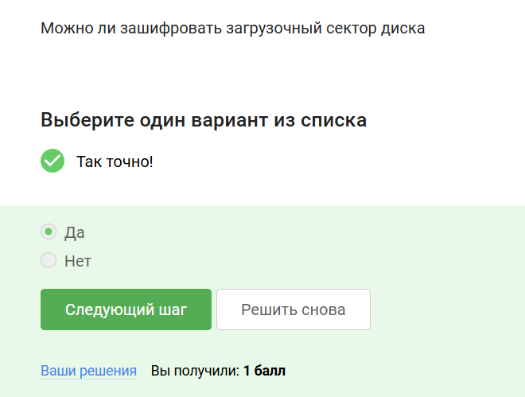

## 3.1 Шифрование диска

Пояснение ответа:
Шифровать можно(и нужно) отдельные сектора диска(включая загрузочный сектор), флэшки с конфиденциальными данными.

## 3.1 Шифрование диска

Вопрос/Ответ 2

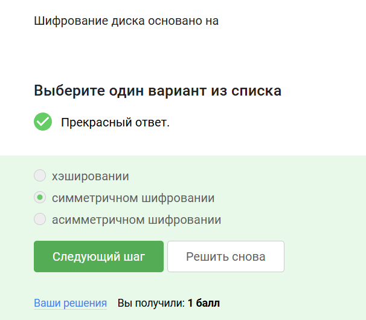

## 3.1 Шифрование диска

Пояснение ответа:
Метод шифрования:

- Для процедуры Encrypt/Decrypt используется симметрические шифрования (AES)

- Данные шифруются секторами 

- Шифрование ускоряется TMP криптопроцессом

- Шифровать можно и загрузочный сектор. При этом пользователь должен запомнить пароль для дешифрирование ключа.

## 3.1 Шифрование диска

Вопрос/Ответ 3 

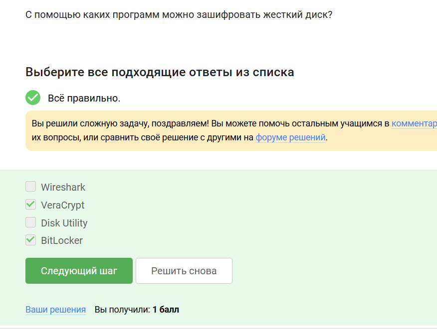

## 3.1 Шифрование диска

Пояснение ответа:
Программы,с которыми можно зашифровать жесткий диск: VeraCrypt, BitLocker, LUKC, FileVault.

# 3.2 Пароли

## 3.2 Пароли

Вопрос/Ответ 1 

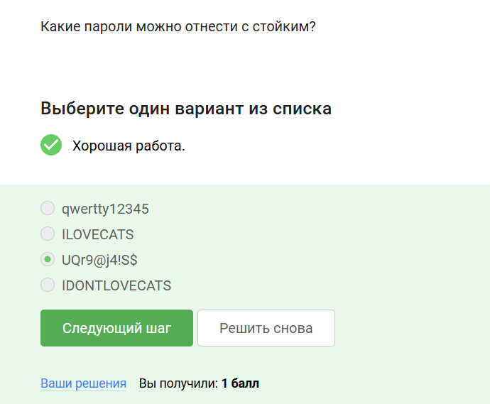

## 3.2 Пароли

Пояснение ответа:
Пароль считается стройким если в нем используются множество видов символов(буквы, цифры, знаки, буквы в большом регистре), чем больше видов, тем больше нужно переборов, чтобы его взломать.

## 3.2 Пароли

Вопрос/Ответ 2 

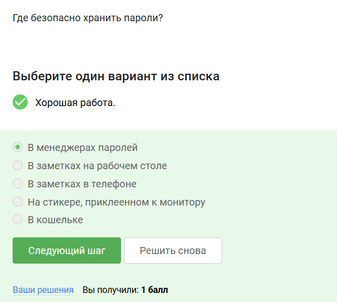

## 3.2 Пароли

Пояснение ответа:
Наиболее безопасным является хранение паролей именно в менеджерах паролей. 

## 3.2 Пароли

Вопрос/Ответ 3 

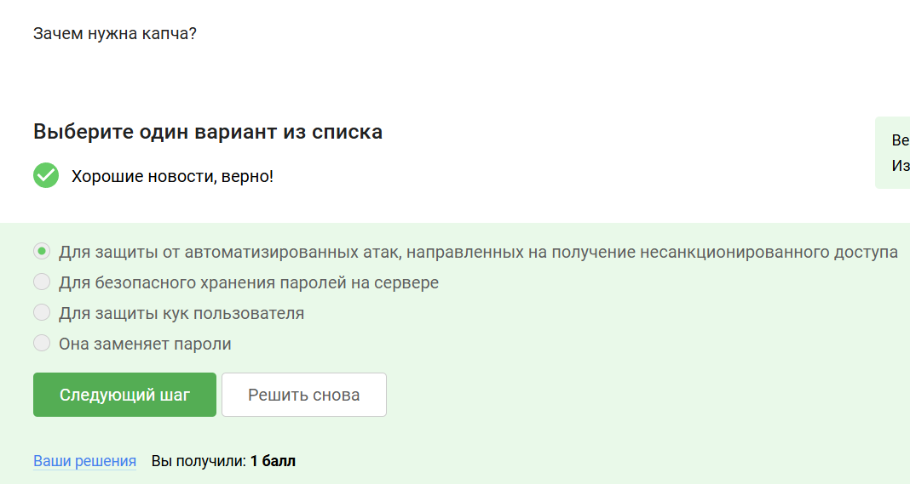

## 3.2 Пароли

Пояснение ответа:
Капча проверяет пользователя не является ли он программой перебора данных для взлома, обычно используются разные методы, такие как: нахождения правильной картинки или набора букв/цифр. Итак, капча защищает от автоматизированных атак, направленные на получение несанкционированного доступа.

## 3.2 Пароли

Вопрос/Ответ 4 

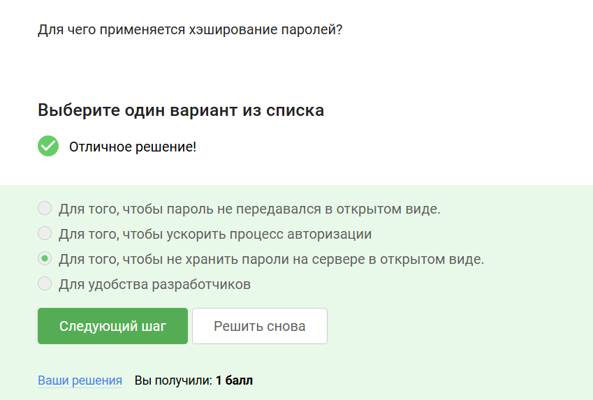

## 3.2 Пароли

Пояснение ответа:
Хеширование паролей используется для того, чтобы не хранить паролина сервере в открытом виде, это делается для безопасности.

## 3.2 Пароли

Вопрос/Ответ 5 

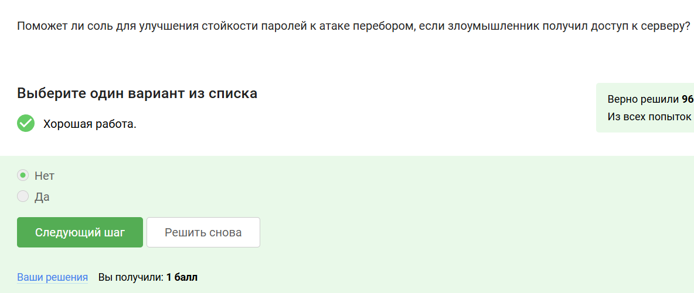

## 3.2 Пароли

Пояснение ответа:
Соль не поможет для улучшения стойкости паролей к атаке перебором, если злоумышленник получил доступ к серверу, так как соль добавляется во время хеширования, но это никак не меняет пароль пользователя и он остается прежним, что позволяет злоумышленнику добраться до цели.

## 3.2 Пароли

Вопрос/Ответ 6

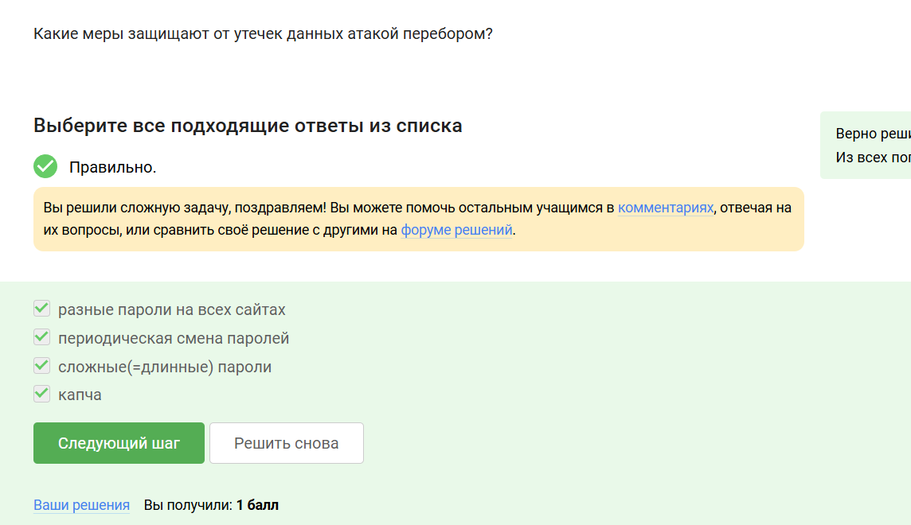

## 3.2 Пароли

Пояснение ответа:
Меры защиты от утечек данных перебором:

- Использовать длинные пароли с символами алфавита разного регистра, цифрами, спец. символами 

- Использовать менеджеры паролей для хранения 

- Регуляное изменение пароли к критическим сервисам 

- Использование разных паролей для разных сайтов, программ.

# 3.3 Фишинг 

## 3.3 Фишинг 

Вопрос/Ответ 1 

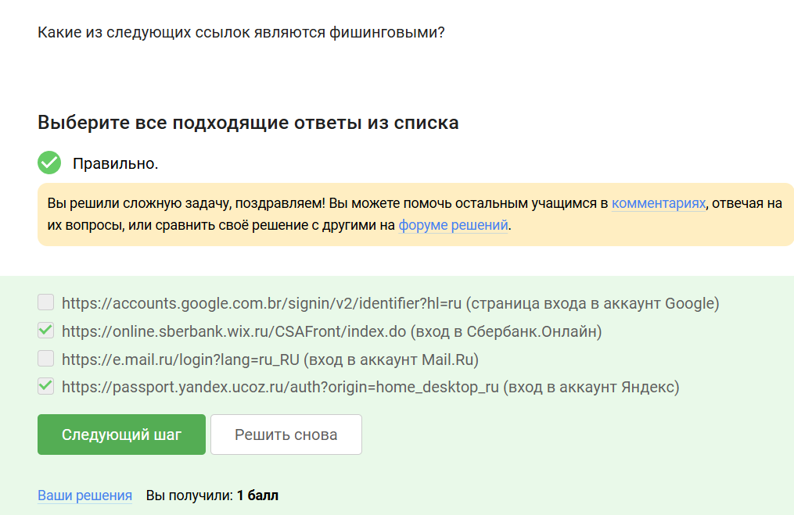

## 3.3 Фишинг 

Пояснение ответа:
В ссылке https://online.sberbank.wix.ru/CSAFront/index.do:

- Домен wix.ru - это беспратный хостинг, никак не связанный со Сбербанком.

- online.sberbank- это всего лишь поддомен хостинга wix.ru, а не настоящий сайт Сбербанка, настоящий- sberbank.ru или online.sberbank.ru

В ссылке https://passport.yandex.ucoz.ru/auth?origin=home_ desktop_ru:

- ucoz.ru- это также бесплатный конструктор сайтов 

- passport.yandex- поддомен ucoz.ru

## 3.3 Фишинг 

Вопрос/Ответ 2 

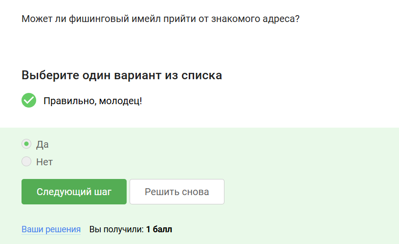

## 3.3 Фишинг 

Пояснение ответа:
Фишинговый имейл может прийти от знакомого адреса, это называется ip или имейл spoofing- подмена адреса отправителя.

# 3.4 Беспроводные сети WiFi

## 3.4 Беспроводные сети WiFi

Вопрос/Ответ 1

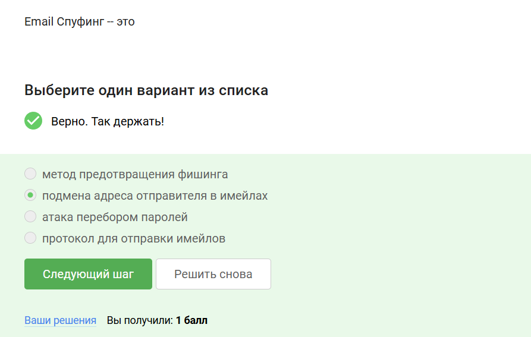

## 3.4 Беспроводные сети WiFi

Пояснение ответа:
Email Спуфинг- это подмена адреса отправителя в имейлах.

## 3.4 Беспроводные сети WiFi

Вопрос/Ответ 2

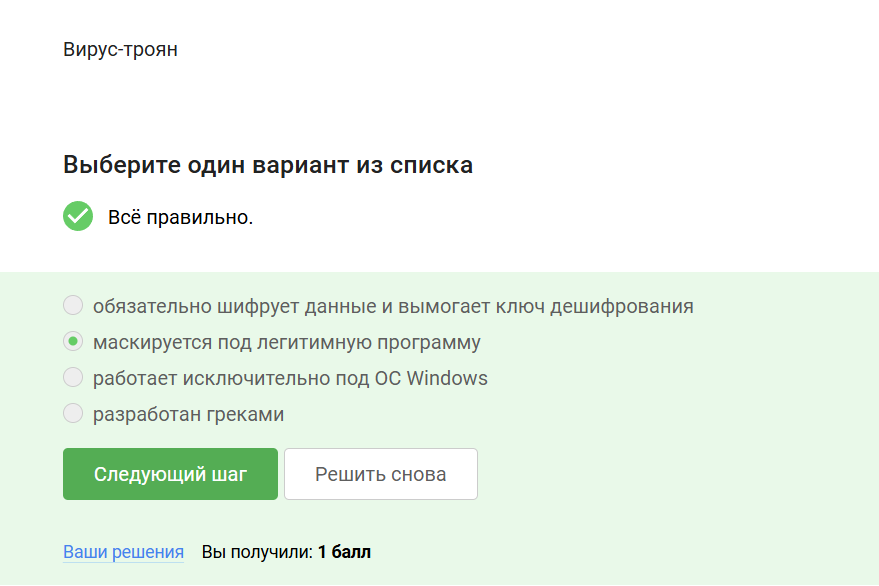

## 3.4 Беспроводные сети WiFi

Пояснение ответа:

Троян- вирус, проникающий в систему под видом легитимного ПО.

# 3.5 Безопасность мессенджеров

## 3.5 Безопасность мессенджеров

Вопрос/Ответ 1 

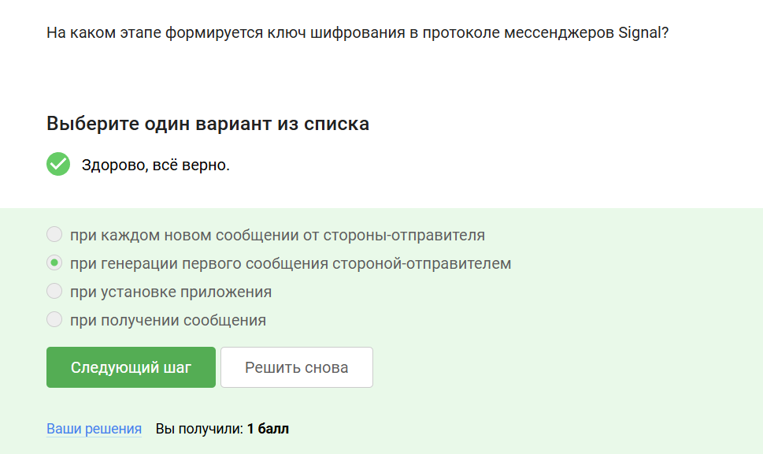

## 3.5 Безопасность мессенджеров

Пояснение ответа:
Ключ шифрования в протоколе мессенджеров Signal формируется при генерации первого сообщения стороной-отправителя.

## 3.5 Безопасность мессенджеров

Вопрос/Ответ 2 

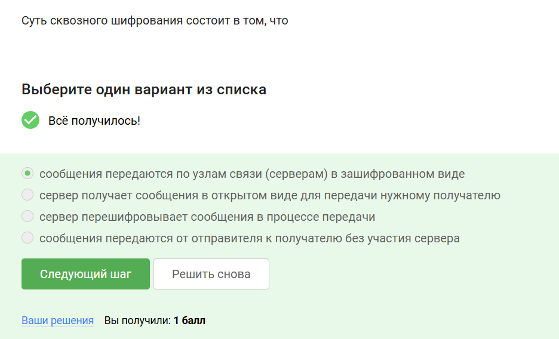

## 3.5 Безопасность мессенджеров

Пояснение ответа:
Суть сквозного шифрования состоит в том, что сообщения передаются по узлам связи в зашифрованном виде.

