---
## Front matter
title: "Прохождения внешнего курса на тему Основы кибербезопасности. Часть 1"
subtitle: "Основы информационной безопасности"
author: "Тойчубекова Асель Нурлановна"

## Generic otions
lang: ru-RU
toc-title: "Содержание"

## Bibliography
bibliography: bib/cite.bib
csl: pandoc/csl/gost-r-7-0-5-2008-numeric.csl

## Pdf output format
toc: true # Table of contents
toc-depth: 2
lof: true # List of figures
lot: true # List of tables
fontsize: 12pt
linestretch: 1.5
papersize: a4
documentclass: scrreprt
## I18n polyglossia
polyglossia-lang:
  name: russian
  options:
	- spelling=modern
	- babelshorthands=true
polyglossia-otherlangs:
  name: english
## I18n babel
babel-lang: russian
babel-otherlangs: english
## Fonts
mainfont: IBM Plex Serif
romanfont: IBM Plex Serif
sansfont: IBM Plex Sans
monofont: IBM Plex Mono
mathfont: STIX Two Math
mainfontoptions: Ligatures=Common,Ligatures=TeX,Scale=0.94
romanfontoptions: Ligatures=Common,Ligatures=TeX,Scale=0.94
sansfontoptions: Ligatures=Common,Ligatures=TeX,Scale=MatchLowercase,Scale=0.94
monofontoptions: Scale=MatchLowercase,Scale=0.94,FakeStretch=0.9
mathfontoptions:
## Biblatex
biblatex: true
biblio-style: "gost-numeric"
biblatexoptions:
  - parentracker=true
  - backend=biber
  - hyperref=auto
  - language=auto
  - autolang=other*
  - citestyle=gost-numeric
## Pandoc-crossref LaTeX customization
figureTitle: "Рис."
tableTitle: "Таблица"
listingTitle: "Листинг"
lofTitle: "Список иллюстраций"
lotTitle: "Список таблиц"
lolTitle: "Листинги"
## Misc options
indent: true
header-includes:
  - \usepackage{indentfirst}
  - \usepackage{float} # keep figures where there are in the text
  - \floatplacement{figure}{H} # keep figures where there are in the text
---

# 1 О курсе 

В этом разделе описана общая информация о курсе, определены цели и дальнейшие планы по курсу. Также даны ссылки на литературу и полезные ссылки.

# 2 Безопасность в сети

## 2.1 Как работает интернет: базовые сетевые протоколы

Вопрос/Ответ 1 (рис. [-@fig:001])

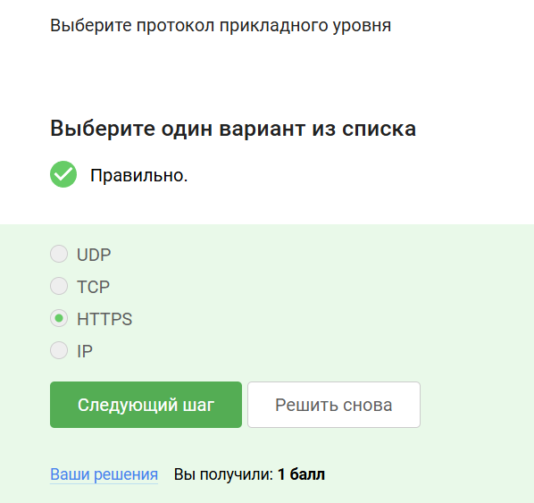{#fig:001 width=70%}

Пояснение ответа:
Протоколы UDP, TCP относятся к транспортному уровню,  HTTPS к прикладному, IP к сетевому уровню.

Вопрос/Ответ 2 (рис. [-@fig:002])

{#fig:002 width=70%}

Пояснение ответа:
Протокол TCP работает на транспортном уровне и отвечает за надежную передачу данных.

Вопрос/Ответ 3 (рис. [-@fig:003])

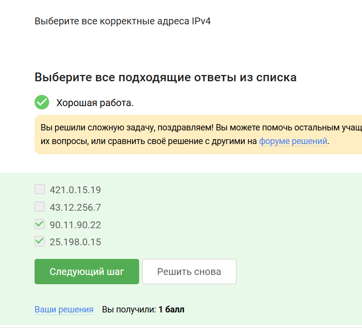{#fig:003 width=70%}

Пояснение ответа:
В 4 версии ip адрес представляет собой 32 битное число, записывается в виде четырех десятичных чисел значения от 0 до 255(8 битов). Из чего следует, что 421.0.15.19 и 43.12.256.7 не подходят. 

Вопрос/Ответ 4 (рис. [-@fig:004])

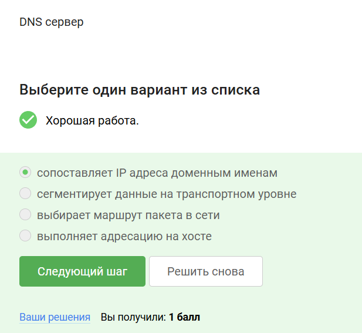{#fig:004 width=70%}

Пояснение ответа:
Основная задача DNS сервера это сопоставить название, то есть доменное имя, с корректным ip адресом, с тем, где лежит этот сервер, этот сайт.

Вопрос/Ответ 5 (рис. [-@fig:005])

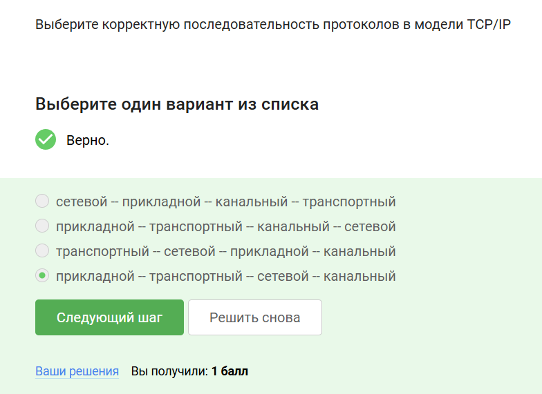{#fig:005 width=70%}

Пояснение ответа:
Модель TCP/IP состоит из четырех уровней:
- Прикладной

- Транспортный

- Сетевой 

- Канальный

Вопрос/Ответ 6 (рис. [-@fig:006])

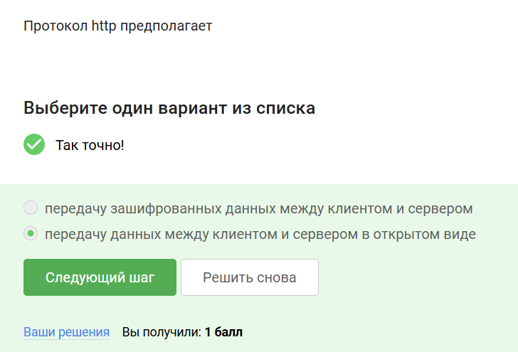{#fig:006 width=70%}

Пояснение ответа:
Протокол прикладного уровня http в отличие от https передает данные между клиентом и сервером в открытом виде. 

Вопрос/Ответ 7 (рис. [-@fig:007])

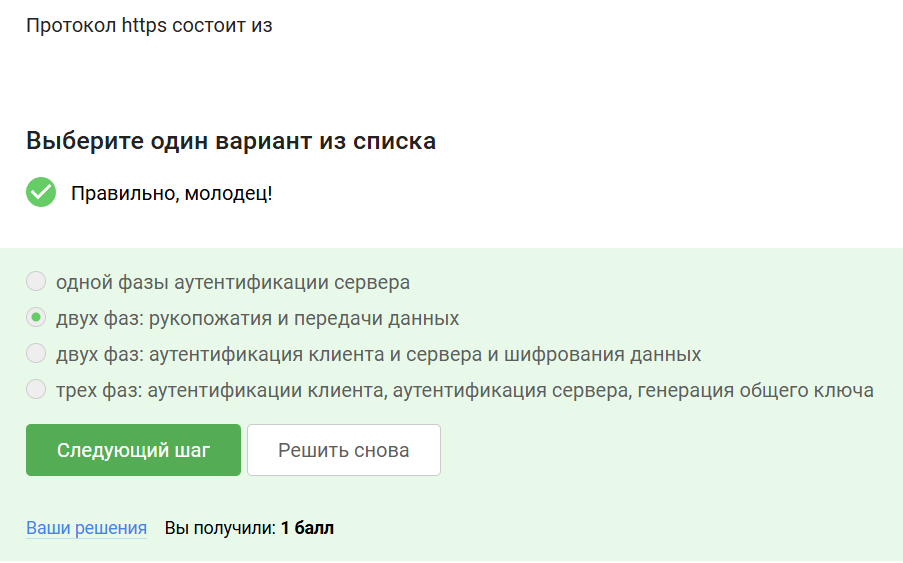{#fig:007 width=70%}

Пояснение ответа:
Протокол https состоит из двух фаз:

- Рукопожатие(идентификация между сервером и клиентом)

- Передача данных

Вопрос/Ответ 8 (рис. [-@fig:008])

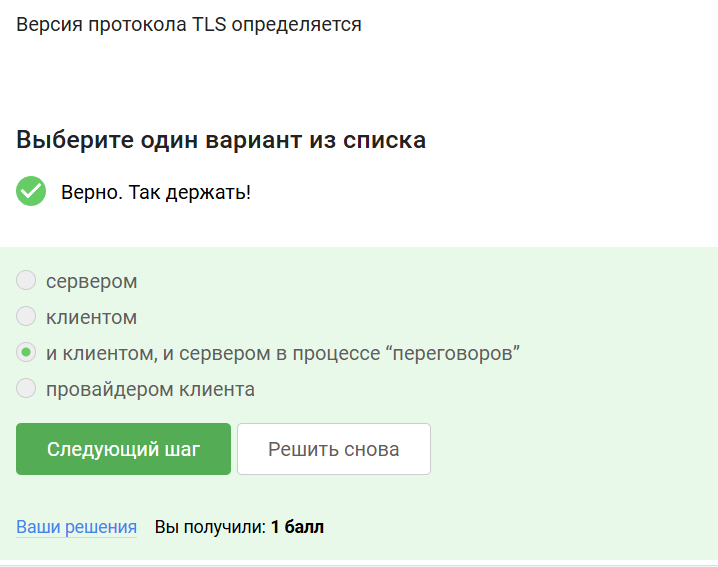{#fig:008 width=70%}

Пояснение ответа:
В ходе TLS-рукопожатия клиент и сервер совместно авполняют следующие действия:

- Указывают какую версию TLS они будут использовать 

- Какие наборы шрифтов они будут использовать 

- Аутентификация идентичности сервера с помощью открытого ключа сервера и цифровой подписи центра сертификации ssl

- Генерация сеансовых ключей для использования симметричного шифрования после завершения рукопожатия.

Вопрос/Ответ 9 (рис. [-@fig:009])

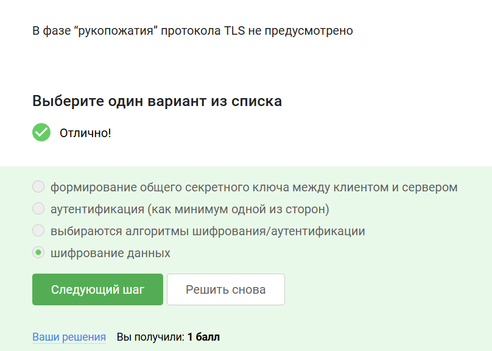{#fig:009 width=70%}

Пояснение ответа:
Рукопожатие - идентификация между сервером и клиентом, оно не подразумевает шифрование данных.

## 2.2 Персонализация сети

Вопрос/Ответ 1 (рис. [-@fig:010])

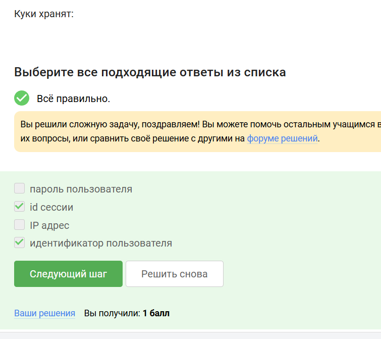{#fig:010 width=70%}

Пояснение ответа:
Куки хранят:

- id пользователя 

- id сессии 

- тип браузера, время запросов

- некоторые действия пользователя

Вопрос/Ответ 2 (рис. [-@fig:011])

{#fig:011 width=70%}

Пояснение ответа:
Куки - данные, передаваемые от сервера к клиенту для его идентификации.
Куки позволяют:

- Сохранять сессионную информацию

- Персонализировать страницы

Вопрос/Ответ 3 (рис. [-@fig:012])

{#fig:012 width=70%}

Пояснение ответа:
Куки генерируется сервером, и запрашивает разрешение на использование клиентом.

Вопрос/Ответ 4 (рис. [-@fig:013])

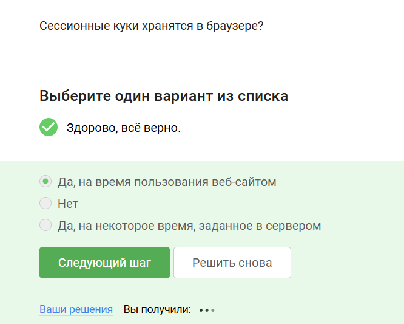{#fig:013 width=70%}

Пояснение ответа:
Сессионные куки хранятся в браузере на время пользование веб сайтом.

## 2.3 Браузер TOR. Анонимизация 

Вопрос/Ответ 1 (рис. [-@fig:014])

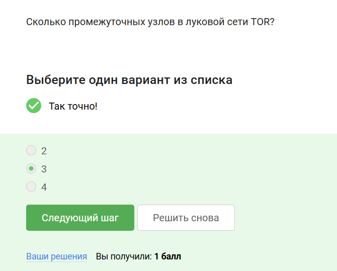{#fig:014 width=70%}

Пояснение ответа:
В луковой сети TOR три промежуточных узла:

- Охранный узел

- Промежуточный узел

- Выходной узел

Вопрос/Ответ 2 (рис. [-@fig:015])

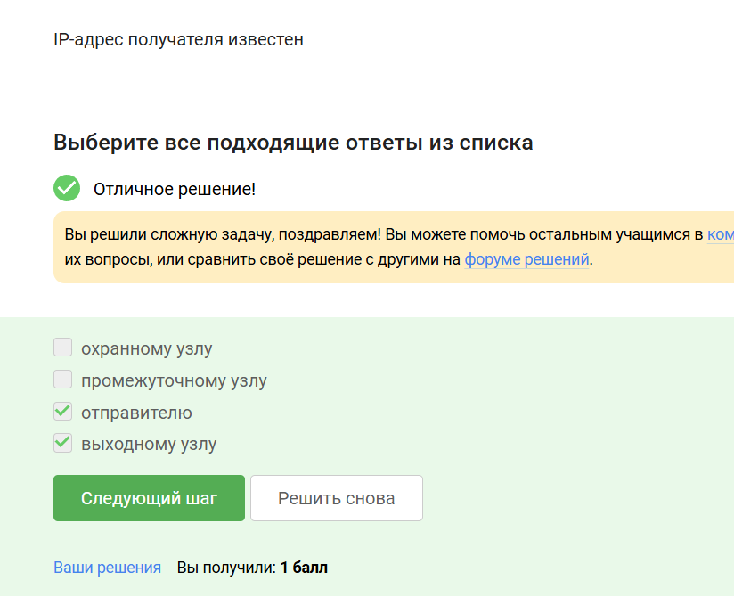{#fig:015 width=70%}

Пояснение ответа:
IP адрес отправителя известен только отправителю и выходному узлу, в охранном и промежуточном узле он зашифрован.

Вопрос/Ответ 3 (рис. [-@fig:016])

{#fig:016 width=70%}

Пояснение ответа:
Отправитель генерирует общий секретный ключ со всеми узлами(охранным, промежуточным, выходным), они одеты друг на друга как оболочка у лука.

Вопрос/Ответ 4 (рис. [-@fig:017])

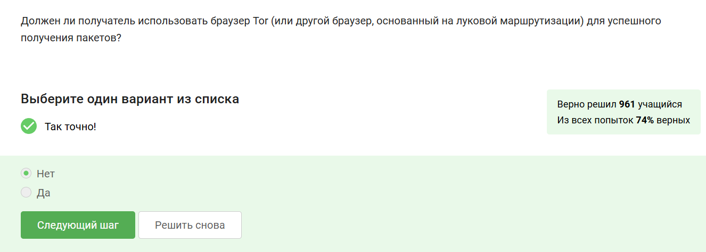{#fig:017 width=70%}

Пояснение ответа:
Получателю не обязательно использовать браузер TOR для успешного получения пакетов.

## 2.4 Беспроводные сети WiFi

Вопрос/Ответ 1 (рис. [-@fig:018])

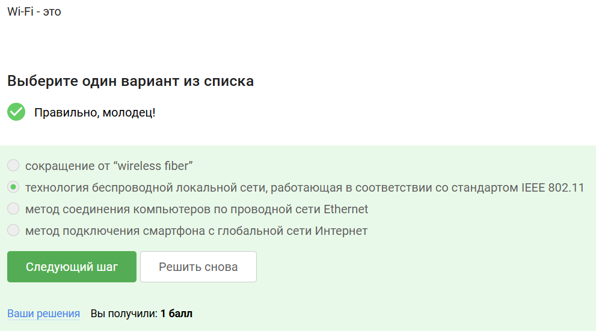{#fig:018 width=70%}

Пояснение ответа:
WiFi - технология беспроводной локальной сети, работающей в соответствии со стандартами IEEE 802.11.

Вопрос/Ответ 2 (рис. [-@fig:019])

{#fig:019 width=70%}

Пояснение ответа:
Протокол WiFi работает на самом низком уровне, канальном уровне.

Вопрос/Ответ 3 (рис. [-@fig:020])

{#fig:020 width=70%}

Пояснение ответа:
Самым ранним и на сегодняшний день небезопасный метод шифрования данных WiFi называется WEP. Он устарел и уже категорически не рекомендуется к использованию, потому что использовал малую длину ключа, 40 бит.

Вопрос/Ответ 4 (рис. [-@fig:021])

{#fig:021 width=70%}

Пояснение ответа:
Данные между хостом сети и роутером передаются в зашифрованном виде после аутентификации устройств.

Вопрос/Ответ 5 (рис. [-@fig:022])

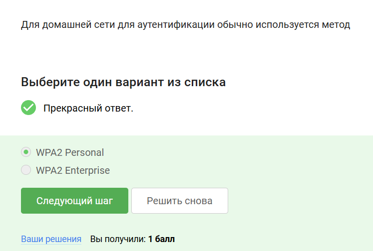{#fig:022 width=70%}

Пояснение ответа:
Для домашней сети для аутентификации обычно используется метод WPA2 Personal, который использует пароль для аутентификации, в то время как WPA2 Enterprise использует базу данных с пользователями, которые могут подключиться к WiFi.

