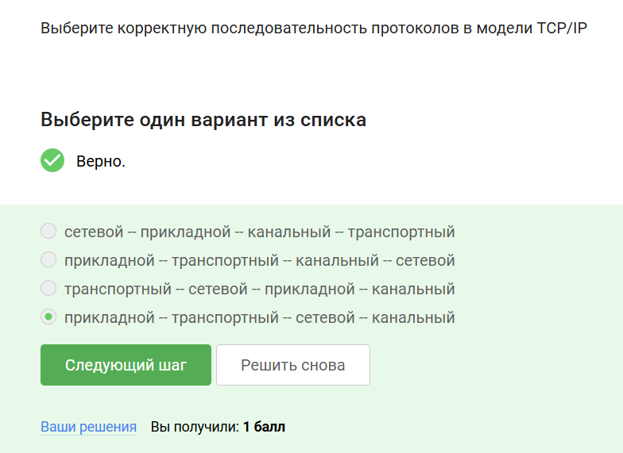
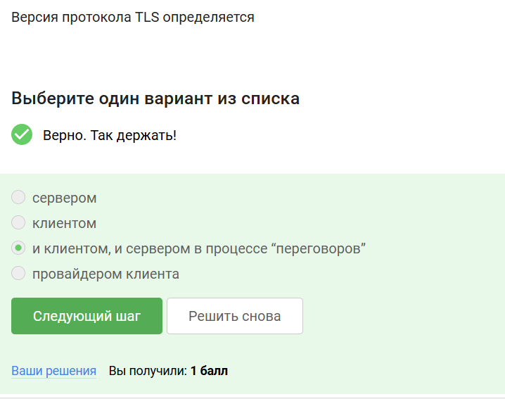
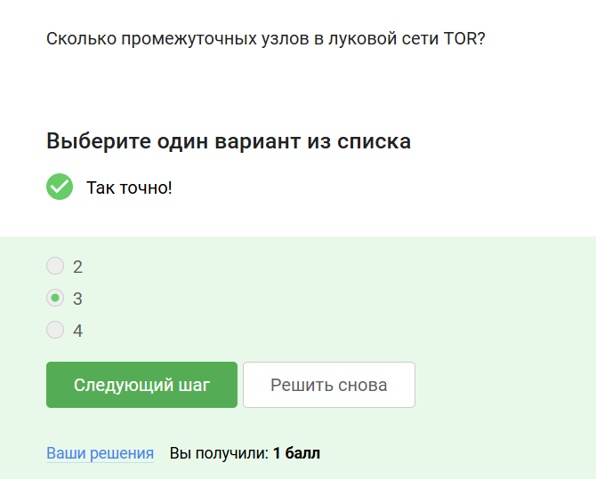
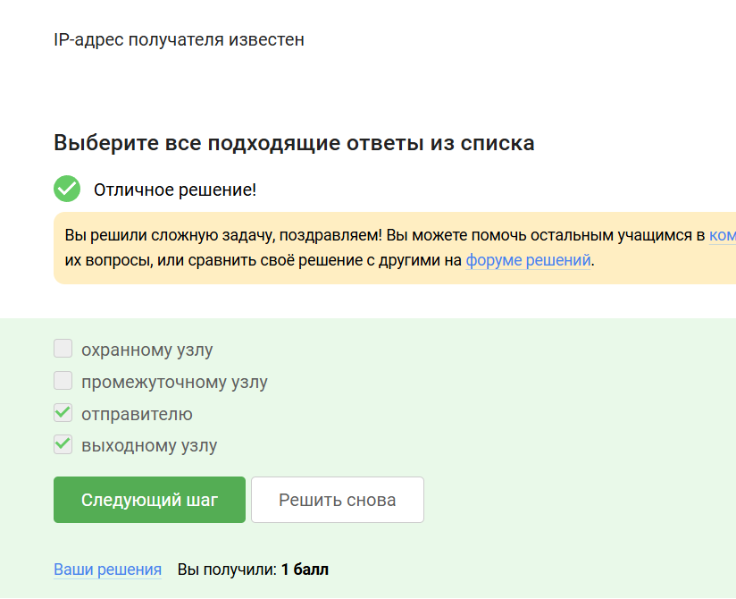
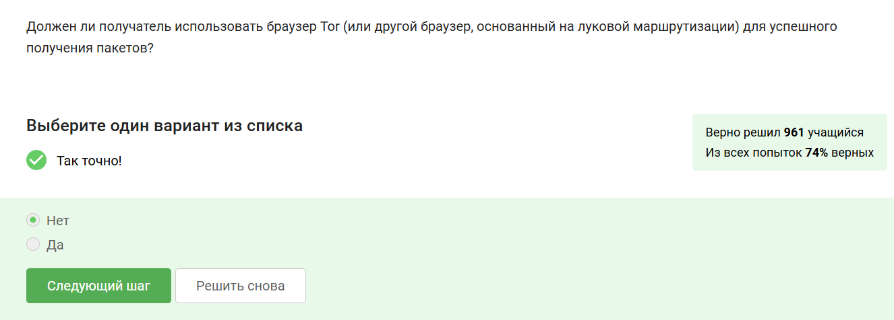
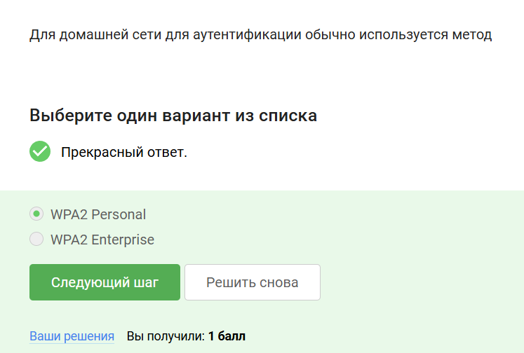

---
## Front matter
lang: ru-RU
title: Прохождения внешнего курса на тему Основы кибербезопасности. Часть 1
subtitle: Основы информационной безопасности
author:
  - Тойчубекова А.Н.
institute:
  - Российский университет дружбы народов, Москва, Россия
date: 17 май 2025

## i18n babel
babel-lang: russian
babel-otherlangs: english

## Formatting pdf
toc: false
toc-title: Содержание
slide_level: 2
aspectratio: 169
section-titles: true
theme: metropolis
header-includes:
 - \metroset{progressbar=frametitle,sectionpage=progressbar,numbering=fraction}
---

# Информация

## Докладчик

:::::::::::::: {.columns align=center}
::: {.column width="70%"}

  * Тойчубекова Асель Нурлановна
  * студент 2 курса
  * факультет физико-математических и естественных наук
  * Российский университет дружбы народов
  * [1032235033@rudn.ru](1032235033@rudn.ru)

:::
::: {.column width="30%"}

:::
::::::::::::::

# 1 О курсе 

## 1 О курсе 

В этом разделе описана общая информация о курсе, определены цели и дальнейшие планы по курсу. Также даны ссылки на литературу и полезные ссылки.

# 2 Безопасность в сети

# 2.1 Как работает интернет: базовые сетевые протоколы

## 2.1 Как работает интернет: базовые сетевые протоколы

Вопрос/Ответ 1 

## 2.1 Как работает интернет: базовые сетевые протоколы

Пояснение ответа:
Протоколы UDP, TCP относятся к транспортному уровню,  HTTPS к прикладному, IP к сетевому уровню.

## 2.1 Как работает интернет: базовые сетевые протоколы

Вопрос/Ответ 2 

## 2.1 Как работает интернет: базовые сетевые протоколы

Пояснение ответа:
Протокол TCP работает на транспортном уровне и отвечает за надежную передачу данных.

## 2.1 Как работает интернет: базовые сетевые протоколы

Вопрос/Ответ 3 

## 2.1 Как работает интернет: базовые сетевые протоколы

Пояснение ответа:
В 4 версии ip адрес представляет собой 32 битное число, записывается в виде четырех десятичных чисел значения от 0 до 255(8 битов). Из чего следует, что 421.0.15.19 и 43.12.256.7 не подходят. 

## 2.1 Как работает интернет: базовые сетевые протоколы

Вопрос/Ответ 4 

## 2.1 Как работает интернет: базовые сетевые протоколы

Пояснение ответа:
Основная задача DNS сервера это сопоставить название, то есть доменное имя, с корректным ip адресом, с тем, где лежит этот сервер, этот сайт.

## 2.1 Как работает интернет: базовые сетевые протоколы

Вопрос/Ответ 5 

## 2.1 Как работает интернет: базовые сетевые протоколы

Пояснение ответа:
Модель TCP/IP состоит из четырех уровней:
- Прикладной

- Транспортный

- Сетевой 

- Канальный

## 2.1 Как работает интернет: базовые сетевые протоколы

Вопрос/Ответ 6 

## 2.1 Как работает интернет: базовые сетевые протоколы

Пояснение ответа:
Протокол прикладного уровня http в отличие от https передает данные между клиентом и сервером в открытом виде. 

## 2.1 Как работает интернет: базовые сетевые протоколы

Вопрос/Ответ 7 

## 2.1 Как работает интернет: базовые сетевые протоколы

Пояснение ответа:
Протокол https состоит из двух фаз:

- Рукопожатие(идентификация между сервером и клиентом)

- Передача данных

## 2.1 Как работает интернет: базовые сетевые протоколы

Вопрос/Ответ 8 

## 2.1 Как работает интернет: базовые сетевые протоколы

Пояснение ответа:
В ходе TLS-рукопожатия клиент и сервер совместно авполняют следующие действия:

- Указывают какую версию TLS они будут использовать 

- Какие наборы шрифтов они будут использовать 

- Аутентификация идентичности сервера с помощью открытого ключа сервера и цифровой подписи центра сертификации ssl

- Генерация сеансовых ключей для использования симметричного шифрования после завершения рукопожатия.

## 2.1 Как работает интернет: базовые сетевые протоколы

Вопрос/Ответ 9

## 2.1 Как работает интернет: базовые сетевые протоколы

Пояснение ответа:
Рукопожатие - идентификация между сервером и клиентом, оно не подразумевает шифрование данных.

# 2.2 Персонализация сети

## 2.2 Персонализация сети

Вопрос/Ответ 1 

## 2.2 Персонализация сети

Пояснение ответа:
Куки хранят:

- id пользователя 

- id сессии 

- тип браузера, время запросов

- некоторые действия пользователя

## 2.2 Персонализация сети

Вопрос/Ответ 2 

## 2.2 Персонализация сети

Пояснение ответа:
Куки - данные, передаваемые от сервера к клиенту для его идентификации.
Куки позволяют:

- Сохранять сессионную информацию

- Персонализировать страницы

## 2.2 Персонализация сети

Вопрос/Ответ 3

## 2.2 Персонализация сети

Пояснение ответа:
Куки генерируется сервером, и запрашивает разрешение на использование клиентом.

## 2.2 Персонализация сети

Вопрос/Ответ 4

## 2.2 Персонализация сети

Пояснение ответа:
Сессионные куки хранятся в браузере на время пользование веб сайтом.

# 2.3 Браузер TOR. Анонимизация 

## 2.3 Браузер TOR. Анонимизация 

Вопрос/Ответ 1 

## 2.3 Браузер TOR. Анонимизация 

Пояснение ответа:
В луковой сети TOR три промежуточных узла:

- Охранный узел

- Промежуточный узел

- Выходной узел

## 2.3 Браузер TOR. Анонимизация 

Вопрос/Ответ 2 

## 2.3 Браузер TOR. Анонимизация 

Пояснение ответа:
IP адрес отправителя известен только отправителю и выходному узлу, в охранном и промежуточном узле он зашифрован.

## 2.3 Браузер TOR. Анонимизация 

Вопрос/Ответ 3 

## 2.3 Браузер TOR. Анонимизация 

Пояснение ответа:
Отправитель генерирует общий секретный ключ со всеми узлами(охранным, промежуточным, выходным), они одеты друг на друга как оболочка у лука.

## 2.3 Браузер TOR. Анонимизация 

Вопрос/Ответ 4 

## 2.3 Браузер TOR. Анонимизация 

Пояснение ответа:
Получателю не обязательно использовать браузер TOR для успешного получения пакетов.

# 2.4 Беспроводные сети WiFi

## 2.4 Беспроводные сети WiFi

Вопрос/Ответ 1 

## 2.4 Беспроводные сети WiFi

Пояснение ответа:
WiFi - технология беспроводной локальной сети, работающей в соответствии со стандартами IEEE 802.11.

## 2.4 Беспроводные сети WiFi

Вопрос/Ответ 2 

## 2.4 Беспроводные сети WiFi

Пояснение ответа:
Протокол WiFi работает на самом низком уровне, канальном уровне.

## 2.4 Беспроводные сети WiFi

Вопрос/Ответ 3 

## 2.4 Беспроводные сети WiFi

Пояснение ответа:
Самым ранним и на сегодняшний день небезопасный метод шифрования данных WiFi называется WEP. Он устарел и уже категорически не рекомендуется к использованию, потому что использовал малую длину ключа, 40 бит.

## 2.4 Беспроводные сети WiFi

Вопрос/Ответ 4 

## 2.4 Беспроводные сети WiFi

Пояснение ответа:
Данные между хостом сети и роутером передаются в зашифрованном виде после аутентификации устройств.

## 2.4 Беспроводные сети WiFi

Вопрос/Ответ 5 

## 2.4 Беспроводные сети WiFi

Пояснение ответа:
Для домашней сети для аутентификации обычно используется метод WPA2 Personal, который использует пароль для аутентификации, в то время как WPA2 Enterprise использует базу данных с пользователями, которые могут подключиться к WiFi.

