---
## Front matter
lang: ru-RU
title: Прохождения внешнего курса на тему Основы кибербезопасности. Часть 3
subtitle: Основы информационной безопасности
author:
  - Тойчубекова А.Н.
institute:
  - Российский университет дружбы народов, Москва, Россия
date: 17 май 2025

## i18n babel
babel-lang: russian
babel-otherlangs: english

## Formatting pdf
toc: false
toc-title: Содержание
slide_level: 2
aspectratio: 169
section-titles: true
theme: metropolis
header-includes:
 - \metroset{progressbar=frametitle,sectionpage=progressbar,numbering=fraction}
---

# Информация

## Докладчик

:::::::::::::: {.columns align=center}
::: {.column width="70%"}

  * Тойчубекова Асель Нурлановна
  * студент 2 курса
  * факультет физико-математических и естественных наук
  * Российский университет дружбы народов
  * [1032235033@rudn.ru](1032235033@rudn.ru)

:::
::: {.column width="30%"}

:::
::::::::::::::

# 4 Криптография на практике

# 4.1 Введение в криптографию

## 4.1 Введение в криптографию

Вопрос/Ответ 1 

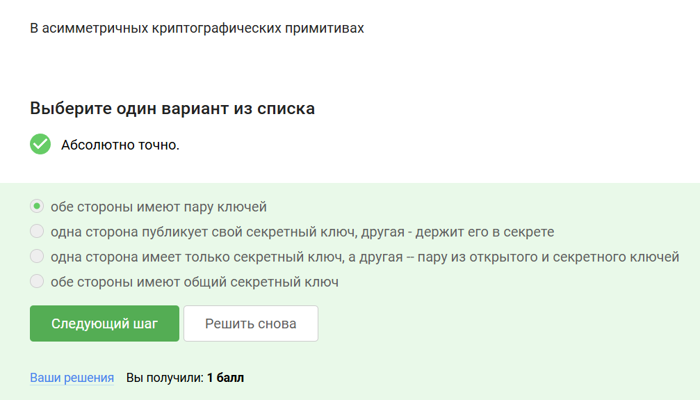

## 4.1 Введение в криптографию

Пояснение ответа:
В асимметричных криптографических примитивах обе стороны имеют пару ключей, у каждого из сторон есть пара ключей: открытый ключ и секретный ключ. Открытый ключ публикуется в открытом доступе, а закрытый или секретный сторона хранит у себя.

## 4.1 Введение в криптографию

Вопрос/Ответ 2 

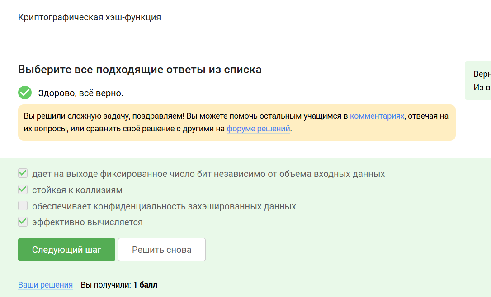

## 4.1 Введение в криптографию

Пояснение ответа:
Криптографическая хэш-функция:

- Дает на выходк фиксированное число бит независимо от объема входных данных

- Стойкая к коллизиям

- Эффективно вычисляется

## 4.1 Введение в криптографию

Вопрос/Ответ 3

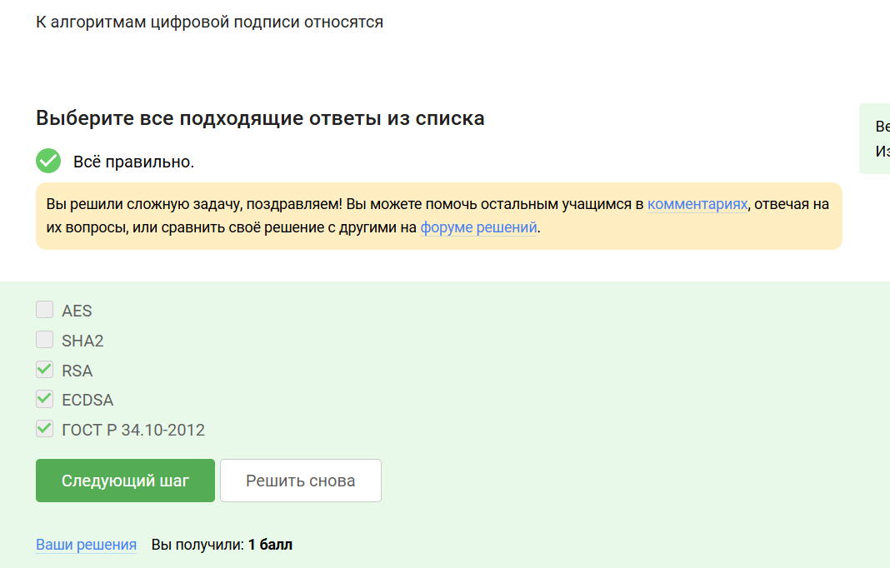

## 4.1 Введение в криптографию

Пояснение ответа:
К алгоритмам цифровой подписи относятся: RSA, ECDSA, ГОСТ 34.10-2012

## 4.1 Введение в криптографию

Вопрос/Ответ 4

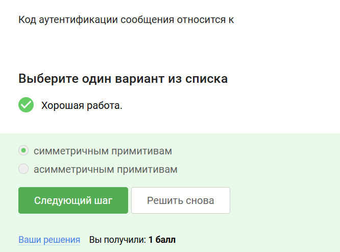

## 4.1 Введение в криптографию

Пояснение ответа:
Код аутентификации сообщения относится к симметричным примитивам, так как имеется общий ключ.

## 4.1 Введение в криптографию

Вопрос/Ответ 5

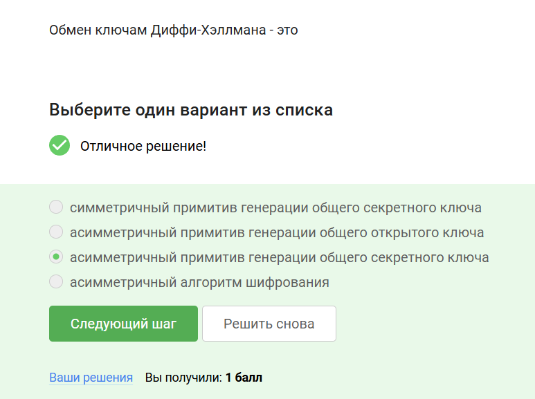

## 4.1 Введение в криптографию

Пояснение ответа:
Обмен ключами Диффи-Хэллмана-это асимметричный примитив генерации общего секретного ключа.

# 4.2 Цифровая подпись

## 4.2 Цифровая подпись

Вопрос/Ответ 1 

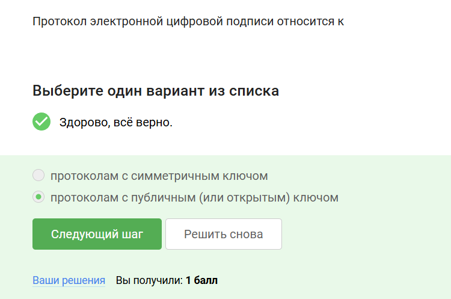

## 4.2 Цифровая подпись

Пояснение ответа:
Протокол электронной цифровой подписи относится протоколам с публичным (или открытым) ключом.

## 4.2 Цифровая подпись

Вопрос/Ответ 2 

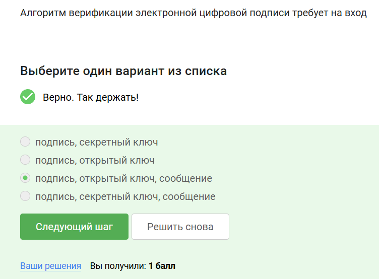

## 4.2 Цифровая подпись

Пояснение ответа:
Алгоритм верификации электронной цифровой подписи требует на вход:

- подпись 

- открытый ключ

- сообщение

## 4.2 Цифровая подпись

Вопрос/Ответ 3

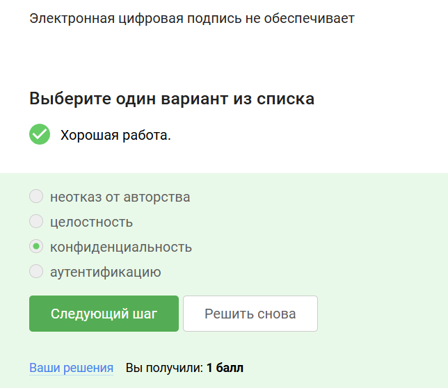

## 4.2 Цифровая подпись

Пояснение ответа:
Цифровая подпись предназначена для:

- Обеспечение целостности сообщения(любое изменение сообщения будет обнаружено)

- Аутентификации сообщения(устанавливается принадлежность подписи владельцу)

- Неотказ от авторства(невозможно отказаться от факта подписи в будущем)

## 4.2 Цифровая подпись

Вопрос/Ответ 4 

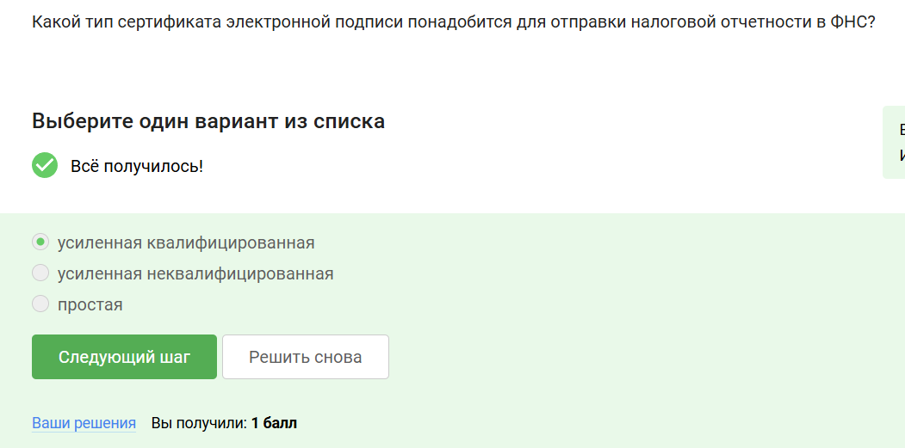

## 4.2 Цифровая подпись

Пояснение ответа:
Усиленной квалификацированной:

- равнозначно рукописей 

- подтверждается сертификатом, выпущенным организацией, аккредитованной минкомсвязи РФ

- госуслуги, государственный документооборот

## 4.2 Цифровая подпись

Вопрос/Ответ 5 

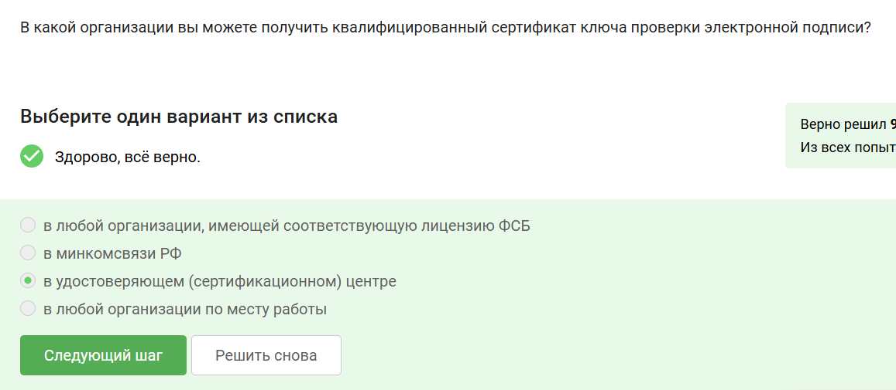

## 4.2 Цифровая подпись

Пояснение ответа:
В удостоверяющем(сертифиционном) центре можно получить квалифицированный сертификат ключа проверки электронной записи.

# 4.3 Электронные платежи

## 4.3 Электронные платежи

Вопрос/Ответ 1 

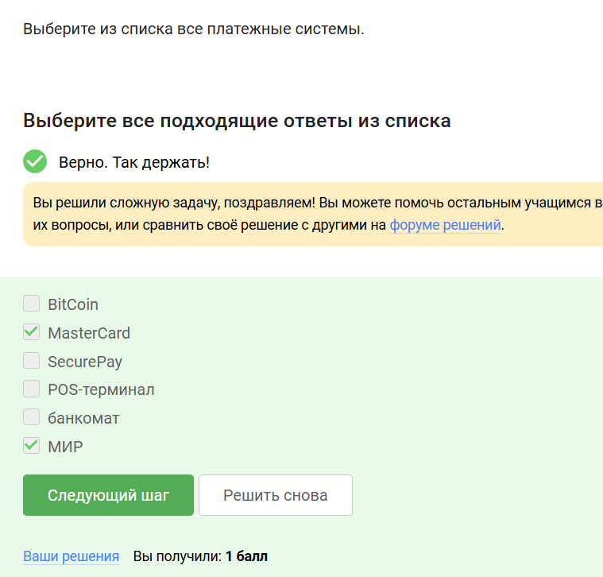

## 4.3 Электронные платежи

Пояснение ответа:
МИР и MasterCard являются платежными системами.

## 4.3 Электронные платежи

Вопрос/Ответ 2 

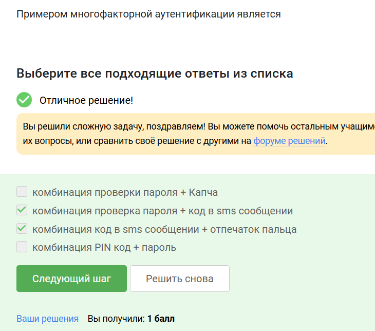

## 4.3 Электронные платежи

Пояснение ответа:
Многократная аутентификация заключается в том, что мы доказываем в ходе этого протокола несколько вещей есть. Основные категории вещей, которые мы можем доказать:

1. то, что я знаю-это либо пароль,либо пин код, либо в случае онлайн платежей это секретный код

2. конкретно в онлайн платежах мы используем второй фактор-это то, чем я владею, который вы должны подтвердить или вбить в ваш браузер

3. другой фактор аутентификации-это свойства например биометрия,отпечаток пальца

4. четвертый фактор аутентификации -локация.

## 4.3 Электронные платежи

Вопрос/Ответ 3 

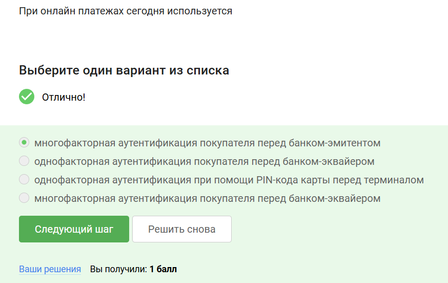

## 4.3 Электронные платежи

Пояснение ответа:
При онлайн платежах сегодня используется многофакторная аутентификация покупателя перед банком-эмитентом

# 4.4 Блокчейн

## 4.4 Блокчейн

Вопрос/Ответ 1 

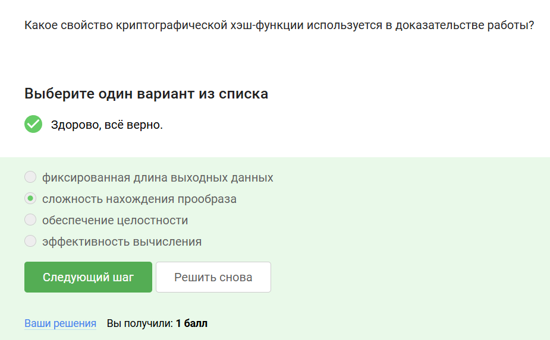

## 4.4 Блокчейн

Пояснение ответа:
Сложность нахождения прообраза криптографической хэш функции используется в доказательстве работы.

## 4.4 Блокчейн

Вопрос/Ответ 2 

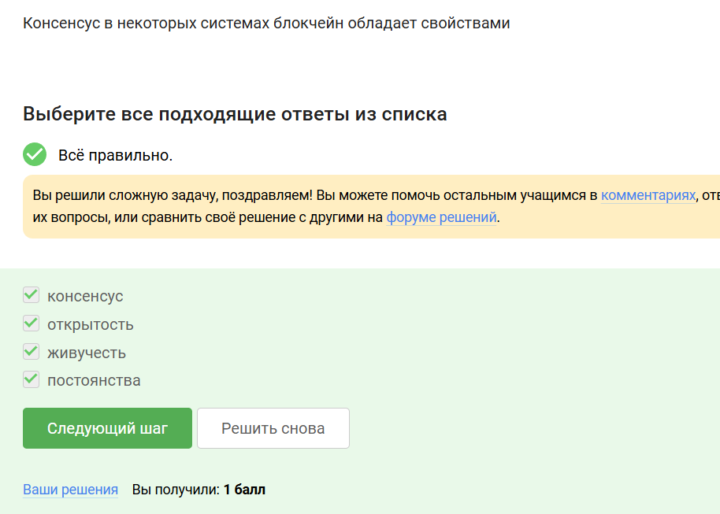

## 4.4 Блокчейн

Пояснение ответа:
В основе блокчейна лежит консенсус- публичная структура данных или леджер(бухгалтерская книга), которая обеспечивает:

- постоянство(добавленные когда-либо данные не могут быть удалены)

- консенсус(все участники видят одни и те же данные за исключением пары блоков)

- живучесть(участники могут добавлять новые транзакции)

- открытость(любой может стать участником блокчейна)

## 4.4 Блокчейн

Вопрос/Ответ 3

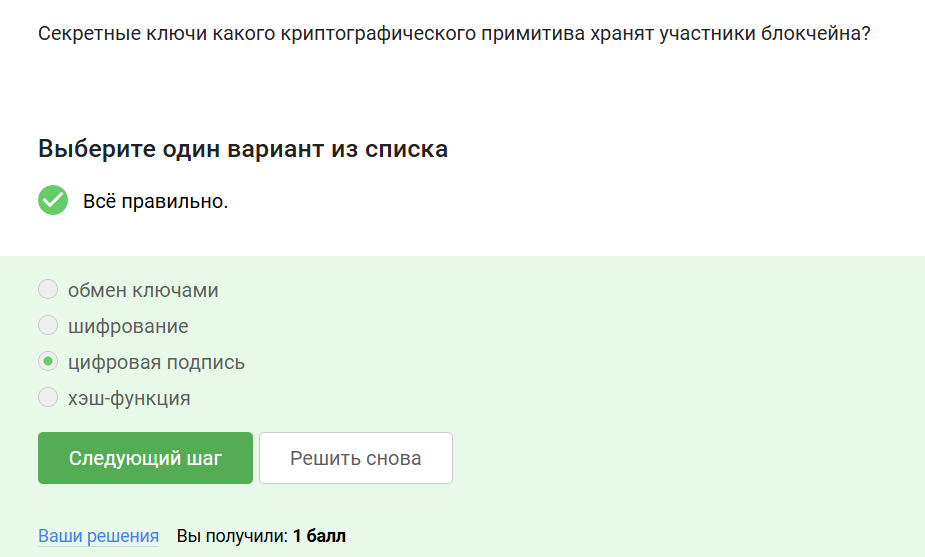

## 4.4 Блокчейн

Пояснение ответа:
Участники блокчейна хранят секретные ключи цифровой подписи каждой транзакции, эта подпись доказывает, что транзакция создана владельцем средств. Только владелец приватного ключа может распорядиться средствами, хранящимися на связанном адресе. 

