---
## Front matter
title: "Прохождения внешнего курса на тему Основы кибербезопасности. Часть 3"
subtitle: "Основы информационной безопасности"
author: "Тойчубекова Асель Нурлановна"

## Generic otions
lang: ru-RU
toc-title: "Содержание"

## Bibliography
bibliography: bib/cite.bib
csl: pandoc/csl/gost-r-7-0-5-2008-numeric.csl

## Pdf output format
toc: true # Table of contents
toc-depth: 2
lof: true # List of figures
lot: true # List of tables
fontsize: 12pt
linestretch: 1.5
papersize: a4
documentclass: scrreprt
## I18n polyglossia
polyglossia-lang:
  name: russian
  options:
	- spelling=modern
	- babelshorthands=true
polyglossia-otherlangs:
  name: english
## I18n babel
babel-lang: russian
babel-otherlangs: english
## Fonts
mainfont: IBM Plex Serif
romanfont: IBM Plex Serif
sansfont: IBM Plex Sans
monofont: IBM Plex Mono
mathfont: STIX Two Math
mainfontoptions: Ligatures=Common,Ligatures=TeX,Scale=0.94
romanfontoptions: Ligatures=Common,Ligatures=TeX,Scale=0.94
sansfontoptions: Ligatures=Common,Ligatures=TeX,Scale=MatchLowercase,Scale=0.94
monofontoptions: Scale=MatchLowercase,Scale=0.94,FakeStretch=0.9
mathfontoptions:
## Biblatex
biblatex: true
biblio-style: "gost-numeric"
biblatexoptions:
  - parentracker=true
  - backend=biber
  - hyperref=auto
  - language=auto
  - autolang=other*
  - citestyle=gost-numeric
## Pandoc-crossref LaTeX customization
figureTitle: "Рис."
tableTitle: "Таблица"
listingTitle: "Листинг"
lofTitle: "Список иллюстраций"
lotTitle: "Список таблиц"
lolTitle: "Листинги"
## Misc options
indent: true
header-includes:
  - \usepackage{indentfirst}
  - \usepackage{float} # keep figures where there are in the text
  - \floatplacement{figure}{H} # keep figures where there are in the text
---

# 4 Криптография на практике

## 4.1 Введение в криптографию

Вопрос/Ответ 1 (рис. [-@fig:001])

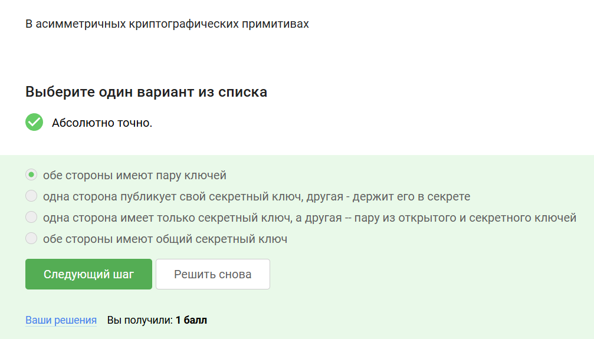{#fig:001 width=70%}

Пояснение ответа:
В асимметричных криптографических примитивах обе стороны имеют пару ключей, у каждого из сторон есть пара ключей: открытый ключ и секретный ключ. Открытый ключ публикуется в открытом доступе, а закрытый или секретный сторона хранит у себя.

Вопрос/Ответ 2 (рис. [-@fig:002])

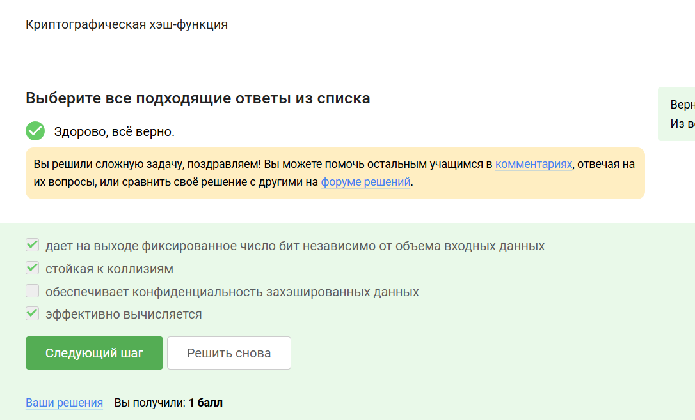{#fig:002 width=70%}

Пояснение ответа:
Криптографическая хэш-функция:

- Дает на выходк фиксированное число бит независимо от объема входных данных

- Стойкая к коллизиям

- Эффективно вычисляется

Вопрос/Ответ 3 (рис. [-@fig:003])

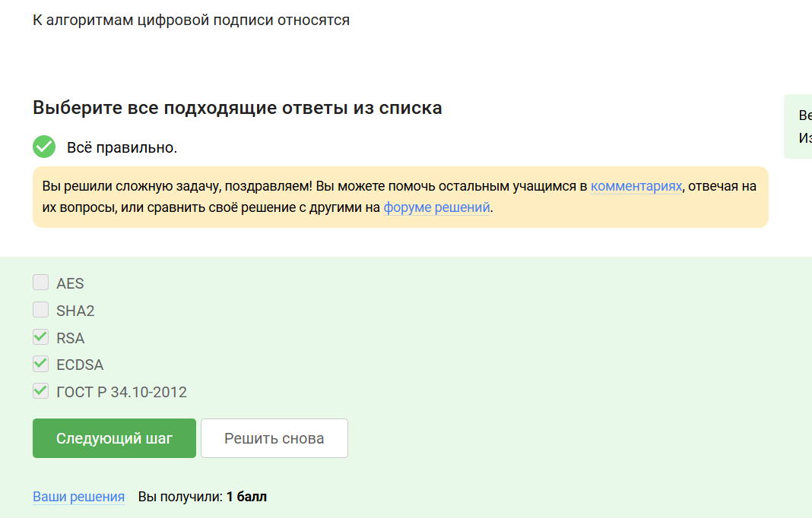{#fig:003 width=70%}

Пояснение ответа:
К алгоритмам цифровой подписи относятся: RSA, ECDSA, ГОСТ 34.10-2012

Вопрос/Ответ 4 (рис. [-@fig:004])

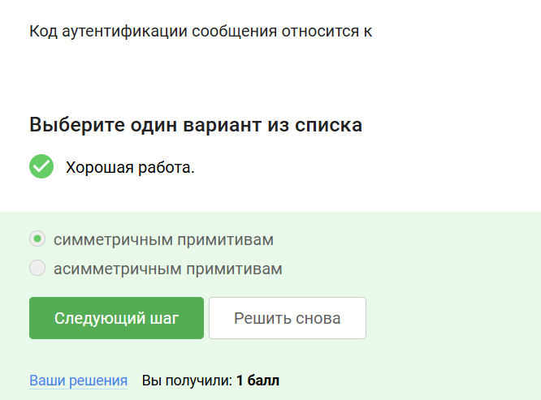{#fig:004 width=70%}

Пояснение ответа:
Код аутентификации сообщения относится к симметричным примитивам, так как имеется общий ключ.

Вопрос/Ответ 5 (рис. [-@fig:005])

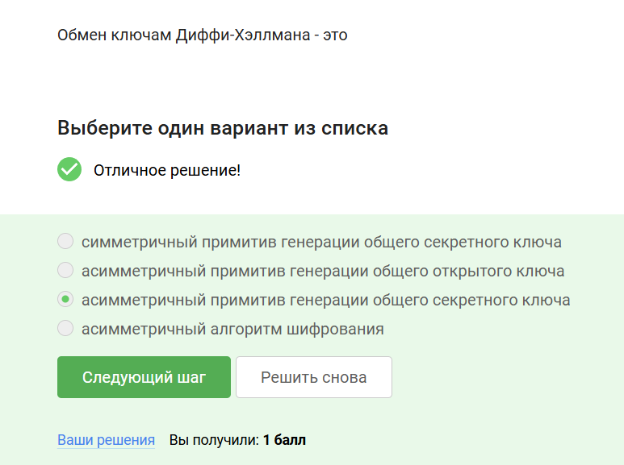{#fig:005 width=70%}

Пояснение ответа:
Обмен ключами Диффи-Хэллмана-это асимметричный примитив генерации общего секретного ключа.

## 4.2 Цифровая подпись

Вопрос/Ответ 1 (рис. [-@fig:006])

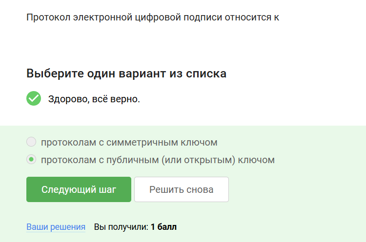{#fig:006 width=70%}

Пояснение ответа:
Протокол электронной цифровой подписи относится протоколам с публичным (или открытым) ключом.

Вопрос/Ответ 2 (рис. [-@fig:007])

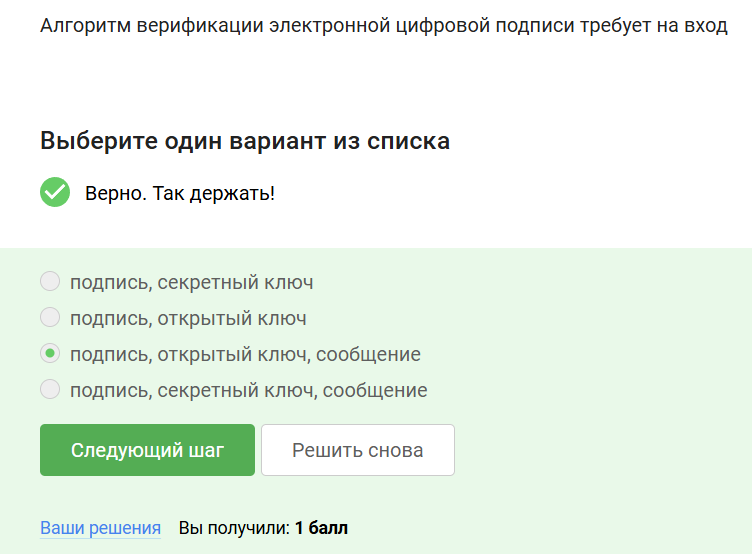{#fig:007 width=70%}

Пояснение ответа:
Алгоритм верификации электронной цифровой подписи требует на вход:

- подпись 

- открытый ключ

- сообщение

Вопрос/Ответ 3 (рис. [-@fig:008])

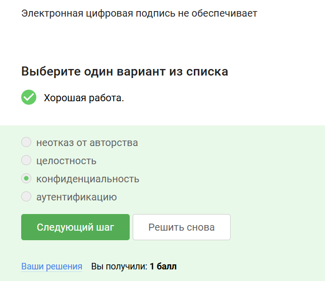{#fig:008 width=70%}

Пояснение ответа:
Цифровая подпись предназначена для:

- Обеспечение целостности сообщения(любое изменение сообщения будет обнаружено)

- Аутентификации сообщения(устанавливается принадлежность подписи владельцу)

- Неотказ от авторства(невозможно отказаться от факта подписи в будущем)

Вопрос/Ответ 4 (рис. [-@fig:009])

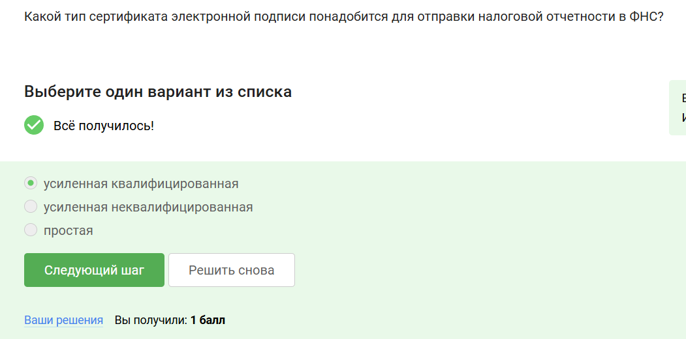{#fig:009 width=70%}

Пояснение ответа:
Усиленной квалификацированной:

- равнозначно рукописей 

- подтверждается сертификатом, выпущенным организацией, аккредитованной минкомсвязи РФ

- госуслуги, государственный документооборот

Вопрос/Ответ 5 (рис. [-@fig:010])

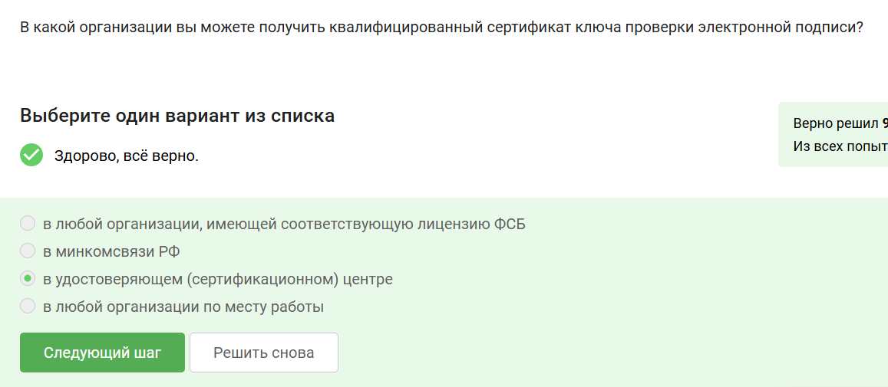{#fig:010 width=70%}

Пояснение ответа:
В удостоверяющем(сертифиционном) центре можно получить квалифицированный сертификат ключа проверки электронной записи.

## 4.3 Электронные платежи

Вопрос/Ответ 1 (рис. [-@fig:011])

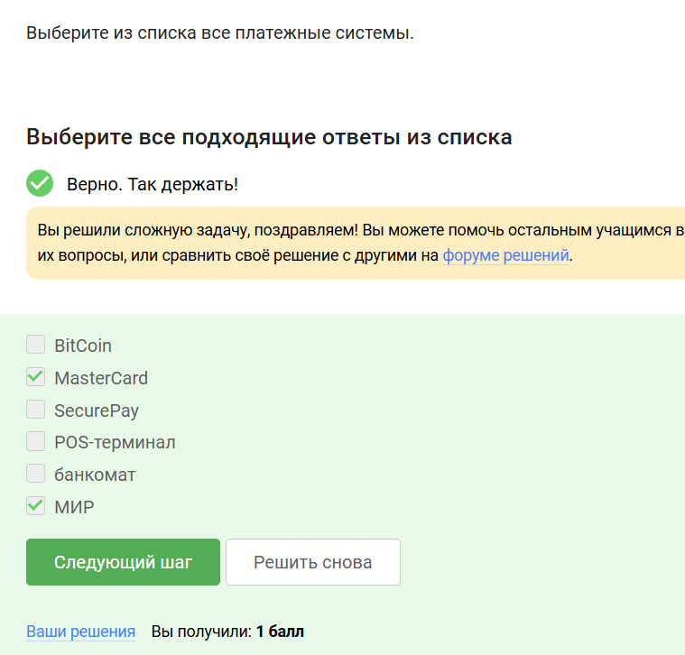{#fig:011 width=70%}

Пояснение ответа:
МИР и MasterCard являются платежными системами.

Вопрос/Ответ 2 (рис. [-@fig:012])

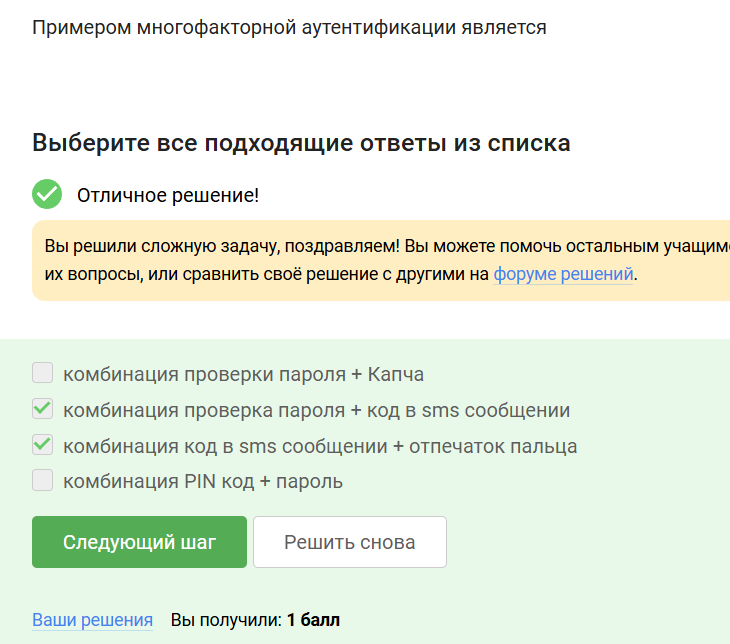{#fig:012 width=70%}

Пояснение ответа:
Многократная аутентификация заключается в том, что мы доказываем в ходе этого протокола несколько вещей есть. Основные категории вещей, которые мы можем доказать:

1. то, что я знаю-это либо пароль,либо пин код, либо в случае онлайн платежей это секретный код

2. конкретно в онлайн платежах мы используем второй фактор-это то, чем я владею, который вы должны подтвердить или вбить в ваш браузер

3. другой фактор аутентификации-это свойства например биометрия,отпечаток пальца

4. четвертый фактор аутентификации -локация.

Вопрос/Ответ 3 (рис. [-@fig:013])

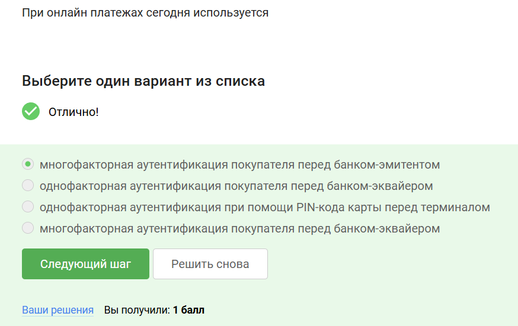{#fig:013 width=70%}

Пояснение ответа:
При онлайн платежах сегодня используется многофакторная аутентификация покупателя перед банком-эмитентом

## 4.4 Блокчейн

Вопрос/Ответ 1 (рис. [-@fig:014])

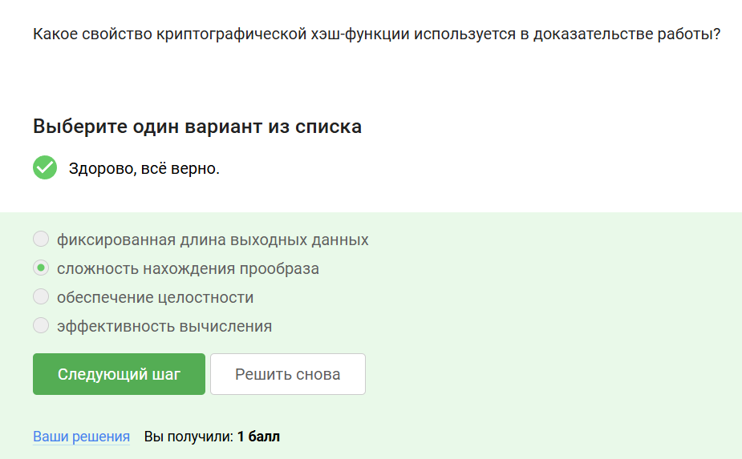{#fig:014 width=70%}

Пояснение ответа:
Сложность нахождения прообраза криптографической хэш функции используется в доказательстве работы.

Вопрос/Ответ 2 (рис. [-@fig:015])

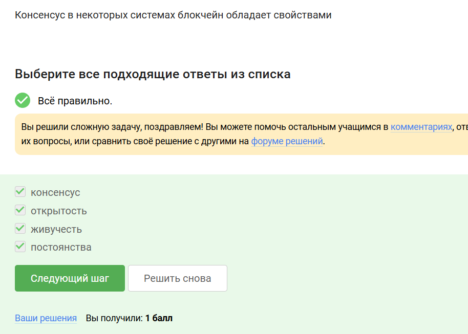{#fig:015 width=70%}

Пояснение ответа:
В основе блокчейна лежит консенсус- публичная структура данных или леджер(бухгалтерская книга), которая обеспечивает:

- постоянство(добавленные когда-либо данные не могут быть удалены)

- консенсус(все участники видят одни и те же данные за исключением пары блоков)

- живучесть(участники могут добавлять новые транзакции)

- открытость(любой может стать участником блокчейна)

Вопрос/Ответ 3 (рис. [-@fig:016])

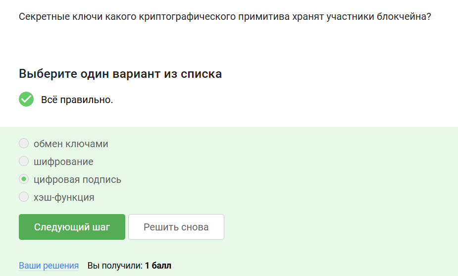{#fig:016 width=70%}

Пояснение ответа:
Участники блокчейна хранят секретные ключи цифровой подписи каждой транзакции, эта подпись доказывает, что транзакция создана владельцем средств. Только владелец приватного ключа может распорядиться средствами, хранящимися на связанном адресе. 

