---
## Front matter
lang: ru-RU
title: Лабораторная работа № 1
subtitle: Основы информационной безопасности
author:
  - Тойчубекова Асель Нурлановна
institute:
  - Российский университет дружбы народов, Москва, Россия
date: 18 февраль 2025

## i18n babel
babel-lang: russian
babel-otherlangs: english

## Formatting pdf
toc: false
toc-title: Содержание
slide_level: 2
aspectratio: 169
section-titles: true
theme: metropolis
header-includes:
 - \metroset{progressbar=frametitle,sectionpage=progressbar,numbering=fraction}
---

# Информация

## Докладчик

:::::::::::::: {.columns align=center}
::: {.column width="70%"}

  * Тойчубекова Асель Нурлановна
  * студент 2 курса
  * Факультете физико-математических и естественных наук
  * Российский университет дружбы народов
  * [1032235033@pfur.ru](1032235033@pfur.ru)
  * <https://antoyjchubekova.github.io/ru/>

:::
::: {.column width="30%"}

:::
::::::::::::::

## Цель работы

Целью данной работы является приобретение практических навыков установки операционной системы на виртуальную машину, настройки минимально необходимых для дальнейшей работы сервисов.

## Теоретическое введение

Linux — это семейство операционных систем на базе ядра Linux. и системы широко используются в серверных, облачных и корпоративных средах благодаря гибкости настройки и поддержке множества архитектур.

Rocky Linux — это один из дистрибутивов Linux, созданный как замена CentOS после его перехода на модель CentOS Stream. Разработанный сообществом, он ориентирован на стабильность и совместимость с Red Hat Enterprise Linux (RHEL).

# Выполнение лабораторной работы

## Установка операционной системы на виртуальную машину

Создаем новую виртуальную машину, указываем имя, тип операционной системы — Linux, версию операционной системы — RedHat (64-bit)

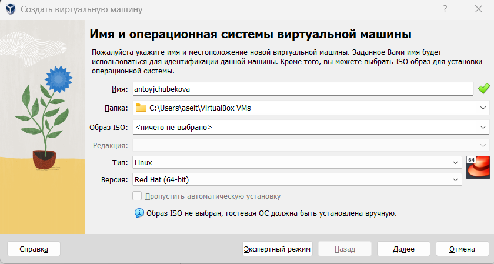

## Установка операционной системы на виртуальную машину

Указываем размер основной памяти виртуальной машины -2048 МБ и число процессоров-4. 

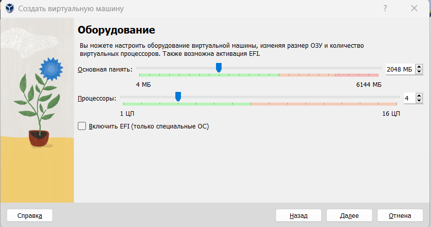

## Установка операционной системы на виртуальную машину

Задаем размер виртуального жесткого диска-40ГБ. 

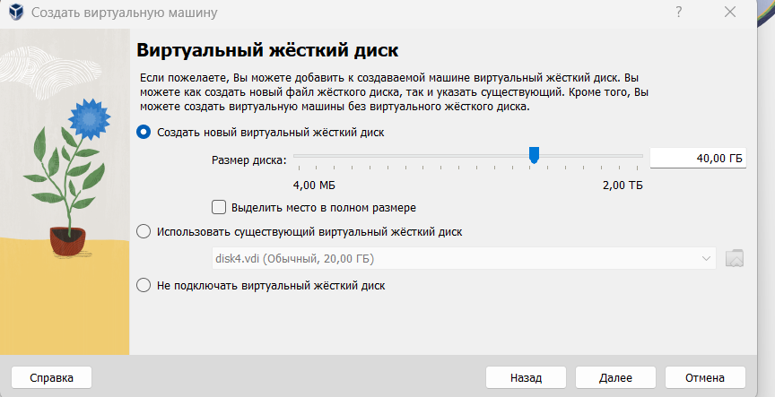

## Установка операционной системы на виртуальную машину

Заходим в настройки и добавляем новый привод оптических дисков и выбираем наш скаченный образ операционной системы.

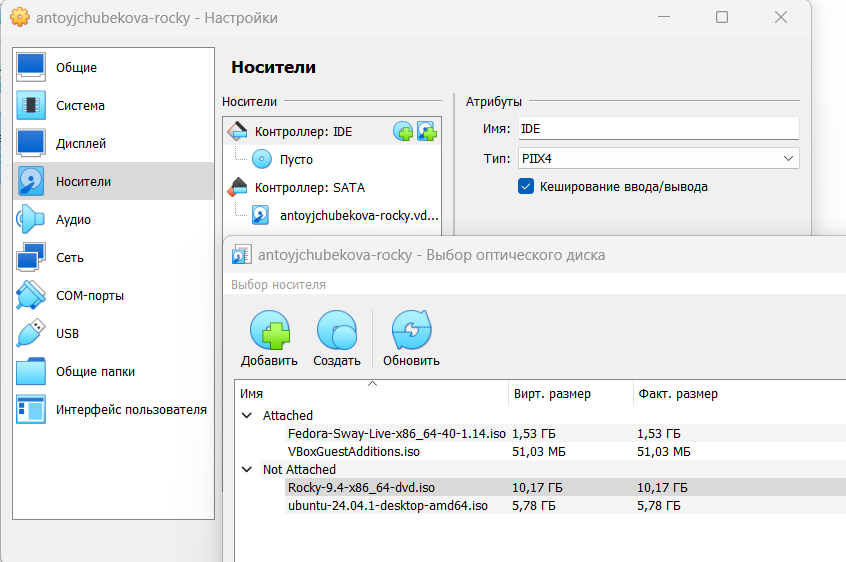

## Установка операционной системы на виртуальную машину

Запустим виртуальную машину и в окне с меню переключимся на строку  «Install Rocky
Linux версия» и нажмем на Enter для запуска установки образа ОС. 

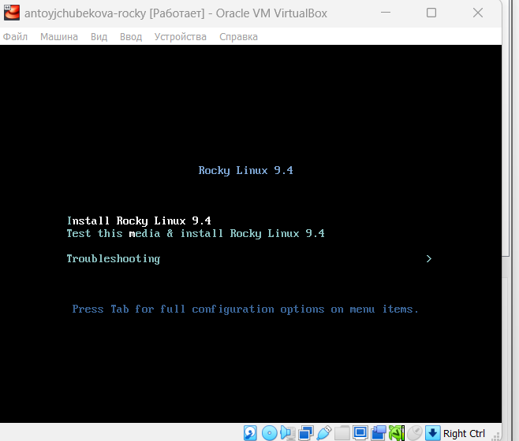

## Установка операционной системы на виртуальную машину

Выберем English в качестве языка интерфейса и перейдем к настройкам установки операционной системы. 

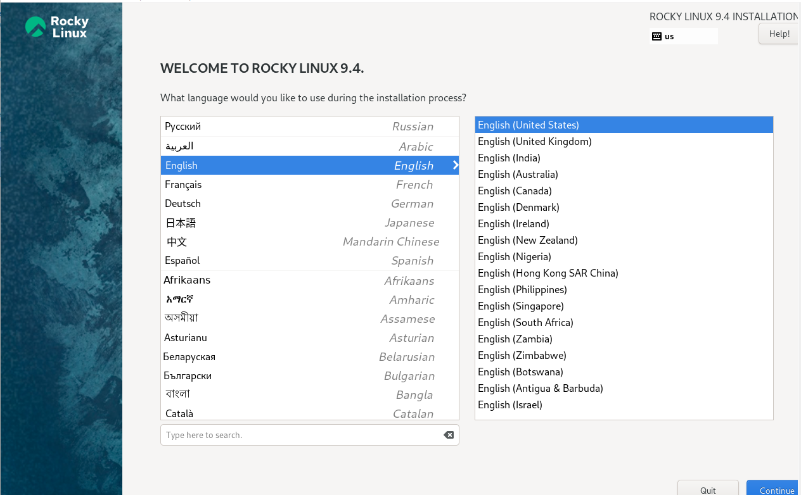

## Установка операционной системы на виртуальную машину

Добавим в раскладку клавиатуры русский язык. 

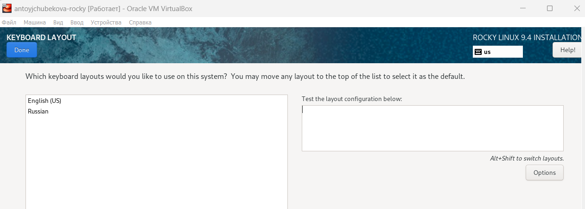

## Установка операционной системы на виртуальную машину

В разделе выбора программ укажем в качестве базового окружения Server with GUI , а в качестве дополнения-Development Tools. 

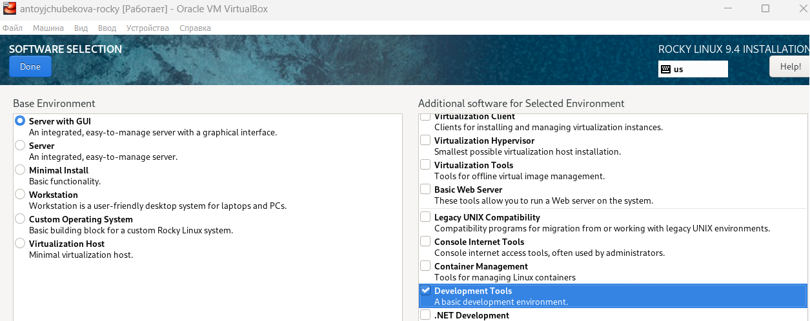

## Установка операционной системы на виртуальную машину

Место установки ОС оставляем без изменений. 

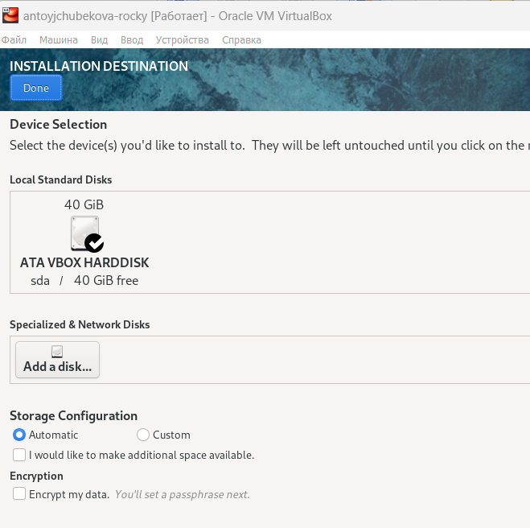

## Установка операционной системы на виртуальную машину

Отключим KDUMP.

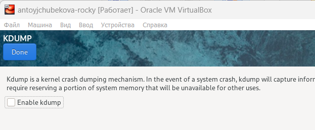

## Установка операционной системы на виртуальную машину

Включим сетевое соединение и в качестве имени узла укажем antoyjchubekova.localdomail. 

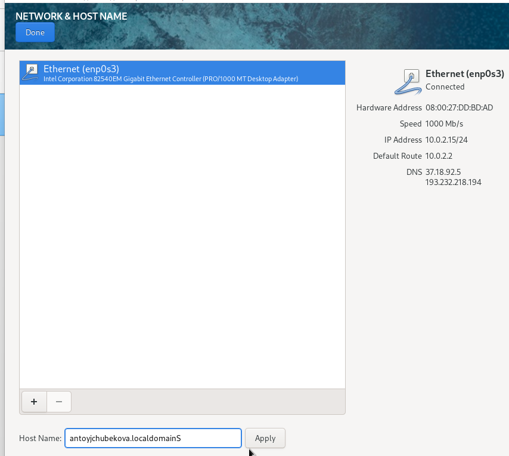

## Установка операционной системы на виртуальную машину

Указываем пароль root, разрешение на ввод пароля для root при использовании ssh. 

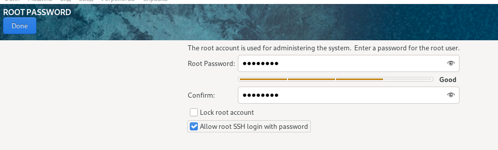

## Установка операционной системы на виртуальную машину

Затем зададим локального пользователя с правами администратора и пароль для него.

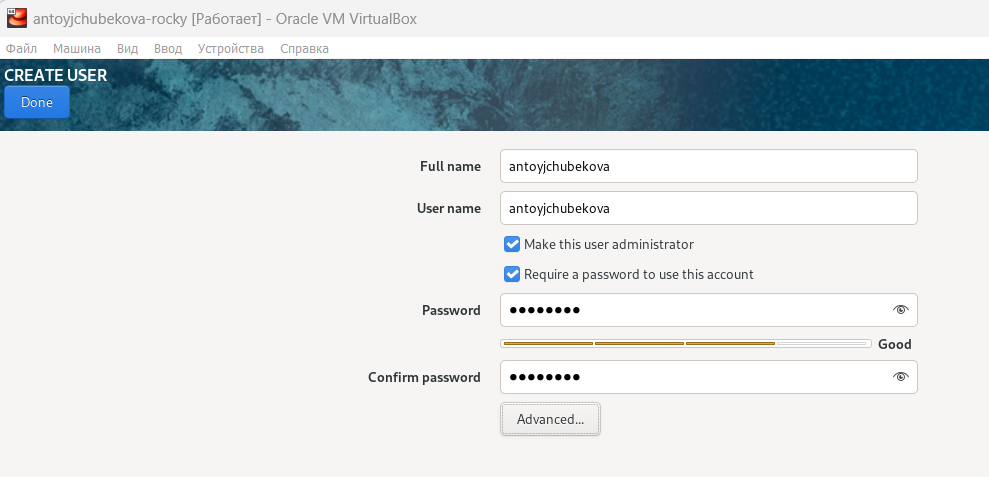

## Установка операционной системы на виртуальную машину
 
 После задания необходимых настроек нажмем на Begin Installation для начала установки
образа системы. 

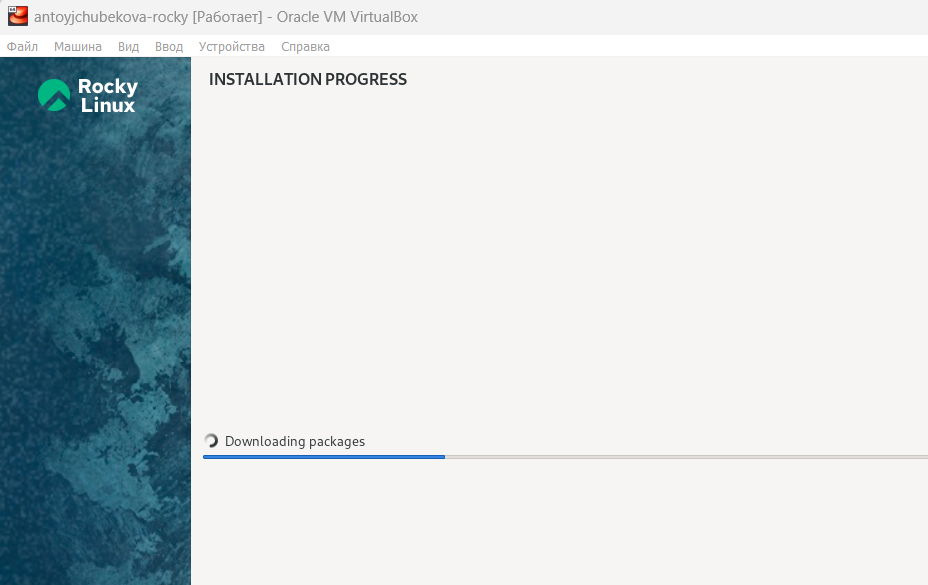

## Установка операционной системы на виртуальную машину
 
 После завершения установки войдем в ОС под заданной учетной записью. В меню Устройства виртуальной машины подключаем образ диска дополнительной гостевой ОС и запустим его. Затем корректно перезагрузим виртуальную машину.

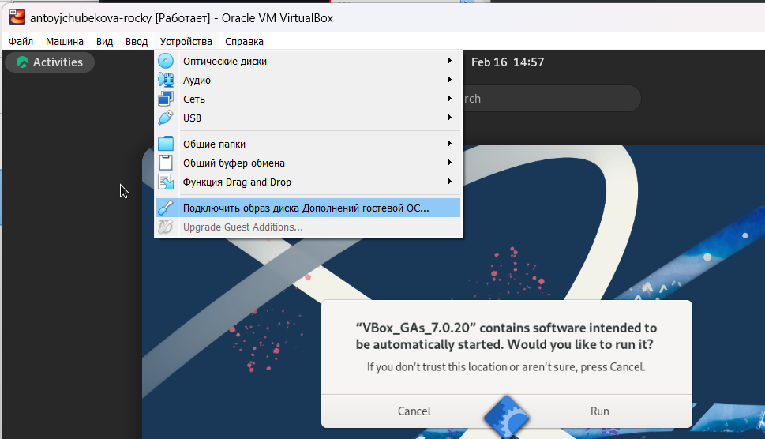

## Установка имени пользователя и названия хоста 

С помощью команды id -un я проверила имя пользователя, она соответствовала логину.

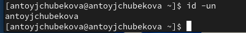

## Установка имени пользователя и названия хоста 

Также с помощью команды hostnamectl проверила имя хоста, который также был корректным.

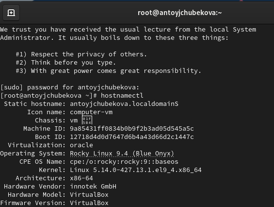

## Выполнение домашнего задания

С помощью команды dmesg | less выведем системные сообщения ядра, такие как информация о загрузке системы, подключении устройств, драйверах и ошибках.

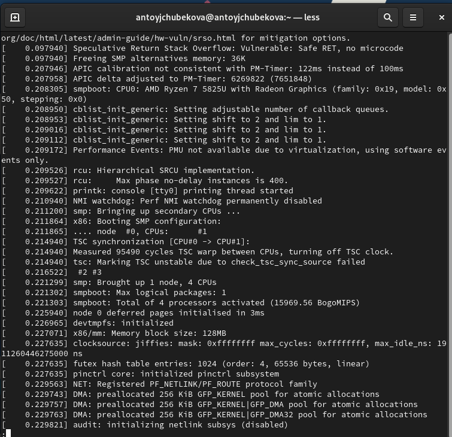

## Выполнение домашнего задания

1. С помощью команды dmesg | grep -i "version" найдем версию ядра Linux. Мы видим, что версия - Linux version 5.14.0-427.13.1.el9_4.x86_64. 

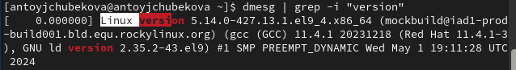

## Выполнение домашнего задания

2. С помощью той же команды dmesg | grep -i "Mhz processor" посмотрим частоту процессора. Мы видим, что частота процессора - 1996.195 Mhz. 

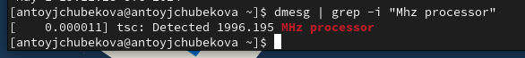

## Выполнение домашнего задания

3. С помощью команды dmesg | grep -i "CPU0" посмотрим модель процессора. Мы видим что, модель процессора-CPU: AMD Ryzen 7 58250 with Radeon Graphics. 

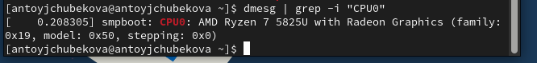

## Выполнение домашнего задания

4. С помощью команды dmesg | grep -i "available" посмотрим объем доступной оперативной памяти. Мы видим что, объем доступной оперативной памяти-из 2096696K (≈2 ГБ) оперативной памяти 260860K (≈255 МБ) доступны.Остальное занято системой драйверами и процессорами.

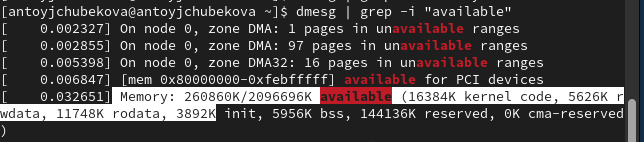

## Выполнение домашнего задания

5. С помощью команды dmesg | grep -i "Hypervisor detected" тип обнаруженного гипервизора. Мы видим, что у нас гипервизор 1 типа KVM.

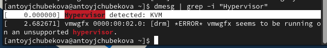

## Выполнение домашнего задания

6. Далее посмотрим тип файловой системы  корневого раздела с командой dmesg | grep -i "filesystem". Мы видим, что тип файловой системы-Mounting V5 filesystem. 

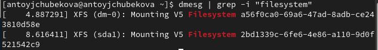

## Выполнение домашнего задания

7. С помощью команды mesg | grep -i "mount" посмотрим последовательность монтирования файловых систем. 

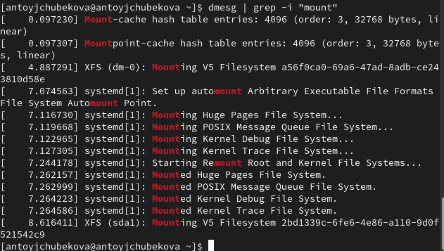

## Выводы

В ходе выполнения лабораторной работы № 1 я научилась навыкам установки операционной системы на виртуальную машину, настройки минимально необходимых для дальнейшей работы сервисов.

## Список литературы

1. Купер М. Искусство программирования на языке сценариев командной оболочки. —2004. — URL: https://www.opennet.ru/docs/RUS/bash_scripting_guide/.
2. Newham C. Learning the bash Shell: Unix Shell Programming. — O’Reilly Media, 2005. —
(In a Nutshell).
3. Робачевский А., Немнюгин С., Стесик О. Операционная система UNIX. — 2-е изд. —
БХВ-Петербург, 2010.
4. Колисниченко Д. Н. Самоучитель системного администратора Linux. — СПб. : БХВПетербург, 2011. — (Системный администратор).
5. Dash P. Getting Started with Oracle VM VirtualBox. — Packt Publishing Ltd, 2013.
6. Colvin H. VirtualBox: An Ultimate Guide Book on Virtualization with VirtualBox. — CreateSpace Independent Publishing Platform, 2015.
7. Таненбаум Э., Бос Х. Современные операционные системы. — 4-е изд. — СПб. : Питер,2015. — (Классика Computer Science).
8. GNU Bash Manual. — 2016. — URL: https : / / www . gnu . org / software / bash /
manual/.
9. Robbins A. Bash Pocket Reference. — O’Reilly Media, 2016.
10. Vugt S. van. Red Hat RHCSA/RHCE 7 cert guide : Red Hat Enterprise Linux 7 (EX200 and
EX300). — Pearson IT Certification, 2016. — (Certification Guide).
11. Zarrelli G. Mastering Bash. — Packt Publishing, 2017.

