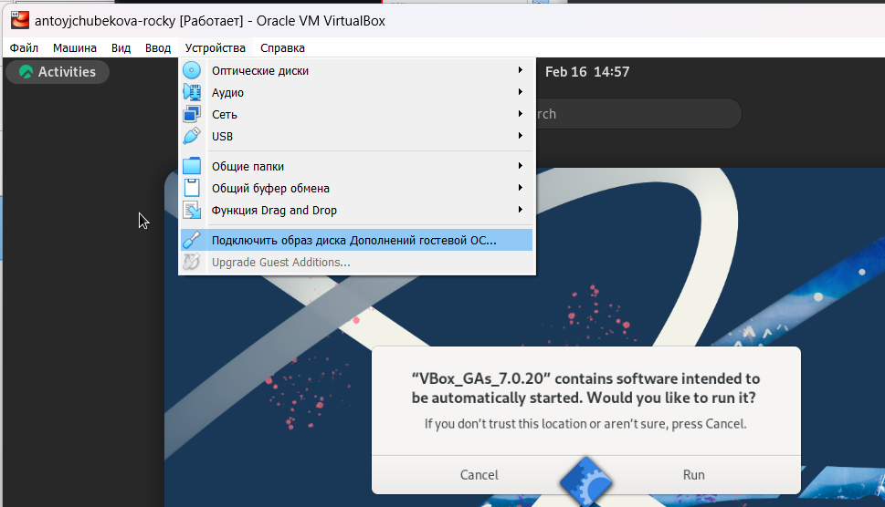

---
## Front matter
title: "Лабораторная работа №1"
subtitle: "Основы информационной безопасности"
author: "Тойчубекова Асель Нурлановна"

## Generic otions
lang: ru-RU
toc-title: "Содержание"

## Bibliography
bibliography: bib/cite.bib
csl: pandoc/csl/gost-r-7-0-5-2008-numeric.csl

## Pdf output format
toc: true # Table of contents
toc-depth: 2
lof: true # List of figures
lot: true # List of tables
fontsize: 12pt
linestretch: 1.5
papersize: a4
documentclass: scrreprt
## I18n polyglossia
polyglossia-lang:
  name: russian
  options:
	- spelling=modern
	- babelshorthands=true
polyglossia-otherlangs:
  name: english
## I18n babel
babel-lang: russian
babel-otherlangs: english
## Fonts
mainfont: IBM Plex Serif
romanfont: IBM Plex Serif
sansfont: IBM Plex Sans
monofont: IBM Plex Mono
mathfont: STIX Two Math
mainfontoptions: Ligatures=Common,Ligatures=TeX,Scale=0.94
romanfontoptions: Ligatures=Common,Ligatures=TeX,Scale=0.94
sansfontoptions: Ligatures=Common,Ligatures=TeX,Scale=MatchLowercase,Scale=0.94
monofontoptions: Scale=MatchLowercase,Scale=0.94,FakeStretch=0.9
mathfontoptions:
## Biblatex
biblatex: true
biblio-style: "gost-numeric"
biblatexoptions:
  - parentracker=true
  - backend=biber
  - hyperref=auto
  - language=auto
  - autolang=other*
  - citestyle=gost-numeric
## Pandoc-crossref LaTeX customization
figureTitle: "Рис."
tableTitle: "Таблица"
listingTitle: "Листинг"
lofTitle: "Список иллюстраций"
lotTitle: "Список таблиц"
lolTitle: "Листинги"
## Misc options
indent: true
header-includes:
  - \usepackage{indentfirst}
  - \usepackage{float} # keep figures where there are in the text
  - \floatplacement{figure}{H} # keep figures where there are in the text
---

# Цель работы

Целью данной работы является приобретение практических навыков
установки операционной системы на виртуальную машину, настройки ми-
нимально необходимых для дальнейшей работы сервисов.

# Задание

* Установить на виртуальную машину VirtualBox операционную систему Linux (дистрибутив Rocky)
* Выполнить домашнее задание

# Теоретическое введение

Linux — это семейство операционных систем на базе ядра Linux, известных своей стабильностью, безопасностью и открытым исходным кодом. Эти системы широко используются в серверных, облачных и корпоративных средах благодаря гибкости настройки и поддержке множества архитектур. В основе Linux лежит философия модульности и свободы выбора, позволяя пользователям адаптировать систему под свои нужды.

Rocky Linux — это один из дистрибутивов Linux, созданный как замена CentOS после его перехода на модель CentOS Stream. Разработанный сообществом, он ориентирован на стабильность и совместимость с Red Hat Enterprise Linux (RHEL), что делает его популярным в корпоративной среде. Rocky Linux предлагает длительную поддержку, надежность и предсказуемые обновления, что делает его отличным выбором для серверов и облачных решений.

# Выполнение лабораторной работы

Для начала скачиваем а DVD-образ операционной системы, соответствующий архитектуре нашего компьютера с сайта разработчика https://rockylinux.org/download. Затем создаем новую виртуальную машину, указываем имя, тип операционной системы — Linux, версию операционной системы — RedHat (64-bit) (рис. [-@fig:001]).

{#fig:001 width=70%}

Указываем размер основной памяти виртуальной машины -2048 МБ и число процессоров-4. (рис. [-@fig:002]).

{#fig:002 width=70%}

Задаем размер виртуального жесткого диска-40ГБ. (рис. [-@fig:003]).

{#fig:003 width=70%}

Заходим в настройки и добавляем новый привод оптических дисков и выбираем наш скаченный образ операционной системы. (рис. [-@fig:004]).

{#fig:004 width=70%}

Запустим виртуальную машину и в окне с меню переключимся на строку  «Install Rocky
Linux версия» и нажмем на Enter для запуска установки образа ОС. (рис. [-@fig:005]).

{#fig:005 width=70%}

Выберем English в качестве языка интерфейса и перейдем к настройкам установки операционной системы. (рис. [-@fig:006]).

{#fig:006 width=70%}

Добавим в раскладку клавиатуры русский язык. (рис. [-@fig:007]).

{#fig:007 width=70%}

В разделе выбора программ укажем в качестве базового окружения Server with GUI , а в качестве дополнения-Development Tools. (рис. [-@fig:008]).

{#fig:008 width=70%}

Место установки ОС оставляем без изменений. (рис. [-@fig:009]).

{#fig:009 width=70%}

Отключим KDUMP. (рис. [-@fig:010]).

{#fig:010 width=70%}

Включим сетевое соединение и в качестве имени узла укажем antoyjchubekova.localdomail. (рис. [-@fig:011]).

{#fig:011 width=70%}

Указываем пароль root, разрешение на ввод пароля для root при использовании ssh. (рис. [-@fig:012]).

{#fig:012 width=70%}
 
 Затем зададим локального пользователя с правами администратора и пароль для него. (рис. [-@fig:013]).

{#fig:013 width=70%}
 
 После задания необходимых настроек нажмем на Begin Installation для начала установки
образа системы. (рис. [-@fig:014]).

{#fig:014 width=70%}
 
 После завершения установки войдем в ОС под заданной учетной записью. В меню Устройства виртуальной машины подключаем образ диска дополнительной гостевой ОС и запустим его. Затем корректно перезагрузим виртуальную машину. (рис. [-@fig:015]).

{#fig:015 width=70%}

## Установка имени пользователя и названия хоста ##

Дальше мы можем установить имя пользователя и название хоста, чтобы она соответствовала нашему логину в дк. Для создание пользователя используется команда adduser -G wheel username, а для его пароля passwd username. С помощью команды id -un я проверила имя пользователя, она соответствовала логину (рис. [-@fig:016]), также с помощью команды hostnamectl проверила имя хоста, который также был корректным. (рис. [-@fig:017]).

{#fig:016 width=70%}

{#fig:017 width=70%}

## Выполнение домашнего задания ##

С помощью команды dmesg | less выведем системные сообщения ядра, такие как информация о загрузке системы, подключении устройств, драйверах и ошибках. (рис. [-@fig:018]).

{#fig:018 width=70%}

1. С помощью команды dmesg | grep -i "version" найдем версию ядра Linux. Мы видим, что версия - Linux version 5.14.0-427.13.1.el9_4.x86_64. (рис. [-@fig:019]).

{#fig:019 width=70%}

2. С помощью той же команды dmesg | grep -i "Mhz processor" посмотрим частоту процессора. Мы видим, что частота процессора - 1996.195 Mhz. (рис. [-@fig:020]).

{#fig:020 width=70%}

3. С помощью команды dmesg | grep -i "CPU0" посмотрим модель процессора. Мы видим что, модель процессора-CPU: AMD Ryzen 7 58250 with Radeon Graphics. (рис. [-@fig:021]).

{#fig:021 width=70%}

4. С помощью команды dmesg | grep -i "available" посмотрим объем доступной оперативной памяти. Мы видим что, объем доступной оперативной памяти-из 2096696K (≈2 ГБ) оперативной памяти 260860K (≈255 МБ) доступны.Остальное занято системой драйверами и процессорами (рис. [-@fig:022]).

{#fig:022 width=70%}

5. С помощью команды dmesg | grep -i "Hypervisor detected" тип обнаруженного гипервизора. Гипервизор (или виртуализатор) — это программное обеспечение, которое позволяет создавать и управлять виртуальными машинами (VM). Он работает как слой между аппаратным обеспечением и операционными системами, предоставляя виртуальные ресурсы для каждой из них. Мы видим, что у нас гипервизор 1 типа KVM (рис. [-@fig:023]).

{#fig:023 width=70%}

6. Далее посмотрим тип файловой системы  корневого раздела с командой dmesg | grep -i "filesystem". Мы видим, что тип файловой системы-Mounting V5 filesystem. (рис. [-@fig:024]).

{#fig:024 width=70%}

7. С помощью команды mesg | grep -i "mount" посмотрим последовательность монтирования файловых систем. (рис. [-@fig:025]).

{#fig:025 width=70%}

# Выводы

В ходе выполнения лабораторной работы № 1 я научилась навыкам установки операционной системы на виртуальную машину, настройки минимально необходимых для дальнейшей работы сервисов.

# Список литературы{.unnumbered}

1. Купер М. Искусство программирования на языке сценариев командной оболочки. —2004. — URL: https://www.opennet.ru/docs/RUS/bash_scripting_guide/.
2. Newham C. Learning the bash Shell: Unix Shell Programming. — O’Reilly Media, 2005. —
(In a Nutshell).
3. Робачевский А., Немнюгин С., Стесик О. Операционная система UNIX. — 2-е изд. —
БХВ-Петербург, 2010.
4. Колисниченко Д. Н. Самоучитель системного администратора Linux. — СПб. : БХВПетербург, 2011. — (Системный администратор).
5. Dash P. Getting Started with Oracle VM VirtualBox. — Packt Publishing Ltd, 2013.
6. Colvin H. VirtualBox: An Ultimate Guide Book on Virtualization with VirtualBox. — CreateSpace Independent Publishing Platform, 2015.
7. Таненбаум Э., Бос Х. Современные операционные системы. — 4-е изд. — СПб. : Питер,2015. — (Классика Computer Science).
8. GNU Bash Manual. — 2016. — URL: https : / / www . gnu . org / software / bash /
manual/.
9. Robbins A. Bash Pocket Reference. — O’Reilly Media, 2016.
10. Vugt S. van. Red Hat RHCSA/RHCE 7 cert guide : Red Hat Enterprise Linux 7 (EX200 and
EX300). — Pearson IT Certification, 2016. — (Certification Guide).
11. Zarrelli G. Mastering Bash. — Packt Publishing, 2017.
