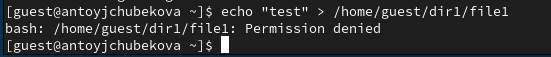

---
## Front matter
lang: ru-RU
title: Лабораторная работа №2
subtitle: Основы информационной безопасности
author:
  - Тойчубекова Асель Нурлановна
institute:
  - Российский университет дружбы народов, Москва, Россия
date: 28 февраль 2025

## i18n babel
babel-lang: russian
babel-otherlangs: english

## Formatting pdf
toc: false
toc-title: Содержание
slide_level: 2
aspectratio: 169
section-titles: true
theme: metropolis
header-includes:
 - \metroset{progressbar=frametitle,sectionpage=progressbar,numbering=fraction}
---

# Информация

## Докладчик

:::::::::::::: {.columns align=center}
::: {.column width="70%"}

  * Тойчубекова Асель Нурлановна
  * Студент 2 курса
  * факультет физико-математических и естественных наук
  * Российский университет дружбы народов
  * [1032235033@rudn.ru](1032235033@rudn.ru)

:::
::: {.column width="30%"}

:::
::::::::::::::

## Цель работы

Целью данной лабораторной работы является получение практических навыков работы в консоли с атрибутами файлов, закрепление теоретических основ дискреционного разграничения доступа в современных системах с открытым кодом на базе ОС Linux.

## Теоретическое введение

В современных операционных системах критически важно обеспечить надежную защиту данных и контроль доступа к ресурсам. Одним из базовых механизмов безопасности в Linux является дискреционное управление доступом (Discretionary Access Control, DAC). Эта модель основана на том, что права доступа к файлам и каталогам определяются их владельцем, который может передавать или ограничивать доступ другим пользователям.

## Теоретическое введение

Основным инструментом DAC в Linux является система разрешений файловой системы (file permissions), которая управляет правами на чтение (read), запись (write) и выполнение (execute) для владельца файла, группы пользователей и всех остальных. Помимо классической схемы прав (rwx), Linux поддерживает специальные атрибуты, такие как SUID, SGID и sticky bit, а также списки расширенных прав доступа (ACLs), которые позволяют более гибко управлять доступом.

# Выполнение лабораторной работы

## Выполнение лабораторной работы

Создаю учетную запись пользователя guest с помощью команды useradd guest. Затем задаю пароль для пользователя guest с командой passwd guest.

## Выполнение лабораторной работы

Войдем в систему от имени пользователя guest. С помощью команды pwd определим директорию, в которой мы находимся. Мы видим, что мы находимся в домашней директории.

## Выполнение лабораторной работы

С помощью команды whoami удостоверимся, что наш пользователь guest. Уточним имя пользователя, его группу, а также группы, куда входит пользователь, командой id. Используя команду groups, узнаем в какие группы входит пользователь. Мы видим, что пользователь guest, входит только в группу guest. Полученная информация совпадает с данными,  выводимыми в приглашении командной строки.

## Выполнение лабораторной работы

С помощью команды cat /etc/passwd | grep guest выведеи информацию об uid пользователя и gid пользователя. Мы видим, что значения uid-1001 и gid -1001 совпадают со значениями вывода команды id.

## Выполнение лабораторной работы

Определим существующие в системе директории командой ls -l /home/. Мы видим, что у нас две директории наших пользователей. 

## Выполнение лабораторной работы

Проверим, какие расширенные атрибуты установлены на поддиректориях, находящихся в директории /home, командой: lsattr /home. Мы видим, что расширенные атрибуты не установлены у нашего пользователя. Для просмотра расширенных атрибутов директории других пользователей, нам было отказано в доступе. 

## Выполнение лабораторной работы

Создадим в домашней директории поддиректорий dir1. С помощью команды ls -l определим какие права доступа были выставлены на директорию dir1. Мы видим, что установлены полные права для владельца и нулевые права для остальных. 

## Выполнение лабораторной работы

С помощью команды lsattr посмотрим расширенные атрибуты директории dir1. 

## Выполнение лабораторной работы

Снимем с директории dir1 все атрибуты командой chmod 000 dir1 и проверим правильность выполнение команды командой ls -l. Мы видим, что все выполнилось правильно и теперь владелец, группа, остальные не имеют никаких прав. 

## Выполнение лабораторной работы

Попытаемся создать в директории файл file1 командой echo "test" > /home/guest/dir1/file1. Мы получили отказ в выполнении операции по созданию файла, так как у владельца нет никаких прав, ни на чтение, ни на выполнение, ни на запись.

## Выполнение лабораторной работы

 Если мы попытаемся перейти в директорию dir1 командой ls -l /home/guest/dir1, там также будет отказано в доспупе, так как у владельца нет права на выполнение.

## Выполнение лабораторной работы

Теперь заполним таблицу «Установленные права и разрешённые действия», выполняя действия от имени владельца директории, определив опытным путем, какие операции разрешены, а какие нет. Если операция разрешена, занесите в таблицу знак «+», если не разрешена, знак «-».

Мы проверим все права rwx владельца для директории и для файла. 

## Выполнение лабораторной работы

Для начала проверим разрешенные операции для директория с правами 100 и файла с правами - 000. Аналогично дальше проверяем для файла с правами - 100,200,300,400,500,600,700.

## Выполнение лабораторной работы

Проверяем разрешенные операции для директории с правами 200 и файла с правами- 000. Аналогично дальше проверяем для файла с правами - 100,200,300,400,500,600,700.

## Выполнение лабораторной работы

Проверяем разрешенные операции для директории с правами 300 и файла с правами- 000. Аналогично дальше проверяем для файла с правами - 100,200,300,400,500,600,700.

## Выполнение лабораторной работы

Проверяем разрешенные операции для директории с правами 400 и файла с правами- 000. Аналогично дальше проверяем для файла с правами - 100,200,300,400,500,600,700. 

## Выполнение лабораторной работы

Проверяем разрешенные операции для директории с правами 500 и файла с правами- 000. Аналогично дальше проверяем для файла с правами - 100,200,300,400,500,600,700.

## Выполнение лабораторной работы

Проверяем разрешенные операции для директории с правами 600 и файла с правами- 000. Аналогично дальше проверяем для файла с правами - 100,200,300,400,500,600,700. 

## Выполнение лабораторной работы

Проверяем разрешенные операции для директории с правами 700 и файла с правами- 000. Аналогично дальше проверяем для файла с правами - 100,200,300,400,500,600,700. 

## Выполнение лабораторной работы

Исходя из этих результатов заполним таблицу "Установленные права и разрешённые действия" 

## Выполнение лабораторной работы

## Выполнение лабораторной работы

## Выполнение лабораторной работы

## Выполнение лабораторной работы

## Выполнение лабораторной работы

Далее на основе заполненной таблицы определим те или иные минимально необходимые права для выполнения операций внутри директории dir1. Опишем это в таблице  "Минимальные права для совершения операций"

## Выполнение лабораторной работы

Для того чтобы узнать минимально необходимые права для создания и удаления поддиректория, проделаем некоторые действия.

## Выполнение лабораторной работы

: Минимальные права для совершения операций {#tbl:minperm}

| Операция               | Минимальные права на директорию | Минимальные права на файл |
|------------------------|--------------------------------|---------------------------|
| Создание файла        | 300                            | 000                       |
| Удаление файла       | 300                            | 000                       |
| Чтение файла         | 100                            | 400                       |
| Запись в файл        | 100                            | 200                       |
| Переименование файла | 300                            | 000                       |
| Создание поддиректории | 300                          | 000                       |
| Удаление поддиректории | 300                          | 000                       |

## Выводы

В ходе выполнения лабораторной работы №2 я получила навыки работы в консоли с атрибутами файлов, закрепление теоретических основ дискреционного разграничения доступа в современных системах с открытым кодом на базе ОС Linux.

## Список литературы{.unnumbered}

- https://esystem.rudn.ru/pluginfile.php/2580978/mod_resource/content/6/002-lab_discret_attr.pdf
