---
## Front matter
title: "Лабораторная работа №2"
subtitle: "Основы информационной безопасности"
author: "Тойчубекова Асель Нурлановна"

## Generic otions
lang: ru-RU
toc-title: "Содержание"

## Bibliography
bibliography: bib/cite.bib
csl: pandoc/csl/gost-r-7-0-5-2008-numeric.csl

## Pdf output format
toc: true # Table of contents
toc-depth: 2
lof: true # List of figures
lot: true # List of tables
fontsize: 12pt
linestretch: 1.5
papersize: a4
documentclass: scrreprt
## I18n polyglossia
polyglossia-lang:
  name: russian
  options:
	- spelling=modern
	- babelshorthands=true
polyglossia-otherlangs:
  name: english
## I18n babel
babel-lang: russian
babel-otherlangs: english
## Fonts
mainfont: IBM Plex Serif
romanfont: IBM Plex Serif
sansfont: IBM Plex Sans
monofont: IBM Plex Mono
mathfont: STIX Two Math
mainfontoptions: Ligatures=Common,Ligatures=TeX,Scale=0.94
romanfontoptions: Ligatures=Common,Ligatures=TeX,Scale=0.94
sansfontoptions: Ligatures=Common,Ligatures=TeX,Scale=MatchLowercase,Scale=0.94
monofontoptions: Scale=MatchLowercase,Scale=0.94,FakeStretch=0.9
mathfontoptions:
## Biblatex
biblatex: true
biblio-style: "gost-numeric"
biblatexoptions:
  - parentracker=true
  - backend=biber
  - hyperref=auto
  - language=auto
  - autolang=other*
  - citestyle=gost-numeric
## Pandoc-crossref LaTeX customization
figureTitle: "Рис."
tableTitle: "Таблица"
listingTitle: "Листинг"
lofTitle: "Список иллюстраций"
lotTitle: "Список таблиц"
lolTitle: "Листинги"
## Misc options
indent: true
header-includes:
  - \usepackage{indentfirst}
  - \usepackage{float} # keep figures where there are in the text
  - \floatplacement{figure}{H} # keep figures where there are in the text
---

# Цель работы

Целью данной лабораторной работы является получение практических навыков работы в консоли с атрибутами файлов, закрепление теоретических основ дискреционного разграничения доступа в современных системах с открытым кодом на базе ОС Linux.

# Задание

- Выполнить лабораторную работу по порядку 
- Заполнить таблицу "Установленные права и разрешённые действия"
- Заполнить таблицу "Минимальные права для совершения операций"

# Теоретическое введение

Дискреционное разграничение прав в Linux: основные атрибуты

В современных операционных системах критически важно обеспечить надежную защиту данных и контроль доступа к ресурсам. Одним из базовых механизмов безопасности в Linux является дискреционное управление доступом (Discretionary Access Control, DAC). Эта модель основана на том, что права доступа к файлам и каталогам определяются их владельцем, который может передавать или ограничивать доступ другим пользователям.

Основным инструментом DAC в Linux является система разрешений файловой системы (file permissions), которая управляет правами на чтение (read), запись (write) и выполнение (execute) для владельца файла, группы пользователей и всех остальных. Помимо классической схемы прав (rwx), Linux поддерживает специальные атрибуты, такие как SUID, SGID и sticky bit, а также списки расширенных прав доступа (ACLs), которые позволяют более гибко управлять доступом.

Хотя дискреционная модель удобна и широко применяется, она имеет уязвимости, связанные с человеческим фактором. Например, владелец файла может случайно предоставить доступ нежелательным пользователям, что создает риск утечки данных. Поэтому в современных системах безопасности Linux дополнительно используются механизмы обязательного контроля доступа (Mandatory Access Control, MAC), такие как SELinux и AppArmor, которые обеспечивают более строгие ограничения на уровне системы.

Таким образом, дискреционное разграничение прав в Linux является фундаментальным механизмом контроля доступа, который обеспечивает гибкость в управлении ресурсами, но требует внимательной настройки и дополнения более строгими методами защиты.

# Выполнение лабораторной работы

Создаю учетную запись пользователя guest с помощью команды useradd guest. Затем задаю пароль для пользователя guest с командой passwd guest.(рис. [-@fig:001]).

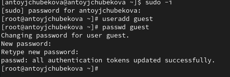{#fig:001 width=70%}

Войдем в систему от имени пользователя guest. С помощью команды pwd определим директорию, в которой мы находимся. Мы видим, что мы находимся в домашней директории. (рис. [-@fig:002]).

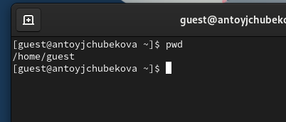{#fig:002 width=70%}

С помощью команды whoami удостоверимся, что наш пользователь guest. Уточним имя пользователя, его группу, а также группы, куда входит пользователь, командой id. Используя команду groups, узнаем в какие группы входит пользователь. Мы видим, что пользователь guest, входит только в группу guest. Полученная информация совпадает с данными,  выводимыми в приглашении командной строки. (рис. [-@fig:003]).

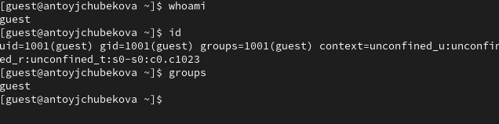{#fig:003 width=70%}

С помощью команды cat /etc/passwd | grep guest выведеи информацию об uid пользователя и gid пользователя. Мы видим, что значения uid-1001 и gid -1001 совпадают со значениями вывода команды id. (рис. [-@fig:004]).

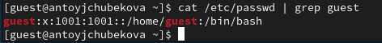{#fig:004 width=70%}

Определим существующие в системе директории командой ls -l /home/. Мы видим, что у нас две директории наших пользователей. (рис. [-@fig:005]).

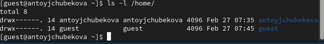{#fig:005 width=70%}

Проверим, какие расширенные атрибуты установлены на поддиректориях, находящихся в директории /home, командой: lsattr /home. Мы видим, что расширенные атрибуты не установлены у нашего пользователя. Для просмотра расширенных атрибутов директории других пользователей, нам было отказано в доступе. (рис. [-@fig:006]).

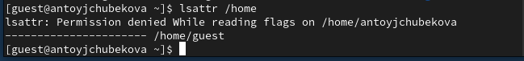{#fig:006 width=70%}

Создадим в домашней директории поддиректорий dir1. С помощью команды ls -l определим какие права доступа были выставлены на директорию dir1. Мы видим, что установлены полные права для владельца и нулевые права для остальных. (рис. [-@fig:007]).

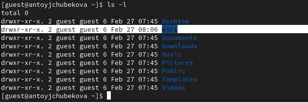{#fig:007 width=70%}

С помощью команды lsattr посмотрим расширенные атрибуты директории dir1.  (рис. [-@fig:008]).

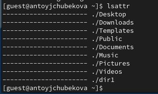{#fig:008 width=70%} 

Снимем с директории dir1 все атрибуты командой chmod 000 dir1 и проверим правильность выполнение команды командой ls -l. Мы видим, что все выполнилось правильно и теперь владелец, группа, остальные не имеют никаких прав. (рис. [-@fig:009]).

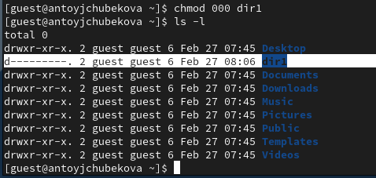{#fig:009 width=70%} 

Попытаемся создать в директории файл file1 командой echo "test" > /home/guest/dir1/file1. Мы получили отказ в выполнении операции по созданию файла, так как у владельца нет никаких прав, ни на чтение, ни на выполнение, ни на запись. (рис. [-@fig:010]). Если мы попытаемся перейти в директорию dir1 командой ls -l /home/guest/dir1, там также будет отказано в доспупе, так как у владельца нет права на выполнение. (рис. [-@fig:011]).

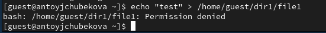{#fig:010 width=70%}

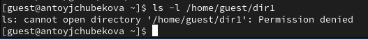{#fig:011 width=70%}

Теперь заполним таблицу «Установленные права и разрешённые действия», выполняя действия от имени владельца директории, определив опытным путем, какие операции разрешены, а какие нет. Если операция разрешена, занесите в таблицу знак «+», если не разрешена, знак «-».

Мы проверим все права rwx владельца для директории и для файла. 

Для начала проверим разрешенные операции для директория с правами 100 и файла с правами - 000. Аналогично дальше проверяем для файла с правами - 100,200,300,400,500,600,700. (рис. [-@fig:012]).

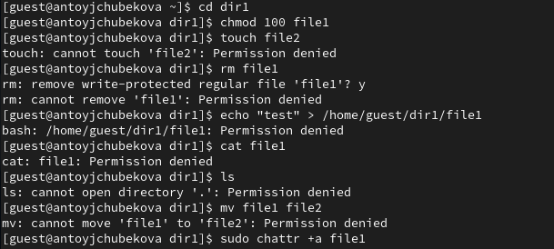{#fig:012 width=70%}

Проверяем разрешенные операции для директории с правами 200 и файла с правами- 000. Аналогично дальше проверяем для файла с правами - 100,200,300,400,500,600,700. (рис. [-@fig:013]).

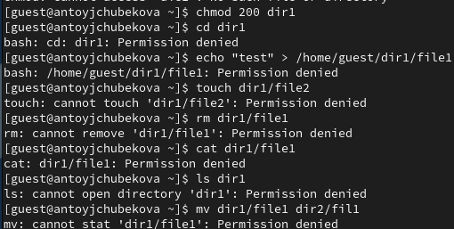{#fig:013 width=70%}

Проверяем разрешенные операции для директории с правами 300 и файла с правами- 000. Аналогично дальше проверяем для файла с правами - 100,200,300,400,500,600,700. (рис. [-@fig:014]).

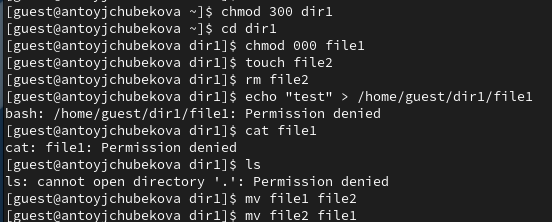{#fig:014 width=70%}

Проверяем разрешенные операции для директории с правами 400 и файла с правами- 000. Аналогично дальше проверяем для файла с правами - 100,200,300,400,500,600,700. (рис. [-@fig:015]).

{#fig:015 width=70%}

Проверяем разрешенные операции для директории с правами 500 и файла с правами- 000. Аналогично дальше проверяем для файла с правами - 100,200,300,400,500,600,700. (рис. [-@fig:016]).

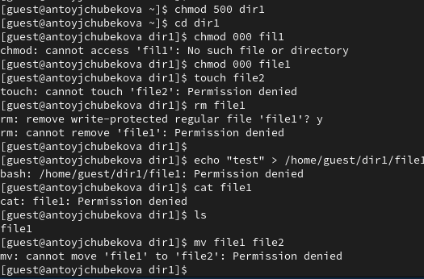{#fig:016 width=70%}

Проверяем разрешенные операции для директории с правами 600 и файла с правами- 000. Аналогично дальше проверяем для файла с правами - 100,200,300,400,500,600,700. (рис. [-@fig:017]).

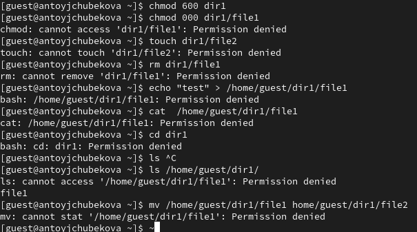{#fig:017 width=70%}

Проверяем разрешенные операции для директории с правами 700 и файла с правами- 000. Аналогично дальше проверяем для файла с правами - 100,200,300,400,500,600,700. (рис. [-@fig:018]).

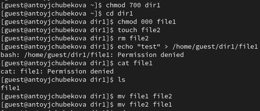{#fig:018 width=70%}

Исходя из этих результатов заполним таблицу "Установленные права и разрешённые действия" [-@tbl:permissions]

: Установленные права и разрешённые действия {#tbl:permissions}

| Права директории | Права файла | Создание файла | Удаление файла | Запись в файл | Чтение файла | Смена директории | Просмотр файлов в директории | Переименование файла | Смена атрибутов файла |
|-----------------|------------|---------------|---------------|--------------|-------------|----------------|----------------------|-----------------|---------------------|
| 000 | 000 | - | - | - | - | - | - | - | - |
| 000 | 100 | - | - | - | - | - | - | - | - |
| 000 | 200 | - | - | - | - | - | - | - | - |
| 000 | 300 | - | - | - | - | - | - | - | - |
| 000 | 400 | - | - | - | - | - | - | - | - |
| 000 | 500 | - | - | - | - | - | - | - | - |
| 000 | 600 | - | - | - | - | - | - | - | - |
| 000 | 700 | - | - | - | - | - | - | - | - |
| 100 | 000 | - | - | - | - | + | - | - | + |
| 100 | 100 | - | - | - | - | + | - | - | + |
| 100 | 200 | - | - | + | - | + | - | - | + |
| 100 | 300 | - | - | + | - | + | - | - | + |
| 100 | 400 | - | - | - | + | + | - | - | + |
| 100 | 500 | - | - | - | + | + | - | - | + |
| 100 | 600 | - | - | + | + | + | - | - | + |
| 100 | 700 | - | - | + | + | + | - | - | + |
| 200 | 000 | - | - | - | - | - | - | - | - |
| 200 | 100 | - | - | - | - | - | - | - | - |
| 200 | 200 | - | - | - | - | - | - | - | - |
| 200 | 300 | - | - | - | - | - | - | - | - |
| 200 | 400 | - | - | - | - | - | - | - | - |
| 200 | 500 | - | - | - | - | - | - | - | - |
| 200 | 600 | - | - | - | - | - | - | - | - |
| 200 | 700 | - | - | - | - | - | - | - | - |
| 300 | 000 | + | + | - | - | + | - | + | + |
| 300 | 100 | + | + | - | - | + | - | + | + |
| 300 | 200 | + | + | + | - | + | - | + | + |
| 300 | 300 | + | + | + | - | + | - | + | + |
| 300 | 400 | + | + | - | + | + | - | + | + |
| 300 | 500 | + | + | - | + | + | - | + | + |
| 300 | 600 | + | + | + | + | + | - | + | + |
| 300 | 700 | + | + | + | + | + | - | + | + |
| 400 | 000 | - | - | - | - | - | + | - | - |
| 400 | 100 | - | - | - | - | - | + | - | - |
| 400 | 200 | - | - | - | - | - | + | - | - |
| 400 | 300 | - | - | - | - | - | + | - | - |
| 400 | 400 | - | - | - | - | - | + | - | - |
| 400 | 500 | - | - | - | - | - | + | - | - |
| 400 | 600 | - | - | - | - | - | + | - | - |
| 400 | 700 | - | - | - | - | - | + | - | - |
| 500 | 000 | - | - | - | - | + | + | - | + |
| 500 | 100 | - | - | - | - | + | + | - | + |
| 500 | 200 | - | - | + | - | + | + | - | + |
| 500 | 300 | - | - | + | - | + | + | - | + |
| 500 | 400 | - | - | - | + | + | + | - | + |
| 500 | 500 | - | - | - | + | + | + | - | + |
| 500 | 600 | - | - | + | + | + | + | - | + |
| 500 | 700 | - | - | + | + | + | + | - | + |
| 600 | 000 | - | - | - | - | - | + | - | - |
| 600 | 100 | - | - | - | - | - | + | - | - |
| 600 | 200 | - | - | - | - | - | + | - | - |
| 600 | 300 | - | - | - | - | - | + | - | - |
| 600 | 400 | - | - | - | - | - | + | - | - |
| 600 | 500 | - | - | - | - | - | + | - | - |
| 600 | 600 | - | - | - | - | - | + | - | - |
| 600 | 700 | - | - | - | - | - | + | - | - |
| 700 | 000 | + | + | - | - | + | + | + | + |
| 700 | 100 | + | + | - | - | + | + | + | + |
| 700 | 200 | + | + | + | - | + | + | + | + |
| 700 | 300 | + | + | + | - | + | + | + | + |
| 700 | 400 | + | + | - | + | + | + | + | + |
| 700 | 500 | + | + | - | + | + | + | + | + |
| 700 | 600 | + | + | + | + | + | + | + | + |
| 700 | 700 | + | + | + | + | + | + | + | + |

Далее на основе заполненной таблицы определим те или иные минимально необходимые права для выполнения операций внутри директории dir1. Опишем это в таблице  "Минимальные права для совершения операций" [-@tbl:minperm]
Для того чтобы узнать минимально необходимые права для создания и удаления поддиректория, проделаем некоторые действия. (рис. [-@fig:019]).

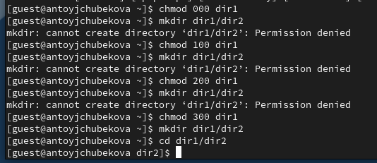{#fig:019 width=70%}

: Минимальные права для совершения операций {#tbl:minperm}

| Операция               | Минимальные права на директорию | Минимальные права на файл |
|------------------------|--------------------------------|---------------------------|
| Создание файла        | 300                            | 000                       |
| Удаление файла       | 300                            | 000                       |
| Чтение файла         | 100                            | 400                       |
| Запись в файл        | 100                            | 200                       |
| Переименование файла | 300                            | 000                       |
| Создание поддиректории | 300                          | 000                       |
| Удаление поддиректории | 300                          | 000                       |

# Выводы

В ходе выполнения лабораторной работы №2 я получила навыки работы в консоли с атрибутами файлов, закрепление теоретических основ дискреционного разграничения доступа в современных системах с открытым кодом на базе ОС Linux.

# Список литературы{.unnumbered}

- https://esystem.rudn.ru/pluginfile.php/2580978/mod_resource/content/6/002-lab_discret_attr.pdf
