---
## Front matter
lang: ru-RU
title: Лабораторная работа №3
subtitle: Основы информационной безопасности
author:
  - Тойчубекова А.Н.
institute:
  - Российский университет дружбы народов, Москва, Россия
date: 15 март 2025

## i18n babel
babel-lang: russian
babel-otherlangs: english

## Formatting pdf
toc: false
toc-title: Содержание
slide_level: 2
aspectratio: 169
section-titles: true
theme: metropolis
header-includes:
 - \metroset{progressbar=frametitle,sectionpage=progressbar,numbering=fraction}
---

# Информация

## Докладчик

:::::::::::::: {.columns align=center}
::: {.column width="70%"}

  * Тойчубекова Асель Нурлановна
  * Студент 2 курса
  * факультет физико-математических и естествественных наук
  * Российский университет дружбы народов
  * [1022235033@pfur.ru](1022235033@pfur.ru)
 

:::
::: {.column width="30%"}

:::
::::::::::::::

## Цель работы

Целью данной лабораторной работы является получение практических навыков работы в консоли с атрибутами файлов для групп пользователей.

# Теоретическое введение

В современных операционных системах критически важно обеспечить надежную защиту данных и контроль доступа к ресурсам. Одним из базовых механизмов безопасности в Linux является дискреционное управление доступом (Discretionary Access Control, DAC).

Основным инструментом DAC в Linux является система разрешений файловой системы (file permissions), которая управляет правами на чтение (read), запись (write) и выполнение (execute) для владельца файла, группы пользователей и всех остальных. 

# Выполнение лабораторной работы

## Выполнение лабораторной работы

На прошлой лабораторной работе мы создали пользователя guest, заходим в систему под пользователем guest. Создаем пользователя guest2 и зададим пароль, командой passwd guest2. Добавим пользователя guest2 в группу guest, командой gpasswd -a guest2 guest.

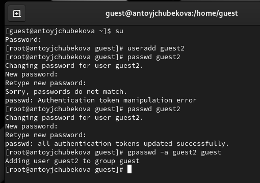

## Выполнение лабораторной работы

Осуществим вход в систему от двух пользователей на двух разных консолях: guest на первой консоли и guest2 на второй консоли, для этого используем команду su. 

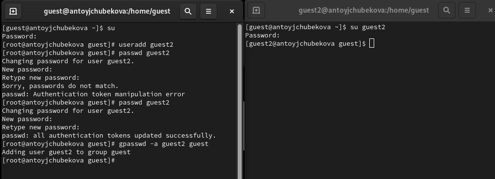

## Выполнение лабораторной работы

Для обоих пользователей командой pwd определим директорию, в которой мы находимся. Мы видим, что вывод совпадает с приглашениями командной строки.

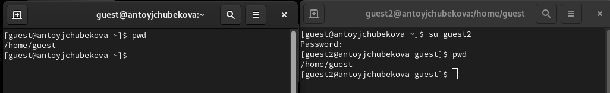

## Выполнение лабораторной работы

Определим командами groups guest и groups guest2, в какие группы входят пользователи guest и guest2. Мы видим, что guest входит в группу guest. А guest2 в группы guest и guest2.

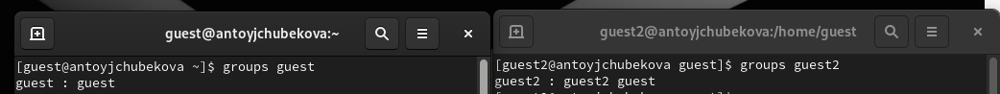

## Выполнение лабораторной работы

Сравним вывод команды groups с выводом команд id -Gn(выводит название групп) и id -G(выводит идентификатор групп). Мы видим, что вывод команды groups и id -Gn совпадают и показывают название групп, в которые входит пользователь. А id -Gn выводит их идентификатор.

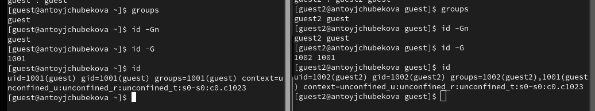

## Выполнение лабораторной работы

Сравним полученную информацию с содержимым файла /etc/group. Мы видим, что и название групп и их идентификаторы совпадают с выводами предыдущих команд.

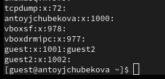

## Выполнение лабораторной работы

От имени пользователя guest2 выполним регистрацию пользователя guest2 в группе guest командой newgrp guest. А также от имени пользователя guest измените права директории /home/guest, разрешив все действия для пользователей группы, используя команду chmod g+rwx /home/guest.

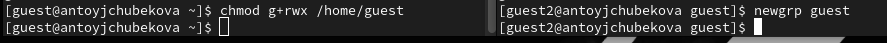

## Выполнение лабораторной работы

От имени пользователя guest снимем с директории /home/guest/dir1 все атрибуты командой chmod 000 dir1 и проверим правильность снятия прав. Мы видим, что все было выполнено корректно. 

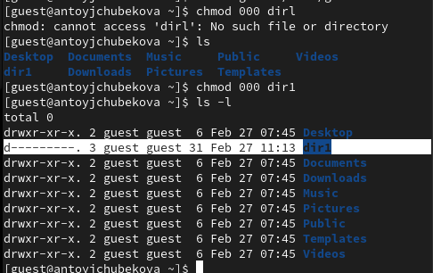

## Выполнение лабораторной работы

Меняя атрибуты у директории dir1 и файла file1 от имени пользователя guest и делая проверку от пользователя guest2, заполним таблицу "Установленные права и разрешённые действия для групп",определив опытным путём, какие операции разрешены, а какие нет.

## Выполнение лабораторной работы

На примере прав доступа dir1(000,010,020,030,040,050,060,070) и прав доступа file1(030) посмотрим какие действия разрешены при разных прав доступа директории и файла. Для начала посмотрим разрешенные действия, если права доступа следующие, dir1=010,file1=030. 

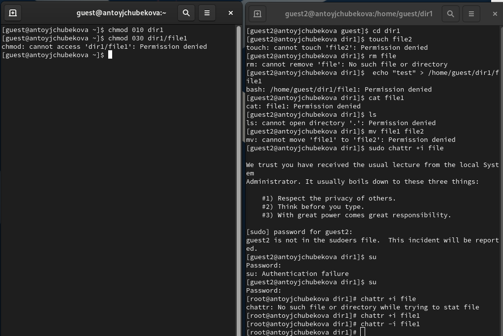

## Выполнение лабораторной работы

Разрешенные действия, если права доступа следующие, dir1=020,file1=030. 

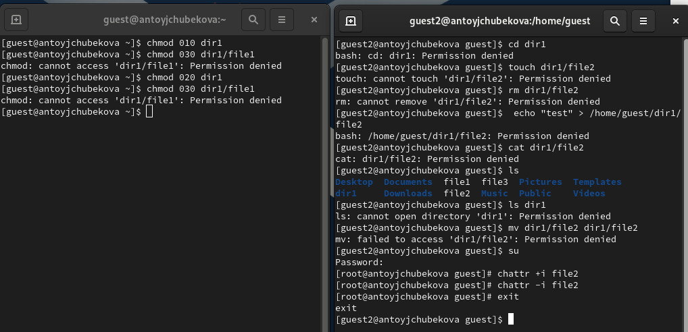

## Выполнение лабораторной работы

Разрешенные действия, если права доступа следующие, dir1=030,file1=030. 

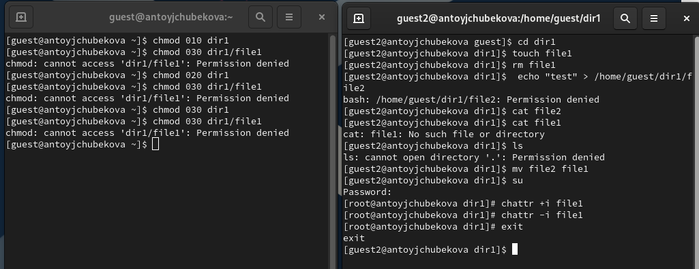

## Выполнение лабораторной работы

Разрешенные действия, если права доступа следующие, dir1=040,file1=030. 

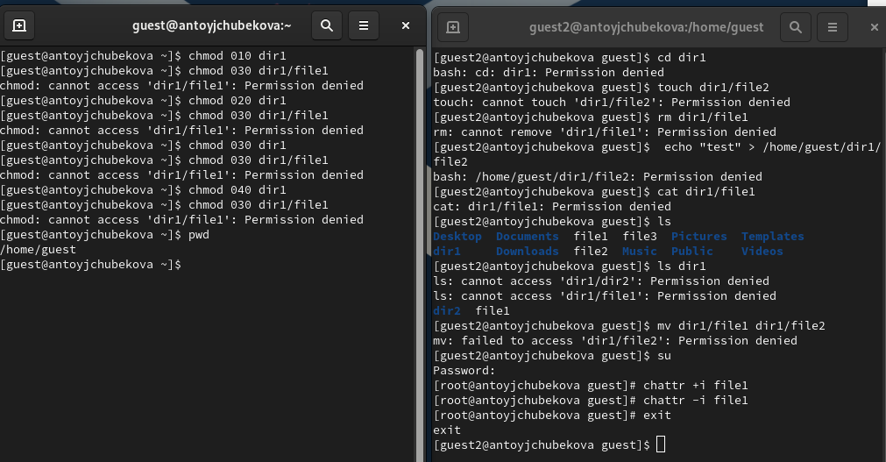

## Выполнение лабораторной работы

Разрешенные действия, если права доступа следующие, dir1=050,file1=030. 

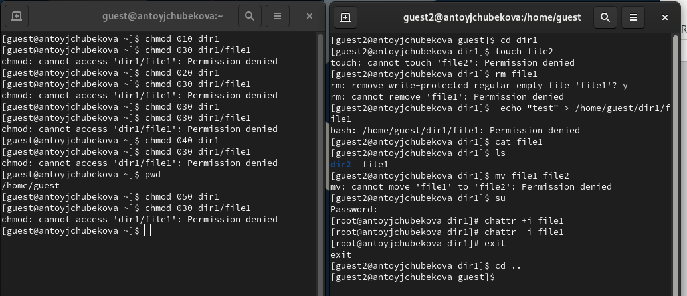

## Выполнение лабораторной работы

Разрешенные действия, если права доступа следующие, dir1=060,file1=030. 

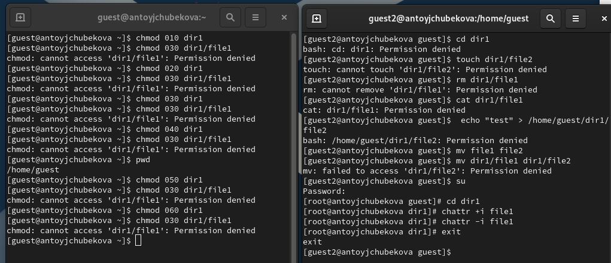

## Выполнение лабораторной работы

Разрешенные действия, если права доступа следующие, dir1=070,file1=030. 

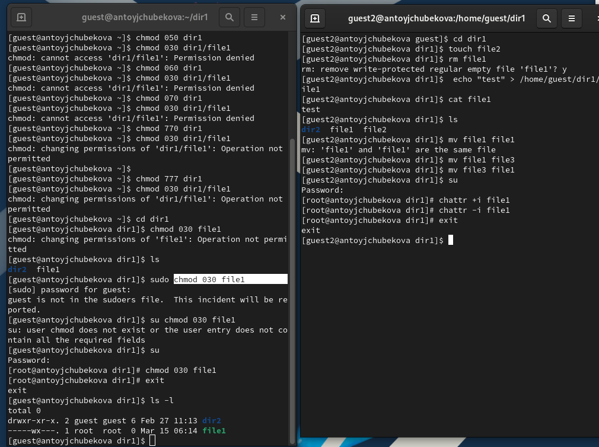

## Выполнение лабораторной работы

Исходя из этих результатов заполним таблицу "Установленные права и разрешённые действия" 

: Установленные права и разрешённые действия {#tbl:permissions}

| Права директории | Права файла | Создание файла | Удаление файла | Запись в файл | Чтение файла | Смена директории | Просмотр файлов в директории | Переименование файла | Смена атрибутов файла |
|------------------|------------|----------------|----------------|---------------|--------------|------------------|-----------------------------|----------------------|----------------------|
| 000 | 000 | - | - | - | - | - | - | - | - |
| 010 | 000 | - | - | - | - | + | - | - | + |
| 020 | 000 | - | - | - | - | - | - | - | - |
| 030 | 000 | + | + | - | - | + | - | + | + |
| 040 | 000 | - | - | - | - | - | + | - | - |

## Выполнение лабораторной работы

| Права директории | Права файла | Создание файла | Удаление файла | Запись в файл | Чтение файла | Смена директории | Просмотр файлов в директории | Переименование файла | Смена атрибутов файла |
|------------------|------------|----------------|----------------|---------------|--------------|------------------|-----------------------------|----------------------|----------------------|
| 050 | 000 | - | - | - | - | + | + | - | + |
| 060 | 000 | - | - | - | - | - | - | - | - |
| 070 | 000 | + | + | - | - | + | + | + | + |
| 000 | 010 | - | - | - | - | - | - | - | - |
| 010 | 010 | - | - | - | - | + | - | - | + |
| 020 | 010 | - | - | - | - | - | - | - | - |
| 030 | 010 | + | + | - | - | + | - | + | + |

## Выполнение лабораторной работы

| Права директории | Права файла | Создание файла | Удаление файла | Запись в файл | Чтение файла | Смена директории | Просмотр файлов в директории | Переименование файла | Смена атрибутов файла |
|------------------|------------|----------------|----------------|---------------|--------------|------------------|-----------------------------|----------------------|----------------------|
| 040 | 010 | - | - | - | - | - | + | - | - |
| 050 | 010 | - | - | - | - | + | + | - | + |
| 060 | 010 | - | - | - | - | - | - | - | - |
| 070 | 010 | + | + | - | - | + | + | + | + |
| 000 | 020 | - | - | - | - | - | - | - | - |
| 010 | 020 | - | - | + | - | + | - | - | + |
| 020 | 020 | - | - | - | - | - | - | - | - |

## Выполнение лабораторной работы

| Права директории | Права файла | Создание файла | Удаление файла | Запись в файл | Чтение файла | Смена директории | Просмотр файлов в директории | Переименование файла | Смена атрибутов файла |
|------------------|------------|----------------|----------------|---------------|--------------|------------------|-----------------------------|----------------------|----------------------|
| 030 | 020 | + | + | + | - | + | - | + | + |
| 040 | 020 | - | - | - | - | - | + | - | - |
| 050 | 020 | - | - | + | - | + | + | - | + |
| 060 | 020 | - | - | - | - | - | + | - | - |
| 070 | 020 | + | + | + | - | + | - | - | - |
| 000 | 030 | - | - | - | - | - | - | - | - |
| 010 | 030 | - | - | + | - | + | - | - | + |

## Выполнение лабораторной работы

| Права директории | Права файла | Создание файла | Удаление файла | Запись в файл | Чтение файла | Смена директории | Просмотр файлов в директории | Переименование файла | Смена атрибутов файла |
|------------------|------------|----------------|----------------|---------------|--------------|------------------|-----------------------------|----------------------|----------------------|
| 020 | 030 | - | - | - | - | - | - | - | - |
| 030 | 030 | + | + | + | - | + | - | + | + |
| 040 | 030 | - | - | - | - | - | + | - | - |
| 050 | 030 | - | - | + | - | + | + | - | + |
| 060 | 030 | - | - | - | - | - | + | - | - |
| 070 | 030 | + | + | + | - | + | + | + | + |
| 000 | 040 | - | - | - | - | - | - | - | - |

## Выполнение лабораторной работы

| Права директории | Права файла | Создание файла | Удаление файла | Запись в файл | Чтение файла | Смена директории | Просмотр файлов в директории | Переименование файла | Смена атрибутов файла |
|------------------|------------|----------------|----------------|---------------|--------------|------------------|-----------------------------|----------------------|----------------------|
| 010 | 040 | - | - | - | + | + | - | - | + |
| 020 | 040 | - | - | - | - | - | - | - | - |
| 030 | 040 | + | + | - | + | + | - | + | + |
| 040 | 040 | - | - | - | - | - | + | - | - |
| 050 | 040 | - | - | - | + | + | + | - | + |
| 060 | 040 | - | - | - | - | - | + | - | - |
| 070 | 040 | + | + | - | + | + | + | + | - |

## Выполнение лабораторной работы

| Права директории | Права файла | Создание файла | Удаление файла | Запись в файл | Чтение файла | Смена директории | Просмотр файлов в директории | Переименование файла | Смена атрибутов файла |
|------------------|------------|----------------|----------------|---------------|--------------|------------------|-----------------------------|----------------------|----------------------|
| 000 | 050 | - | - | - | - | - | - | - | - |
| 010 | 050 | - | - | - | + | + | - | - | + |
| 020 | 050 | - | - | - | - | - | - | - | - |
| 030 | 050 | + | + | - | + | + | - | + | + |
| 040 | 050 | - | - | - | - | - | + | - | - |
| 050 | 050 | - | - | - | + | + | + | - | + |
| 060 | 050 | - | - | - | - | - | + | - | - |

## Выполнение лабораторной работы

| Права директории | Права файла | Создание файла | Удаление файла | Запись в файл | Чтение файла | Смена директории | Просмотр файлов в директории | Переименование файла | Смена атрибутов файла |
|------------------|------------|----------------|----------------|---------------|--------------|------------------|-----------------------------|----------------------|----------------------|
| 070 | 050 | + | + | - | + | + | + | + | + |
| 000 | 060 | - | - | - | - | - | - | - | - |
| 010 | 060 | - | - | + | + | + | - | - | + |
| 020 | 060 | - | - | - | - | - | - | - | - |
| 030 | 060 | + | + | + | + | + | - | + | + |
| 040 | 060 | - | - | - | - | - | + | - | - |
| 050 | 060 | - | - | + | + | + | + | - | + |

## Выполнение лабораторной работы

| Права директории | Права файла | Создание файла | Удаление файла | Запись в файл | Чтение файла | Смена директории | Просмотр файлов в директории | Переименование файла | Смена атрибутов файла |
|------------------|------------|----------------|----------------|---------------|--------------|------------------|-----------------------------|----------------------|----------------------|
| 060 | 060 | - | - | - | - | - | + | - | - |
| 070 | 060 | + | + | + | + | + | + | + | + |
| 000 | 070 | - | - | - | - | - | - | - | - |
| 010 | 070 | - | - | + | + | + | - | - | + |
| 020 | 070 | - | - | - | - | - | - | - | - |
| Права директории | Права файла | Создание файла | Удаление файла | Запись в файл | Чтение файла | Смена директории | Просмотр файлов в директории | Переименование файла | Смена атрибутов файла |
|------------------|------------|----------------|----------------|---------------|--------------|------------------|-----------------------------|----------------------|----------------------|
| 030 | 070 | + | + | + | + | + | - | + | + |
| 040 | 070 | - | - | - | - | - | + | - | - |
| 050 | 070 | - | - | + | + | + | + | - | + |
| 060 | 070 | - | - | - | - | - | + | - | - |
| 070 | 070 | + | + | + | + | + | + | + | + |

## Выполнение лабораторной работы

Далее на основе заполненной таблицы определим те или иные минимально необходимые права для выполнения операций внутри директории dir1. Опишем это в таблице  "Минимальные права для совершения операций"

: Минимальные права для совершения операций {#tbl:minperm}

| Операция                | Минимальные права на директорию | Минимальные права на файл |
|-------------------------|--------------------------------|---------------------------|
| Создание файла         | 030                            | 000                       |
| Удаление файла        | 030                            | 000                       |
| Чтение файла         | 010                            | 040                       |
| Запись в файл         | 010                            | 020                       |
| Переименование файла   | 030                            | 000                       |
| Создание поддиректории | 030                            | 000                       |
| Удаление поддиректории | 030                            | 000                       |

## Выводы

В ходе выполнения лабораторной работы я получила практические навыки работы в консоли с атрибутами файлов для групп пользователей.

## Список литературы

- https://esystem.rudn.ru/course/view.php?id=21200
