---
## Front matter
title: "Лабораторная работа №3"
subtitle: "Основы информационной безопасности"
author: "Тойчубекова Асель Нурлановна"

## Generic otions
lang: ru-RU
toc-title: "Содержание"

## Bibliography
bibliography: bib/cite.bib
csl: pandoc/csl/gost-r-7-0-5-2008-numeric.csl

## Pdf output format
toc: true # Table of contents
toc-depth: 2
lof: true # List of figures
lot: true # List of tables
fontsize: 12pt
linestretch: 1.5
papersize: a4
documentclass: scrreprt
## I18n polyglossia
polyglossia-lang:
  name: russian
  options:
	- spelling=modern
	- babelshorthands=true
polyglossia-otherlangs:
  name: english
## I18n babel
babel-lang: russian
babel-otherlangs: english
## Fonts
mainfont: IBM Plex Serif
romanfont: IBM Plex Serif
sansfont: IBM Plex Sans
monofont: IBM Plex Mono
mathfont: STIX Two Math
mainfontoptions: Ligatures=Common,Ligatures=TeX,Scale=0.94
romanfontoptions: Ligatures=Common,Ligatures=TeX,Scale=0.94
sansfontoptions: Ligatures=Common,Ligatures=TeX,Scale=MatchLowercase,Scale=0.94
monofontoptions: Scale=MatchLowercase,Scale=0.94,FakeStretch=0.9
mathfontoptions:
## Biblatex
biblatex: true
biblio-style: "gost-numeric"
biblatexoptions:
  - parentracker=true
  - backend=biber
  - hyperref=auto
  - language=auto
  - autolang=other*
  - citestyle=gost-numeric
## Pandoc-crossref LaTeX customization
figureTitle: "Рис."
tableTitle: "Таблица"
listingTitle: "Листинг"
lofTitle: "Список иллюстраций"
lotTitle: "Список таблиц"
lolTitle: "Листинги"
## Misc options
indent: true
header-includes:
  - \usepackage{indentfirst}
  - \usepackage{float} # keep figures where there are in the text
  - \floatplacement{figure}{H} # keep figures where there are in the text
---

# Цель работы

Целью данной лабораторной работы является получение практических навыков работы в консоли с атрибутами файлов для групп пользователей.

# Задание

- Выполнить порядок выполнения лабораторной работы
- Заполнить 2 таблицы, проверив действия на права доступа

# Теоретическое введение

Дискреционное разграничение прав в Linux: основные атрибуты

В современных операционных системах критически важно обеспечить надежную защиту данных и контроль доступа к ресурсам. Одним из базовых механизмов безопасности в Linux является дискреционное управление доступом (Discretionary Access Control, DAC). Эта модель основана на том, что права доступа к файлам и каталогам определяются их владельцем, который может передавать или ограничивать доступ другим пользователям.

Основным инструментом DAC в Linux является система разрешений файловой системы (file permissions), которая управляет правами на чтение (read), запись (write) и выполнение (execute) для владельца файла, группы пользователей и всех остальных. Помимо классической схемы прав (rwx), Linux поддерживает специальные атрибуты, такие как SUID, SGID и sticky bit, а также списки расширенных прав доступа (ACLs), которые позволяют более гибко управлять доступом.

Хотя дискреционная модель удобна и широко применяется, она имеет уязвимости, связанные с человеческим фактором. Например, владелец файла может случайно предоставить доступ нежелательным пользователям, что создает риск утечки данных. Поэтому в современных системах безопасности Linux дополнительно используются механизмы обязательного контроля доступа (Mandatory Access Control, MAC), такие как SELinux и AppArmor, которые обеспечивают более строгие ограничения на уровне системы.

Таким образом, дискреционное разграничение прав в Linux является фундаментальным механизмом контроля доступа, который обеспечивает гибкость в управлении ресурсами, но требует внимательной настройки и дополнения более строгими методами защиты.

# Выполнение лабораторной работы

На прошлой лабораторной работе мы создали пользователя guest, заходим в систему под пользователем guest. Создаем пользователя guest2 и зададим пароль, командой passwd guest2. Добавим пользователя guest2 в группу guest, командой gpasswd -a guest2 guest. (рис. [-@fig:001]).

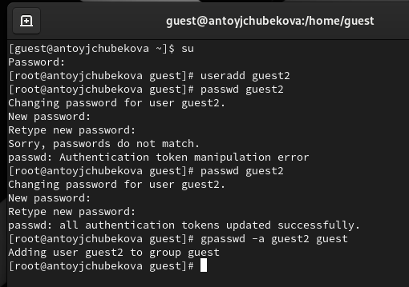{#fig:001 width=70%}

Осуществим вход в систему от двух пользователей на двух разных консолях: guest на первой консоли и guest2 на второй консоли, для этого используем команду su. (рис. [-@fig:002]).

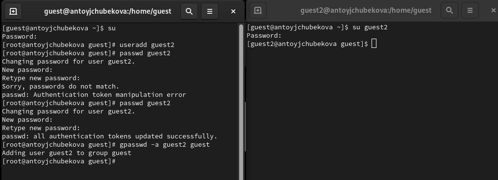{#fig:002 width=70%}

Для обоих пользователей командой pwd определим директорию, в которой мы находимся. Мы видим, что вывод совпадает с приглашениями командной строки. (рис. [-@fig:003]).

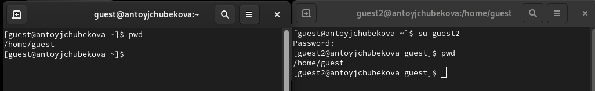{#fig:003 width=70%}

Определим командами groups guest и groups guest2, в какие группы входят пользователи guest и guest2. Мы видим, что guest входит в группу guest. А guest2 в группы guest и guest2. (рис. [-@fig:004]).

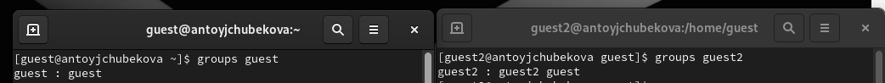{#fig:004 width=70%}

Сравним вывод команды groups с выводом команд id -Gn(выводит название групп) и id -G(выводит идентификатор групп). Мы видим, что вывод команды groups и id -Gn совпадают и показывают название групп, в которые входит пользователь. А id -Gn выводит их идентификатор. (рис. [-@fig:005]).

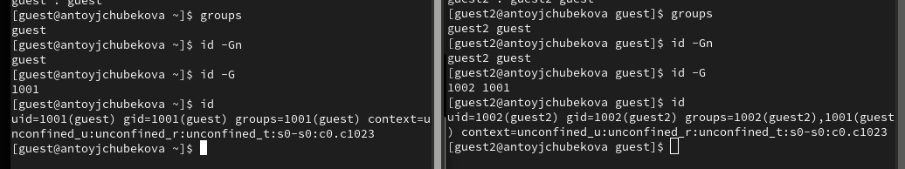{#fig:005 width=70%}

Сравним полученную информацию с содержимым файла /etc/group. Мы видим, что и название групп и их идентификаторы совпадают с выводами предыдущих команд.  (рис. [-@fig:006]).

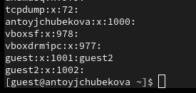{#fig:006 width=70%}

От имени пользователя guest2 выполним регистрацию пользователя guest2 в группе guest командой newgrp guest. А также от имени пользователя guest измените права директории /home/guest, разрешив все действия для пользователей группы, используя команду chmod g+rwx /home/guest.  (рис. [-@fig:007]).

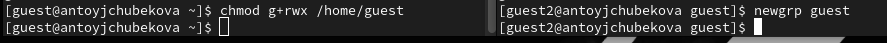{#fig:007 width=70%}

От имени пользователя guest снимем с директории /home/guest/dir1 все атрибуты командой chmod 000 dir1 и проверим правильность снятия прав. Мы видим, что все было выполнено корректно. (рис. [-@fig:008]).

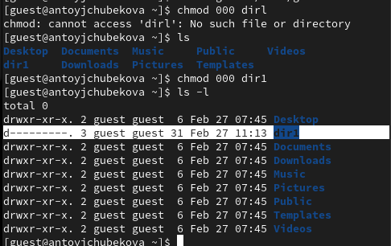{#fig:008 width=70%}

Меняя атрибуты у директории dir1 и файла file1 от имени пользователя guest и делая проверку от пользователя guest2, заполним таблицу "Установленные права и разрешённые действия для групп",определив опытным путём, какие операции разрешены, а какие нет.

На примере прав доступа dir1(000,010,020,030,040,050,060,070) и прав доступа file1(030) посмотрим какие действия разрешены при разных прав доступа директории и файла. Для начала посмотрим разрешенные действия, если права доступа следующие, dir1=010,file1=030. (рис. [-@fig:009]).

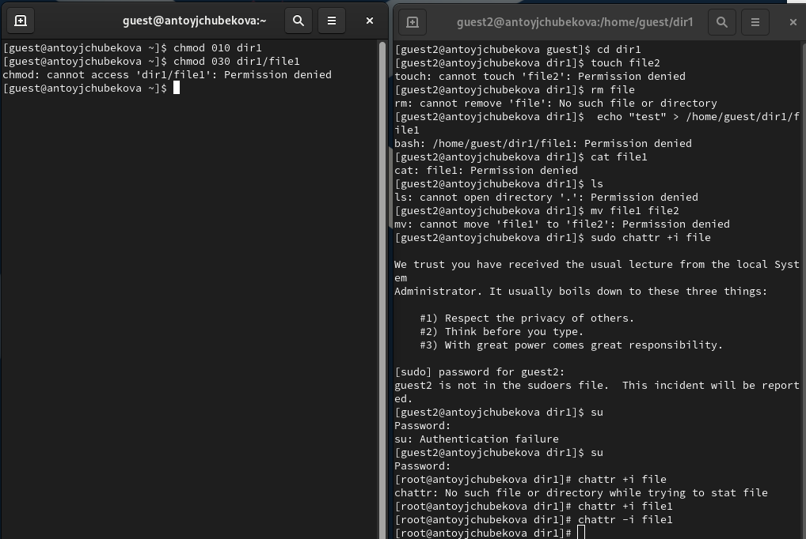{#fig:009 width=70%}

Разрешенные действия, если права доступа следующие, dir1=020,file1=030. (рис. [-@fig:010]).

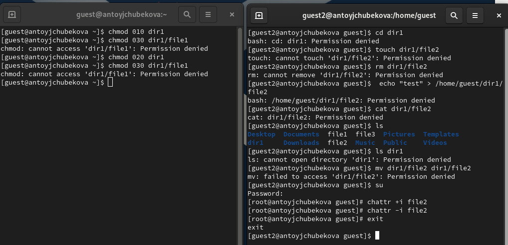{#fig:010 width=70%}

Разрешенные действия, если права доступа следующие, dir1=030,file1=030. (рис. [-@fig:011]).

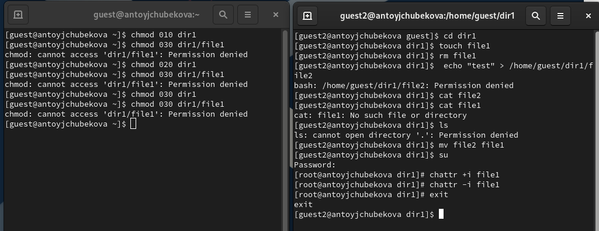{#fig:011 width=70%}

Разрешенные действия, если права доступа следующие, dir1=040,file1=030. (рис. [-@fig:012]).

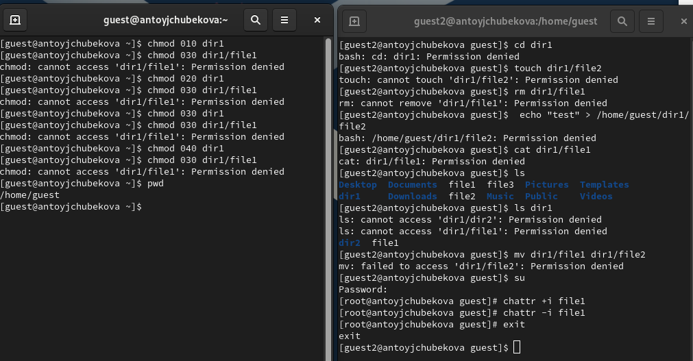{#fig:012 width=70%}

Разрешенные действия, если права доступа следующие, dir1=050,file1=030. (рис. [-@fig:013]).

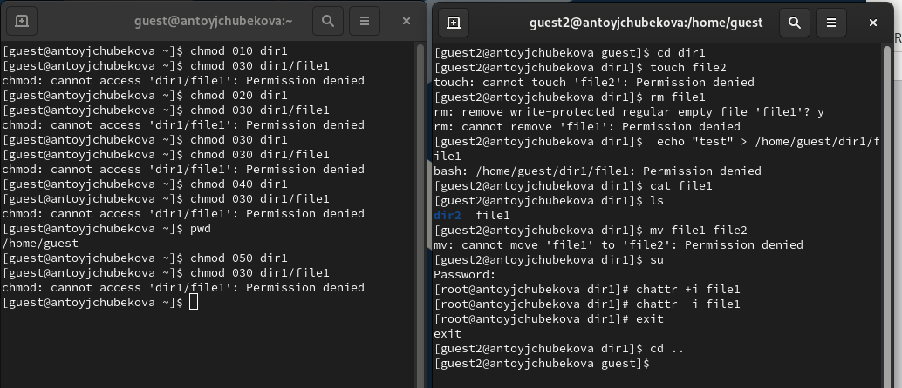{#fig:013 width=70%}

Разрешенные действия, если права доступа следующие, dir1=060,file1=030. (рис. [-@fig:014]).

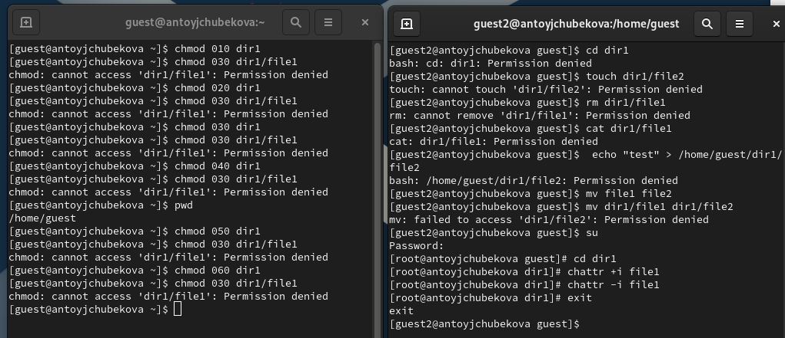{#fig:014 width=70%}

Разрешенные действия, если права доступа следующие, dir1=070,file1=030. (рис. [-@fig:015]).

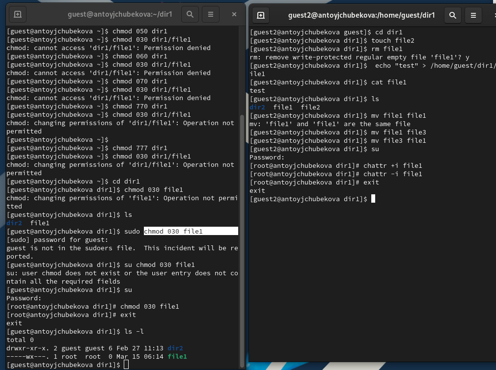{#fig:015 width=70%}

Исходя из этих результатов заполним таблицу "Установленные права и разрешённые действия" [-@tbl:permissions]

: Установленные права и разрешённые действия {#tbl:permissions}

| Права директории | Права файла | Создание файла | Удаление файла | Запись в файл | Чтение файла | Смена директории | Просмотр файлов в директории | Переименование файла | Смена атрибутов файла |
|------------------|------------|----------------|----------------|---------------|--------------|------------------|-----------------------------|----------------------|----------------------|
| 000 | 000 | - | - | - | - | - | - | - | - |
| 010 | 000 | - | - | - | - | + | - | - | + |
| 020 | 000 | - | - | - | - | - | - | - | - |
| 030 | 000 | + | + | - | - | + | - | + | + |
| 040 | 000 | - | - | - | - | - | + | - | - |
| 050 | 000 | - | - | - | - | + | + | - | + |
| 060 | 000 | - | - | - | - | - | - | - | - |
| 070 | 000 | + | + | - | - | + | + | + | + |
| 000 | 010 | - | - | - | - | - | - | - | - |
| 010 | 010 | - | - | - | - | + | - | - | + |
| 020 | 010 | - | - | - | - | - | - | - | - |
| 030 | 010 | + | + | - | - | + | - | + | + |
| 040 | 010 | - | - | - | - | - | + | - | - |
| 050 | 010 | - | - | - | - | + | + | - | + |
| 060 | 010 | - | - | - | - | - | - | - | - |
| 070 | 010 | + | + | - | - | + | + | + | + |
| 000 | 020 | - | - | - | - | - | - | - | - |
| 010 | 020 | - | - | + | - | + | - | - | + |
| 020 | 020 | - | - | - | - | - | - | - | - |
| 030 | 020 | + | + | + | - | + | - | + | + |
| 040 | 020 | - | - | - | - | - | + | - | - |
| 050 | 020 | - | - | + | - | + | + | - | + |
| 060 | 020 | - | - | - | - | - | + | - | - |
| 070 | 020 | + | + | + | - | + | - | - | - |
| 000 | 030 | - | - | - | - | - | - | - | - |
| 010 | 030 | - | - | + | - | + | - | - | + |
| 020 | 030 | - | - | - | - | - | - | - | - |
| 030 | 030 | + | + | + | - | + | - | + | + |
| 040 | 030 | - | - | - | - | - | + | - | - |
| 050 | 030 | - | - | + | - | + | + | - | + |
| 060 | 030 | - | - | - | - | - | + | - | - |
| 070 | 030 | + | + | + | - | + | + | + | + |
| 000 | 040 | - | - | - | - | - | - | - | - |
| 010 | 040 | - | - | - | + | + | - | - | + |
| 020 | 040 | - | - | - | - | - | - | - | - |
| 030 | 040 | + | + | - | + | + | - | + | + |
| 040 | 040 | - | - | - | - | - | + | - | - |
| 050 | 040 | - | - | - | + | + | + | - | + |
| 060 | 040 | - | - | - | - | - | + | - | - |
| 070 | 040 | + | + | - | + | + | + | + | - |
| 000 | 050 | - | - | - | - | - | - | - | - |
| 010 | 050 | - | - | - | + | + | - | - | + |
| 020 | 050 | - | - | - | - | - | - | - | - |
| 030 | 050 | + | + | - | + | + | - | + | + |
| 040 | 050 | - | - | - | - | - | + | - | - |
| 050 | 050 | - | - | - | + | + | + | - | + |
| 060 | 050 | - | - | - | - | - | + | - | - |
| 070 | 050 | + | + | - | + | + | + | + | + |
| 000 | 060 | - | - | - | - | - | - | - | - |
| 010 | 060 | - | - | + | + | + | - | - | + |
| 020 | 060 | - | - | - | - | - | - | - | - |
| 030 | 060 | + | + | + | + | + | - | + | + |
| 040 | 060 | - | - | - | - | - | + | - | - |
| 050 | 060 | - | - | + | + | + | + | - | + |
| 060 | 060 | - | - | - | - | - | + | - | - |
| 070 | 060 | + | + | + | + | + | + | + | + |
| 000 | 070 | - | - | - | - | - | - | - | - |
| 010 | 070 | - | - | + | + | + | - | - | + |
| 020 | 070 | - | - | - | - | - | - | - | - |
| 030 | 070 | + | + | + | + | + | - | + | + |
| 040 | 070 | - | - | - | - | - | + | - | - |
| 050 | 070 | - | - | + | + | + | + | - | + |
| 060 | 070 | - | - | - | - | - | + | - | - |
| 070 | 070 | + | + | + | + | + | + | + | + |

Далее на основе заполненной таблицы определим те или иные минимально необходимые права для выполнения операций внутри директории dir1. Опишем это в таблице  "Минимальные права для совершения операций" [-@tbl:minperm]

: Минимальные права для совершения операций {#tbl:minperm}

| Операция                | Минимальные права на директорию | Минимальные права на файл |
|-------------------------|--------------------------------|---------------------------|
| Создание файла         | 030                            | 000                       |
| Удаление файла        | 030                            | 000                       |
| Чтение файла         | 010                            | 040                       |
| Запись в файл         | 010                            | 020                       |
| Переименование файла   | 030                            | 000                       |
| Создание поддиректории | 030                            | 000                       |
| Удаление поддиректории | 030                            | 000                       |

# Выводы

В ходе выполнения лабораторной работы я получила практические навыки работы в консоли с атрибутами файлов для групп пользователей.

# Список литературы

- https://esystem.rudn.ru/course/view.php?id=21200
