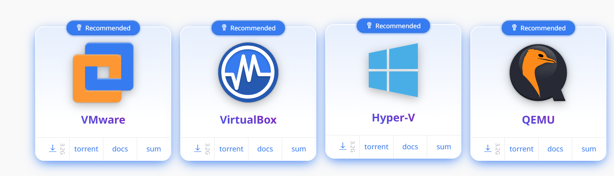
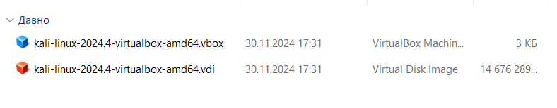
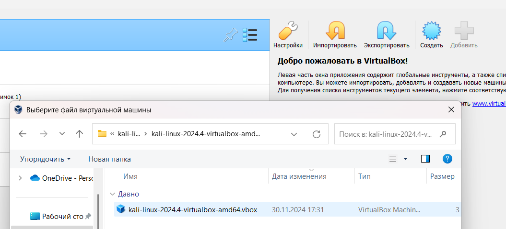
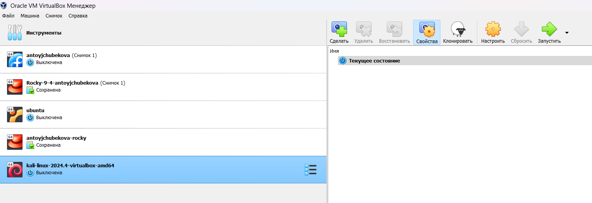
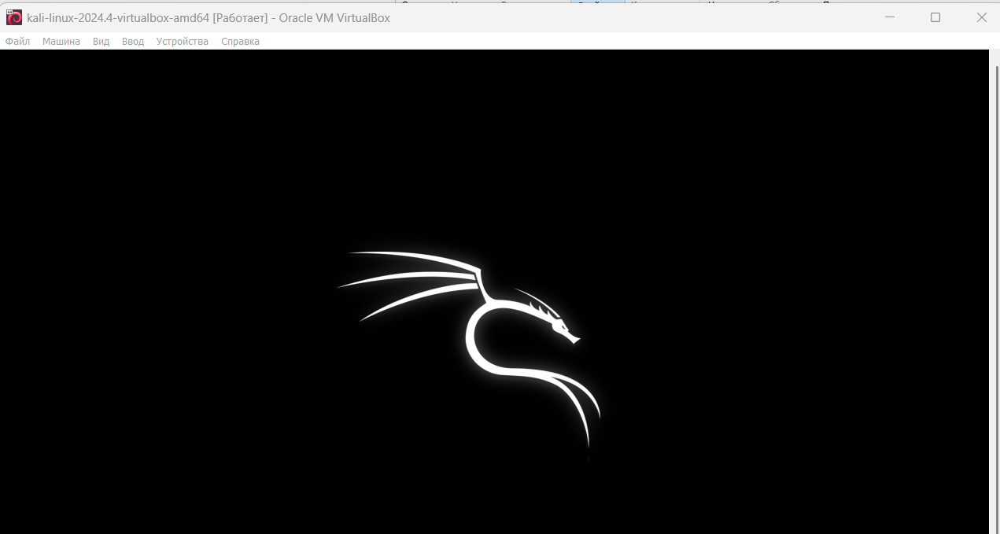
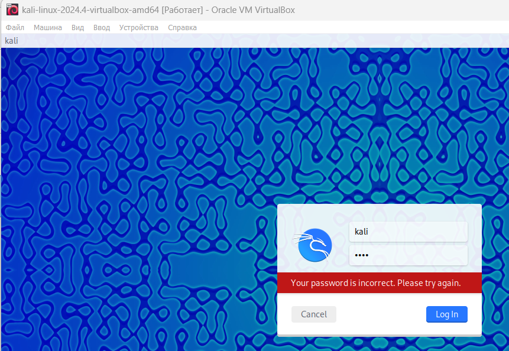
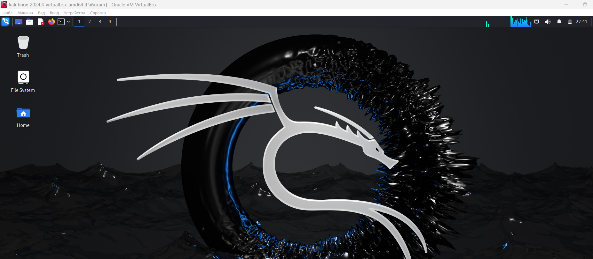
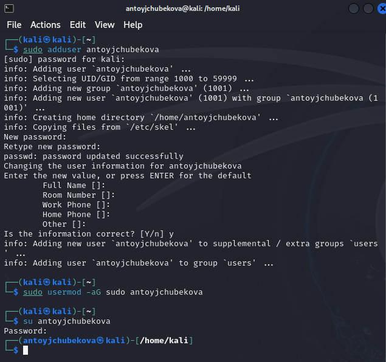

---
## Front matter
lang: ru-RU
title: Индивидуальный проект Этап 1
subtitle: Основы информационной безопасности
author:
  - Тойчубекова Асель Нурлановна
institute:
  - Российский университет дружбы народов, Москва, Россия
date: 07 март 2025

## i18n babel
babel-lang: russian
babel-otherlangs: english

## Formatting pdf
toc: false
toc-title: Содержание
slide_level: 2
aspectratio: 169
section-titles: true
theme: metropolis
header-includes:
 - \metroset{progressbar=frametitle,sectionpage=progressbar,numbering=fraction}
---

# Информация

## Докладчик

:::::::::::::: {.columns align=center}
::: {.column width="70%"}

  * Тойчубекова Асель Нурлановна
  * Студент 2 курса
  * факультет физико-математических и естественных наук
  * Российский университет дружбы народов
  * [103223503@pfur.ru](103223503@pfur.ru)

:::
::: {.column width="30%"}

:::
::::::::::::::

## Цель работы

Целью индивидуального проекта является научиться основным способностям тестирования веб приложений

## Теоретическое введение

Kali Linux — это операционная система, основанная на Debian и ориентированная на тестирование безопасности и проникновение в сети. 

Kali Linux поставляется с более чем 600 предустановленными инструментами для различных видов тестирования, таких как сканирование сети, взлом паролей, эксплуатация уязвимостей, обратный инжиниринг и многое другое. Среди самых популярных инструментов — Nmap (сканер безопасности), Metasploit (платформа для эксплуатации уязвимостей), Aircrack-ng (для взлома Wi-Fi), Wireshark (для анализа трафика) и другие.
 
# Выполнение лабораторной работы

## Выполнение лабораторной работы

Скачаем Kali Linux с официального сайта https://www.kali.org/. Мы можем скачать как полноценный установочный образ в формате .iso(Installer Images), также можно скачать готовые виртуальные машиныв в форматах .ova, .vbox (VirtualBox, VMware, Hyper-V)

## Выполнение лабораторной работы

Выбрав тип виртуализации VirtualBo я скачала готовые виртуальные машины в форматах .ova, .vbox. 

## Выполнение лабораторной работы

Далее открываю VitualBox нажимаю кнопку добавить и добавляю скаченную виртуальную машину Kali Linux.

## Выполнение лабораторной работы

Мы видим, что виртуальная машина успешно была добавлена. Настройки установлены по умолчанию, оставляем их без изменения. 

## Выполнение лабораторной работы

Далее запускаем Kali Linux, нажав кнопку Запустить.

## Выполнение лабораторной работы

Изначально в качестве логина и пароля вводим kali.

## Выполнение лабораторной работы

Мы успешно зашли в систему. 

## Выполнение лабораторной работы

Далее добавляю свою учетную запись, задаю пароль, также добавляю себя в группу суперпользователя.

## Выводы

В ходе выполнения первого этапа индивидуального проекта я установила дистрибутив Kali Linux в VirtualBox.

## Список литературы

- https://esystem.rudn.ru/mod/page/view.php?id=1220336p
