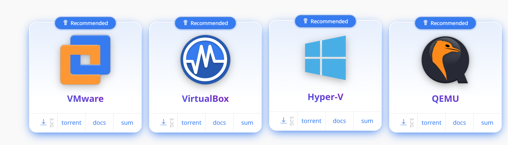
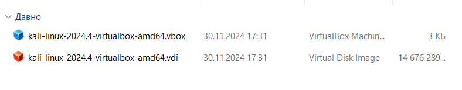
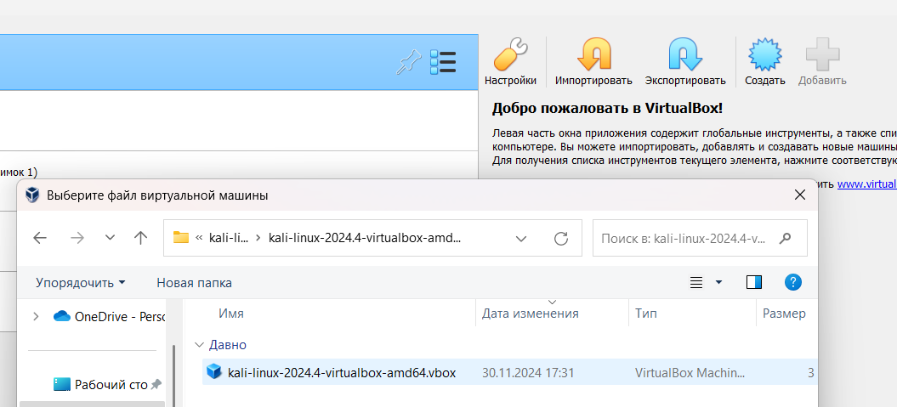
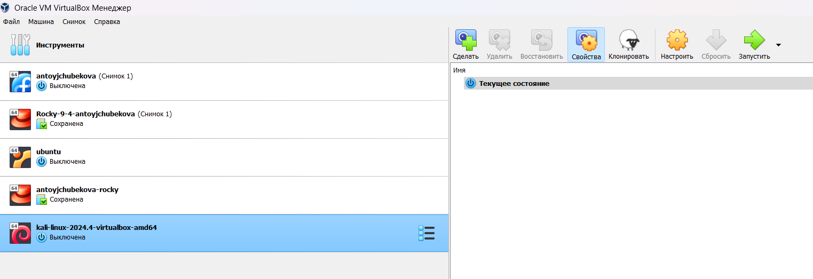
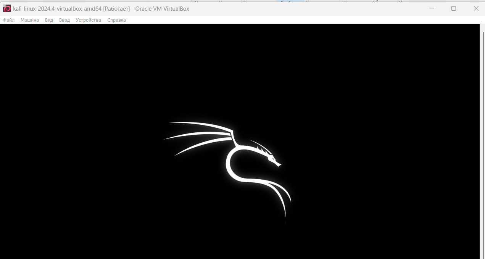
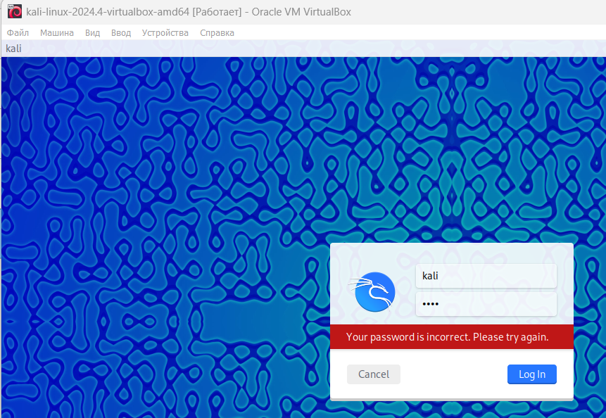
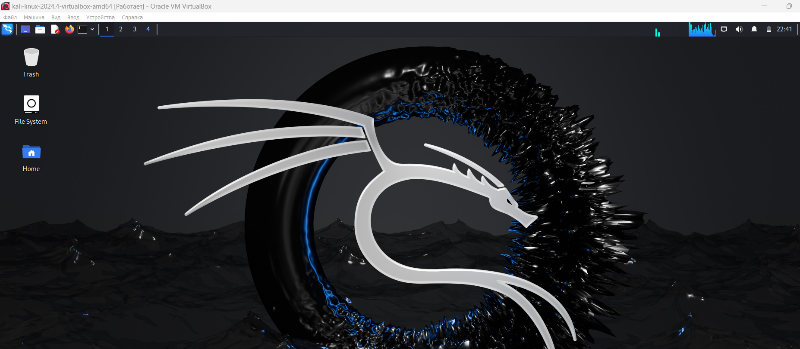
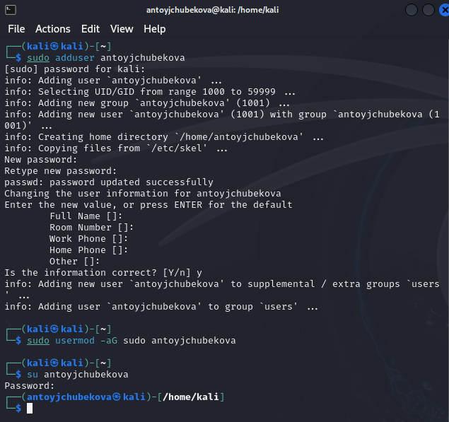

---
## Front matter
title: "Индивидуальный проект. Этап 1"
subtitle: "Основы информационной безопасности"
author: "Тойчубекова Асель Нурлановна"

## Generic otions
lang: ru-RU
toc-title: "Содержание"

## Bibliography
bibliography: bib/cite.bib
csl: pandoc/csl/gost-r-7-0-5-2008-numeric.csl

## Pdf output format
toc: true # Table of contents
toc-depth: 2
lof: true # List of figures
lot: true # List of tables
fontsize: 12pt
linestretch: 1.5
papersize: a4
documentclass: scrreprt
## I18n polyglossia
polyglossia-lang:
  name: russian
  options:
	- spelling=modern
	- babelshorthands=true
polyglossia-otherlangs:
  name: english
## I18n babel
babel-lang: russian
babel-otherlangs: english
## Fonts
mainfont: IBM Plex Serif
romanfont: IBM Plex Serif
sansfont: IBM Plex Sans
monofont: IBM Plex Mono
mathfont: STIX Two Math
mainfontoptions: Ligatures=Common,Ligatures=TeX,Scale=0.94
romanfontoptions: Ligatures=Common,Ligatures=TeX,Scale=0.94
sansfontoptions: Ligatures=Common,Ligatures=TeX,Scale=MatchLowercase,Scale=0.94
monofontoptions: Scale=MatchLowercase,Scale=0.94,FakeStretch=0.9
mathfontoptions:
## Biblatex
biblatex: true
biblio-style: "gost-numeric"
biblatexoptions:
  - parentracker=true
  - backend=biber
  - hyperref=auto
  - language=auto
  - autolang=other*
  - citestyle=gost-numeric
## Pandoc-crossref LaTeX customization
figureTitle: "Рис."
tableTitle: "Таблица"
listingTitle: "Листинг"
lofTitle: "Список иллюстраций"
lotTitle: "Список таблиц"
lolTitle: "Листинги"
## Misc options
indent: true
header-includes:
  - \usepackage{indentfirst}
  - \usepackage{float} # keep figures where there are in the text
  - \floatplacement{figure}{H} # keep figures where there are in the text
---

# Цель работы

Целью индивидуального проекта является научиться основным способностям тестирования веб приложений

# Задание

- Установка Kali Linux
- Найти максимальное количество уязвимостей различных типов.
- Реализовать успешную эксплуатацию каждой уязвимости.

# Теоретическое введение

Kali Linux — это операционная система, основанная на Debian и ориентированная на тестирование безопасности и проникновение в сети. Она широко используется профессиональными хакерами, исследователями безопасности и специалистами по защите данных для проведения тестов на уязвимости и анализа системы.

Kali Linux поставляется с более чем 600 предустановленными инструментами для различных видов тестирования, таких как сканирование сети, взлом паролей, эксплуатация уязвимостей, обратный инжиниринг и многое другое. Среди самых популярных инструментов — Nmap (сканер безопасности), Metasploit (платформа для эксплуатации уязвимостей), Aircrack-ng (для взлома Wi-Fi), Wireshark (для анализа трафика) и другие.

Kali поддерживает работу как на обычных ПК, так и на виртуальных машинах, а также позволяет устанавливать систему на USB-накопитель для использования в режиме "Live" без установки на жесткий диск.

Кроме того, Kali Linux активно поддерживается и обновляется сообществом, предоставляя пользователям доступ к последним разработкам в области кибербезопасности.
 
# Выполнение лабораторной работы

Скачаем Kali Linux с официального сайта https://www.kali.org/. Мы можем скачать как полноценный установочный образ в формате .iso(Installer Images), также можно скачать готовые виртуальные машиныв в форматах .ova, .vbox (VirtualBox, VMware, Hyper-V), эти образы уже включают все необходимые компоненты для работы системы, операционная система, драйверы, и настройка виртуальной машины, что позволяет моментально запуустить Kali Linux. (рис. [-@fig:001]).

{#fig:001 width=70%}

Выбрав тип виртуализации VirtualBo я скачала готовые виртуальные машины в форматах .ova, .vbox. (рис. [-@fig:002]).

{#fig:002 width=70%}

Далее открываю VitualBox нажимаю кнопку добавить и добавляю скаченную виртуальную машину Kali Linux. (рис. [-@fig:003]).

{#fig:003 width=70%}

Мы видим, что виртуальная машина успешно была добавлена. Настройки установлены по умолчанию, оставляем их без изменения. (рис. [-@fig:004]).

{#fig:004 width=70%}

Далее запускаем Kali Linux, нажав кнопку Запустить. (рис. [-@fig:005]).

{#fig:005 width=70%}

Изначально в качестве логина и пароля вводим kali. (рис. [-@fig:006]).

{#fig:006 width=70%}

Мы успешно зашли в систему. (рис. [-@fig:007]).

{#fig:007 width=70%}

Далее добавляю свою учетную запись, задаю пароль, также добавляю себя в группу суперпользователя. (рис. [-@fig:008]).

{#fig:008 width=70%}

# Выводы

В ходе выполнения первого этапа индивидуального проекта я установила дистрибутив Kali Linux в VirtualBox.

# Список литературы{.unnumbered}

- https://esystem.rudn.ru/mod/page/view.php?id=1220336p
