---
## Front matter
lang: ru-RU
title: Индивидуальный проект. Этап 2
subtitle: Основы информационной безопасности
author:
  - Тойчубекова А.Н.
institute:
  - Российский университет дружбы народов, Москва, Россия
date: 22 март 2025

## i18n babel
babel-lang: russian
babel-otherlangs: english

## Formatting pdf
toc: false
toc-title: Содержание
slide_level: 2
aspectratio: 169
section-titles: true
theme: metropolis
header-includes:
 - \metroset{progressbar=frametitle,sectionpage=progressbar,numbering=fraction}
---

# Информация

## Докладчик

:::::::::::::: {.columns align=center}
::: {.column width="70%"}

  * Тойчубекова Асель Нурлановна
  * студент 2 курса
  * факультет физико мвтемвтических и естественных наук
  * Российский университет дружбы народов
  * [103223035033@pfur.ru](103223035033@pfur.ru)

:::
::: {.column width="30%"}

:::
::::::::::::::

## Цель работы

Целью индивидуального проекта является научиться основным способам тестирования веб приложений.

## Теоретическое введение

Damn Vulnerable Web Application (DVWA) — это учебное веб-приложение, специально разработанное для тестирования уязвимостей и отработки навыков в области веб-безопасности.

DVWA включает различные уровни сложности атак, такие как SQL-инъекции, межсайтовый скриптинг (XSS), межсайтовая подделка запросов (CSRF) и другие распространённые уязвимости. Пользователи могут переключать уровень сложности (низкий, средний, высокий) для изучения различных способов атак и методов защиты от них.

# Выполнение индивидуального проекта

## Выполнение индивидуального проекта

Для начала клонируем репозиторий DVWA из гитхаба, ссылка которой было указано в туисе. Далее перенесем DVWA в /var/www/html, где распологаются все сайты. С помощью команды ls мы видим, что все успешно выполнено.

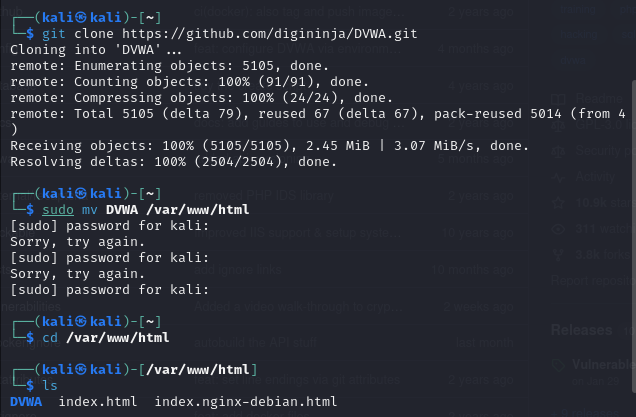

## Выполнение индивидуального проекта

Устанавливаем все права доступа для DVWA. Далее перейдем в конфигурационный файл DVWA и скопируем файл config.inc.php.dist в новый файл config.inc.php. 

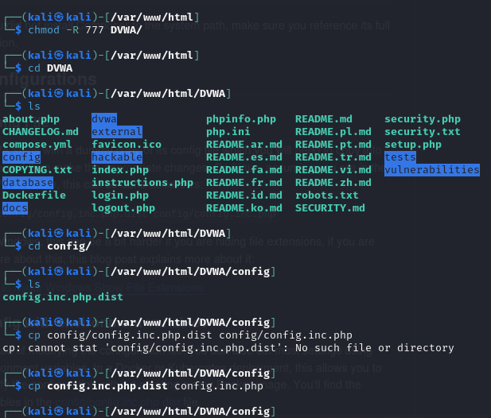

## Выполнение индивидуального проекта

Далее открываем конфигурационный файл для редактирования, устанавливаем имя пользователя и пароль, сохраняем и закрываем.

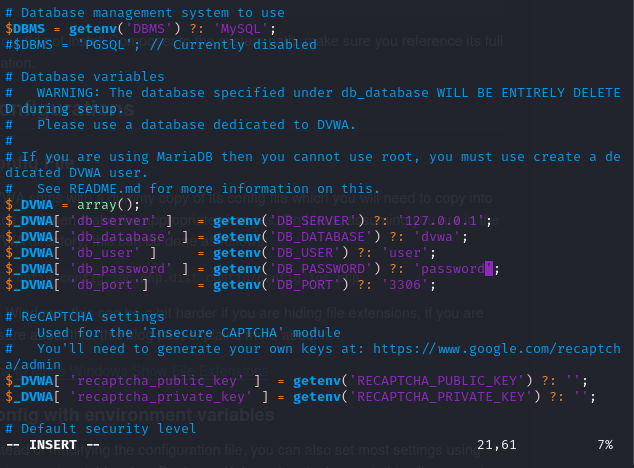

## Выполнение индивидуального проекта

Затем перейдя в режим суперпользователя настроим базу данных MariaDB для DVWA. Запускаем mysql. 

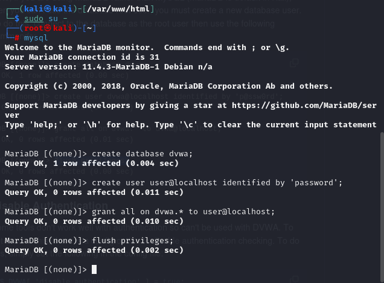

## Выполнение индивидуального проекта

Попробуем подключиться к базе данных с ранее созданным пользователем. Мы видим, что вывелось сообщение Database changed, что подтверждает успешное подключение. 

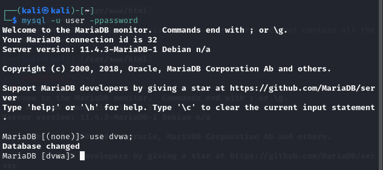

## Выполнение индивидуального проекта

Под именем суперпользователя перейдем в директорию /etc/php/8.4/apache2 и откроем файл php.ini для редактирования.

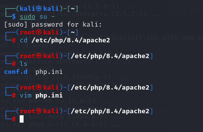

## Выполнение индивидуального проекта

В конфигурационном файле php ставим значения allow_ url_ fopen и allow_ url _include на On, это позволит php обрабатывать удаленные файлы по url и использовать include, require (позволяют подключать один php файл в другой) для загрузки кода по url. 

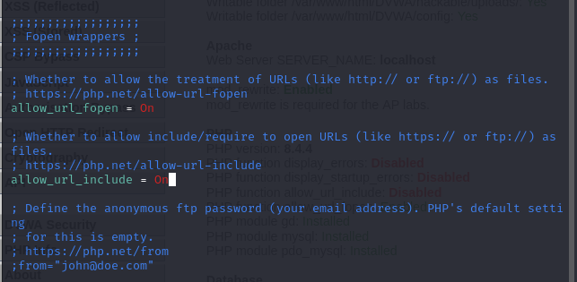

## Выполнение индивидуального проекта

Далее установим значения display_ errors и display_ startup_ errors на значения On, это позволит ошибкам php отображаться на экране, также при запуске. 

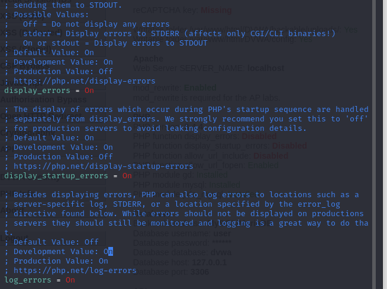

## Выполнение индивидуального проекта

Установим php -gd, доля работы с графикой. 

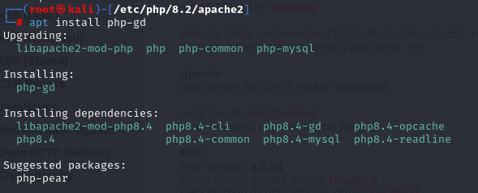

## Выполнение индивидуального проекта

Добавляем в apache модуль rewrite, который позволяет apache перенаправлять url-адреса.

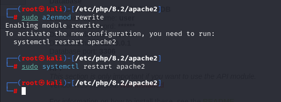

## Выполнение индивидуального проекта

Запускаем apache2 и в посковой системе введем localhost/setup. Мы видим, что нам вывелась старница DVWA для настройки базы данных.

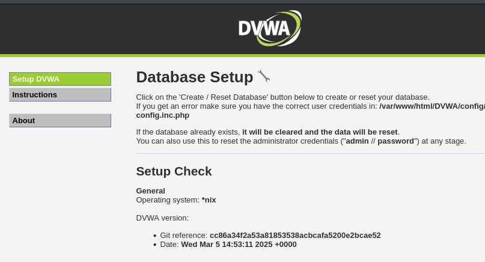

## Выполнение индивидуального проекта

Немного опустившись вниз по странице найдем кнопку сreate database нажмем на нее, чтобы начать работу с базой данных, у нас спросят ввести имя и пароль, введем  admin, password.

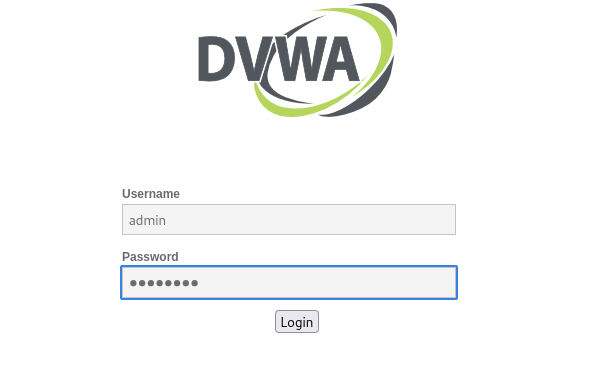

## Выполнение индивидуального проекта

Мы видим, что мы успешно вошли в DVWA все наши настройки корректно установлены.  

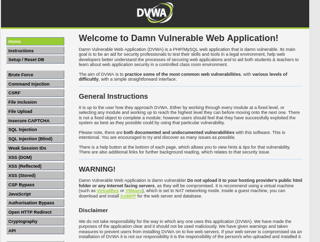

## Выводы

В ходе выполнения данного этапа индивидуального проекта я научилась устанавливать DVWA на KAli Linux.
