---
## Front matter
title: "Индивидуальный проект. Этап 2"
subtitle: "Основы информационной безопасности"
author: "Тойчубекова Асель Нурлановна"

## Generic otions
lang: ru-RU
toc-title: "Содержание"

## Bibliography
bibliography: bib/cite.bib
csl: pandoc/csl/gost-r-7-0-5-2008-numeric.csl

## Pdf output format
toc: true # Table of contents
toc-depth: 2
lof: true # List of figures
lot: true # List of tables
fontsize: 12pt
linestretch: 1.5
papersize: a4
documentclass: scrreprt
## I18n polyglossia
polyglossia-lang:
  name: russian
  options:
	- spelling=modern
	- babelshorthands=true
polyglossia-otherlangs:
  name: english
## I18n babel
babel-lang: russian
babel-otherlangs: english
## Fonts
mainfont: IBM Plex Serif
romanfont: IBM Plex Serif
sansfont: IBM Plex Sans
monofont: IBM Plex Mono
mathfont: STIX Two Math
mainfontoptions: Ligatures=Common,Ligatures=TeX,Scale=0.94
romanfontoptions: Ligatures=Common,Ligatures=TeX,Scale=0.94
sansfontoptions: Ligatures=Common,Ligatures=TeX,Scale=MatchLowercase,Scale=0.94
monofontoptions: Scale=MatchLowercase,Scale=0.94,FakeStretch=0.9
mathfontoptions:
## Biblatex
biblatex: true
biblio-style: "gost-numeric"
biblatexoptions:
  - parentracker=true
  - backend=biber
  - hyperref=auto
  - language=auto
  - autolang=other*
  - citestyle=gost-numeric
## Pandoc-crossref LaTeX customization
figureTitle: "Рис."
tableTitle: "Таблица"
listingTitle: "Листинг"
lofTitle: "Список иллюстраций"
lotTitle: "Список таблиц"
lolTitle: "Листинги"
## Misc options
indent: true
header-includes:
  - \usepackage{indentfirst}
  - \usepackage{float} # keep figures where there are in the text
  - \floatplacement{figure}{H} # keep figures where there are in the text
---

# Цель работы

Целью индивидуального проекта является научиться основным способам тестирования веб приложений.

# Задание

- Установка DVWA в гостевую систему к Kali Linux

# Теоретическое введение

Damn Vulnerable Web Application (DVWA) — это учебное веб-приложение, специально разработанное для тестирования уязвимостей и отработки навыков в области веб-безопасности. Оно представляет собой платформу с преднамеренно уязвимым кодом, позволяя исследователям и разработчикам анализировать и исправлять типичные ошибки, встречающиеся в веб-приложениях.

DVWA включает различные уровни сложности атак, такие как SQL-инъекции, межсайтовый скриптинг (XSS), межсайтовая подделка запросов (CSRF) и другие распространённые уязвимости. Пользователи могут переключать уровень сложности (низкий, средний, высокий) для изучения различных способов атак и методов защиты от них.

# Выполнение индивидуального проекта

Для начала клонируем репозиторий DVWA из гитхаба, ссылка которой было указано в туисе. Далее перенесем DVWA в /var/www/html, где распологаются все сайты. С помощью команды ls мы видим, что все успешно выполнено. (рис. [-@fig:001]).

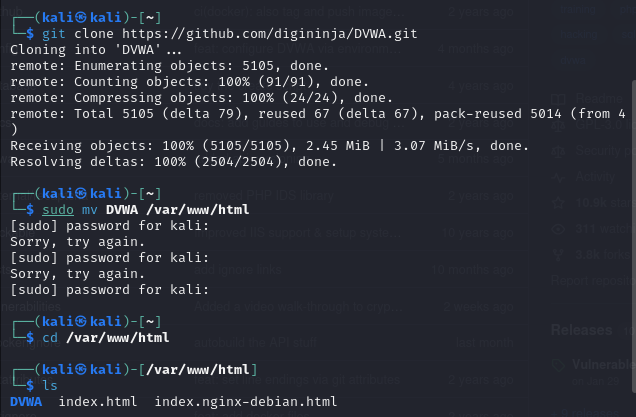{#fig:001 width=70%}

Устанавливаем все права доступа для DVWA. Далее перейдем в конфигурационный файл DVWA и скопируем файл config.inc.php.dist в новый файл config.inc.php. (рис. [-@fig:002]).

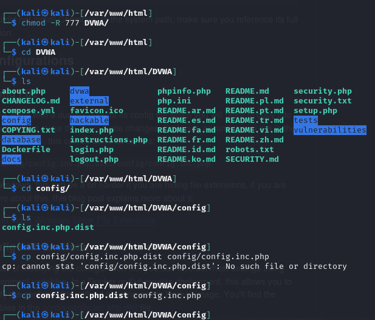{#fig:002 width=70%}

Далее открываем конфигурационный файл для редактирования, устанавливаем имя пользователя и пароль, сохраняем и закрываем. (рис. [-@fig:003]).

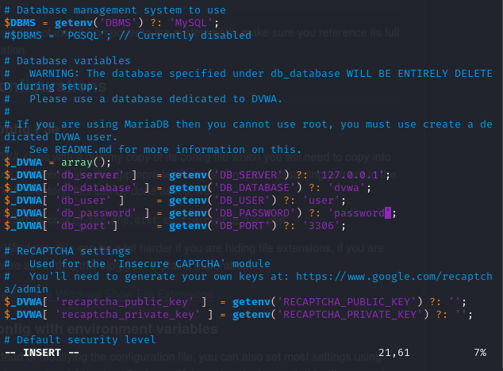{#fig:003 width=70%}

Затем перейдя в режим суперпользователя настроим базу данных MariaDB для DVWA. Запускаем mysql, создаем базу данных, создаем нового пользователя с паролем, который сможет подключиться только с локального компьютера и имеет все права доступа к базе данных. (рис. [-@fig:004]).

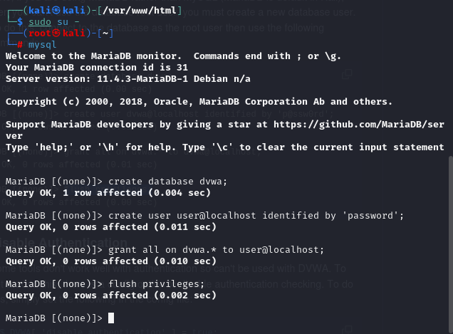{#fig:004 width=70%}

Попробуем подключиться к базе данных с ранее созданным пользователем. Мы видим, что вывелось сообщение Database changed, что подтверждает успешное подключение. (рис. [-@fig:005]).

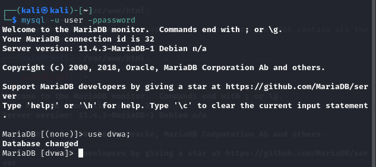{#fig:005 width=70%}

Под именем суперпользователя перейдем в директорию /etc/php/8.4/apache2 и откроем файл php.ini для редактирования. (рис. [-@fig:006]).

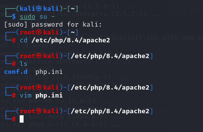{#fig:006 width=70%}

В конфигурационном файле php ставим значения allow_ url_ fopen и allow_ url _include на On, это позволит php обрабатывать удаленные файлы по url и использовать include, require (позволяют подключать один php файл в другой) для загрузки кода по url. (рис. [-@fig:007]).

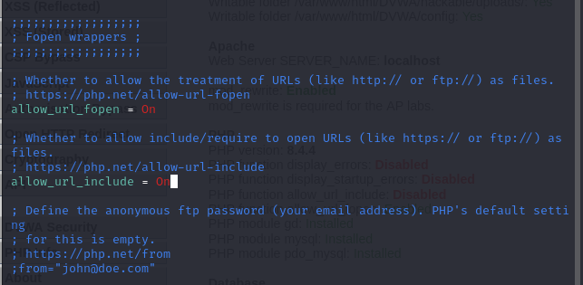{#fig:007 width=70%}

Далее установим значения display_ errors и display_ startup_ errors на значения On, это позволит ошибкам php отображаться на экране, также при запуске. (рис. [-@fig:008]).

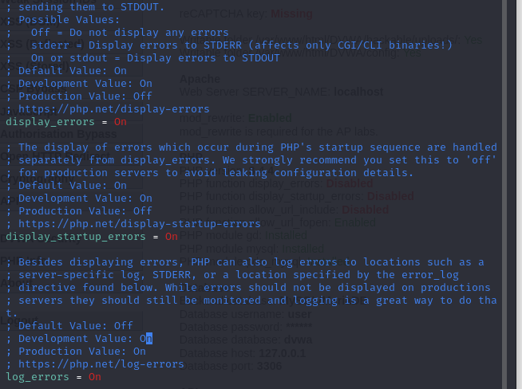{#fig:008 width=70%}

Установим php -gd, доля работы с графикой. (рис. [-@fig:009]).

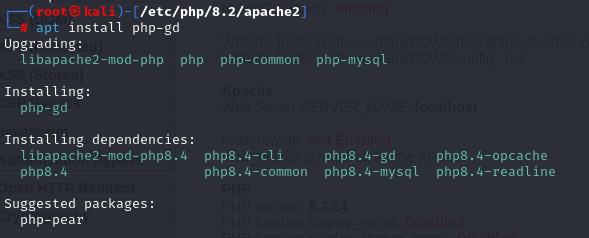{#fig:009 width=70%}

Добавляем в apache модуль rewrite, который позволяет apache перенаправлять url-адреса. (рис. [-@fig:010]).

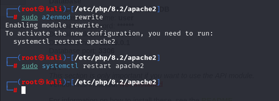{#fig:010 width=70%}

Запускаем apache2 и в посковой системе введем localhost/setup. Мы видим, что нам вывелась старница DVWA для настройки базы данных. (рис. [-@fig:011]).

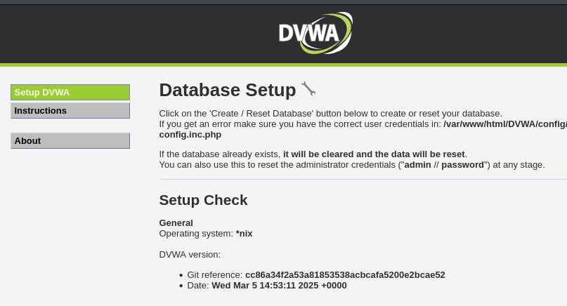{#fig:011 width=70%}

Немного опустившись вниз по странице найдем кнопку сreate database нажмем на нее, чтобы начать работу с базой данных, у нас спросят ввести имя и пароль, введем в разле имя admin, в разделе пароль password. (рис. [-@fig:012]).

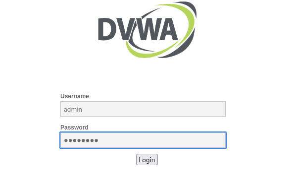{#fig:012 width=70%}

Мы видим, что мы успешно вошли в DVWA все наши настройки корректно установлены.  (рис. [-@fig:013]).

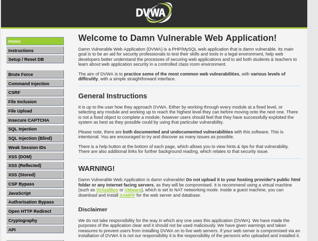{#fig:013 width=70%}

# Выводы

В ходе выполнения данного этапа индивидуального проекта я научилась устанавливать DVWA на KAli Linux.
