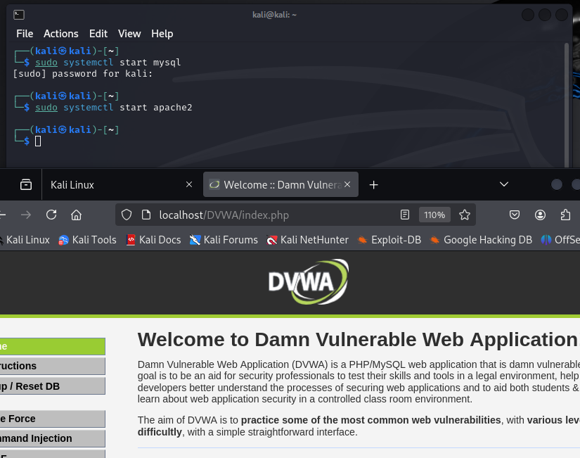
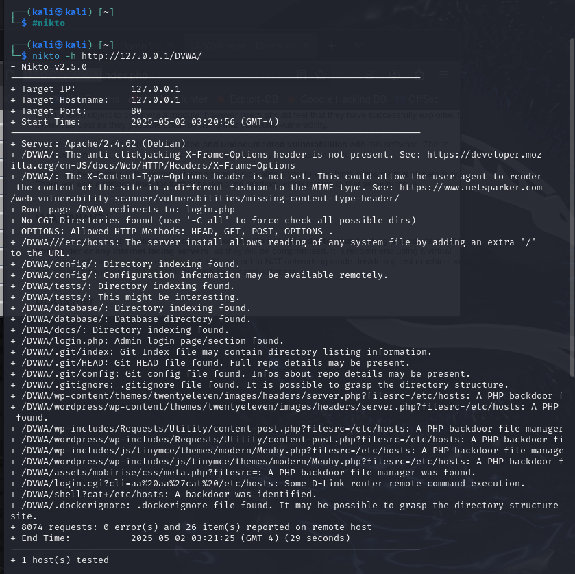
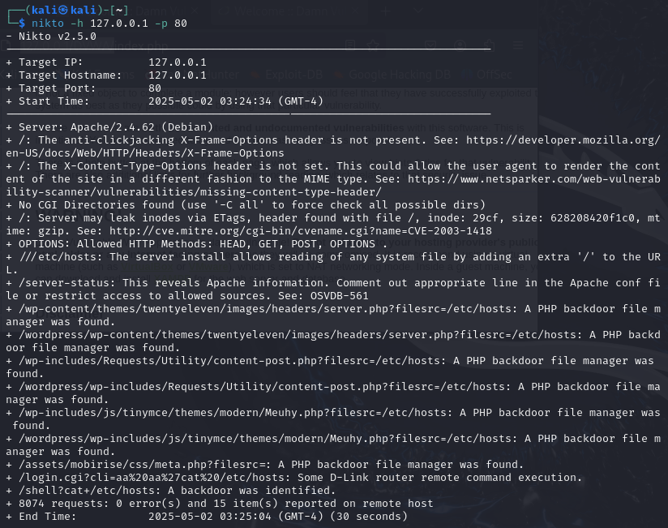

---
## Front matter
title: "Индивидуальный проект. Этап 4"
subtitle: "Основы информационной безопасности"
author: "Тойчубекова Асель Нурлановна"

## Generic otions
lang: ru-RU
toc-title: "Содержание"

## Bibliography
bibliography: bib/cite.bib
csl: pandoc/csl/gost-r-7-0-5-2008-numeric.csl

## Pdf output format
toc: true # Table of contents
toc-depth: 2
lof: true # List of figures
lot: true # List of tables
fontsize: 12pt
linestretch: 1.5
papersize: a4
documentclass: scrreprt
## I18n polyglossia
polyglossia-lang:
  name: russian
  options:
	- spelling=modern
	- babelshorthands=true
polyglossia-otherlangs:
  name: english
## I18n babel
babel-lang: russian
babel-otherlangs: english
## Fonts
mainfont: IBM Plex Serif
romanfont: IBM Plex Serif
sansfont: IBM Plex Sans
monofont: IBM Plex Mono
mathfont: STIX Two Math
mainfontoptions: Ligatures=Common,Ligatures=TeX,Scale=0.94
romanfontoptions: Ligatures=Common,Ligatures=TeX,Scale=0.94
sansfontoptions: Ligatures=Common,Ligatures=TeX,Scale=MatchLowercase,Scale=0.94
monofontoptions: Scale=MatchLowercase,Scale=0.94,FakeStretch=0.9
mathfontoptions:
## Biblatex
biblatex: true
biblio-style: "gost-numeric"
biblatexoptions:
  - parentracker=true
  - backend=biber
  - hyperref=auto
  - language=auto
  - autolang=other*
  - citestyle=gost-numeric
## Pandoc-crossref LaTeX customization
figureTitle: "Рис."
tableTitle: "Таблица"
listingTitle: "Листинг"
lofTitle: "Список иллюстраций"
lotTitle: "Список таблиц"
lolTitle: "Листинги"
## Misc options
indent: true
header-includes:
  - \usepackage{indentfirst}
  - \usepackage{float} # keep figures where there are in the text
  - \floatplacement{figure}{H} # keep figures where there are in the text
---

# Цель работы

Целью данного этапа индивидуального проекта является познакомится с программой nikto и получение практических навыков работы с ней.

# Задание

- Использовать программу nikto для получение информации об уязвимости DVWA.

# Теоретическое введение

nikto — базовый сканер безопасности веб-сервера. Он сканирует и обнаруживает уязвимости в веб-приложениях, обычно вызванные неправильной конфигурацией на самом сервере, файлами, установленными по умолчанию, и небезопасными файлами, а также устаревшими серверными приложениями.

Утилита относиться к классу blackbox сканеров, т. е. сканеров, использующих стратегию сканирования методом черного ящика. Это значит, что заранее неизвестно о внутреннем устройстве программы/сайта (доступ к исходному коду отсутствует) и упор сделан на функциональность. Программа может обнаруживать более 6700 потенциально опасных файлов и уязвимостей. Новые уязвимости добавляются в базу данных программы по мере их возникновения. Помимо поиска уязвимостей, сканер производит поиск на наличие устаревших версий, используемых библиотек и фреймворков. Nikto не позиционируется как стелс сканер (стелс сканеры никогда не устанавливают TCP-соединения до конца, тем самым сканирование происходит скрытно) – при сканировании сайта в логах сайта или в любой другой системе обнаружения вторжений, если она используется, будет отображена информация о том, что сайт подвергается сканированию.

Первая версия Nikto под номером 1.00 была создана в 2001 году Американским инженером по информационной безопасности Крисом Сулло. На текущий момент последней актуальной версией является версия 2.1.6.

Среди функций Nikto можно выделить следующие:

- поддержка SSL,

- поддержка HTTP прокси;

- создание отчетов в текстовом формате, XML, HTML, NBE или CSV;

- возможность сканирования портов;

- поиск поддоменов;

- поддержка плагинов для расширения функционала сканирования.

# Выполнение лабораторной работы

Мы будем выявлять уязвимости в нашем веб-сайте DVWA, из-за чего нам нужно для начала его запустить. (рис. [-@fig:001]).

{#fig:001 width=70%}

Теперь запускаем программу nikto командой #nikto. Далее чтобы запустить сканер прописываем команду nikto -h доменное_имя или IP_адрес. Параметр -h обязателен к использованию, иначе программа не сможет запустить сканирование. Мы видим, что спустя некоторое время на экране появилась некоторая информация. (рис. [-@fig:002]).

{#fig:002 width=70%}

В начале сканирования всегда отображается следующий блок с информацией:

- Target IP: IP адрес сканируемого домена.

- Target Hostname: имя хоста (доменное имя) сканируемого сайта;

- Target Port: порт, на котором находится сайт;

- Start Time: дата и время начала сканирования в формате год-месяц-день час:минута:секунда.

Далее идет анализ самого веб-сайта:

- +Server: Apache/2.4.62 (Debian)- Обнаружен веб-сервер Apache версии 2.4.62, установленный на Debian.

- +/DVWA/: The anti-clickjacking X-Frame-Options header is not present.- На странице /DVWA/ отсутствует заголовок X-Frame-Options, из-за чего сайт уязвим к clickjacking — подмене интерфейса с помощью фреймов.

- +/DVWA/: The X-Content-Type-Options header is not set.- Отсутствует заголовок X-Content-Type-Options, что может привести к MIME-sniffing атакам — когда браузер сам определяет тип контента и ошибается.

- +Root page /DVWA redirects to: login.php - Главная страница /DVWA перенаправляет на login.php — это просто уведомление, не уязвимость.

- +No CGI Directories found (use '-C all' to force check all possible dirs)- CGI-директории не найдены. CGI — устаревшая технология запуска скриптов, иногда содержит уязвимости.

- +OPTIONS: Allowed HTTP Methods: HEAD, GET, POST, OPTIONS .-  Сервер разрешает перечисленные HTTP-методы. Это стандартно, но расширенные методы могут быть точкой атаки.

- +/DVWA///etc/hosts: The server install allows reading of any system file...- Критическая уязвимость: при добавлении лишнего / можно прочитать файлы системы — тут файл /etc/hosts.

- +/DVWA/config/: Directory indexing found.-  Включена индексация директорий — можно видеть все файлы в /DVWA/config/.

- +/DVWA/config/: Configuration information may be available remotely.- Конфигурационные файлы могут быть доступны через интернет — опасность утечки данных.

- +/DVWA/tests/: Directory indexing found. , + /DVWA/tests/: This might be interesting.- В папке /tests/ можно увидеть файлы — возможно, есть скрипты, пригодные для атаки.

- +/DVWA/database/: Directory indexing found., + /DVWA/database/: Database directory found.-  Доступна директория базы данных — возможно, можно скачать файлы с настоящими данными.

- +/DVWA/docs/: Directory indexing found.- Папка с документацией доступна — это не критично, но может раскрыть структуру проекта.

- +/DVWA/login.php: Admin login page/section found.- Найдена страница входа администратора. Это может быть целью для brute force-атак.

- +/DVWA/.git/index: Git Index file may contain directory listing information.
+/DVWA/.git/HEAD: Git HEAD file found. Full repo details may be present.
+/DVWA/.git/config: Git config file found. Infos about repo details may be present.
+/DVWA/.gitignore: .gitignore file found. It is possible to grasp the directory structure. -Сайт случайно открывает файлы git-репозитория. Через них можно восстановить весь проект, включая секреты и конфигурации.

- +/DVWA/wp-content/themes/.../server.php?filesrc=/etc/hosts: A PHP backdoor file manager was found.
...-  Найдено множество PHP backdoor скриптов — это вредоносные файлы, которые дают удалённый доступ к файлам, например, позволяют просматривать /etc/hosts. Каждый найденный путь — это отдельный путь к backdoor'у.

- +/DVWA/login.cgi?cli=aa%20aa%27cat%20/etc/hosts: Some D-Link router remote command execution.
+/DVWA/shell?cat+/etc/hosts: A backdoor was identified.- Эти запросы указывают на удалённое выполнение команд на сервере — одна из самых опасных уязвимостей.

- +/DVWA/.dockerignore: .dockerignore file found...-  Файл .dockerignore доступен — может раскрыть, какие файлы исключаются из Docker-сборки.

И затем описывается заключение:

- +8074 requests: 0 error(s) and 26 item(s) reported on remote host -  Сделано 8074 HTTP-запроса, ошибок не было. Найдено 26 значимых элементов.

- +End Time: 2025-05-02 03:21:25 (GMT-4) (29 seconds)-Время окончания сканирования. Общее время — 29 секунд.

А теперь попробуем вызвать программу nikto указав адрес хоста и порта. Мы видим,что выводится информация, которая незначительно отличается от предыдущей. (рис. [-@fig:003]).

{#fig:003 width=70%}

Оба вывода — это результаты сканирования веб-сервера с помощью Nikto, но они отличаются целевыми путями и глубиной анализа, а также количеством найденных потенциальных уязвимостей. Давай по порядку.

Первый скан (nikto -h http://127.0.0.1/DVWA/) явно указывает путь /DVWA/, то есть Nikto начинает сканирование внутри каталога уязвимого приложения DVWA (Damn Vulnerable Web Application). В результате он находит больше конкретных директорий, таких как /DVWA/config/, /DVWA/tests/, /DVWA/database/, /DVWA/docs/, а также .git-файлы и даже PHP-бэкдоры. Это сканирование глубже анализирует структуру папки DVWA и выявляет больше деталей, характерных для уязвимого тестового веб-приложения.

Второй скан (nikto -h 127.0.0.1 -p 80) запускается на корень сайта (/). В этом случае он не заходит глубоко в подкаталоги (вроде /DVWA), если их не перенаправляет туда сервер. Поэтому он находит только общие уязвимости, характерные для сервера в целом: отсутствие заголовков безопасности, ETag-информацию, открытый /server-status и наличие некоторых PHP-бэкдоров, если они лежат прямо в корне или стандартных путях.

# Выводы

В ходе выполнения 4 этапа индивидуального проекта я получила практические навыки работы с программой, выявления уязвимостей веб-сайтов, nikto.

